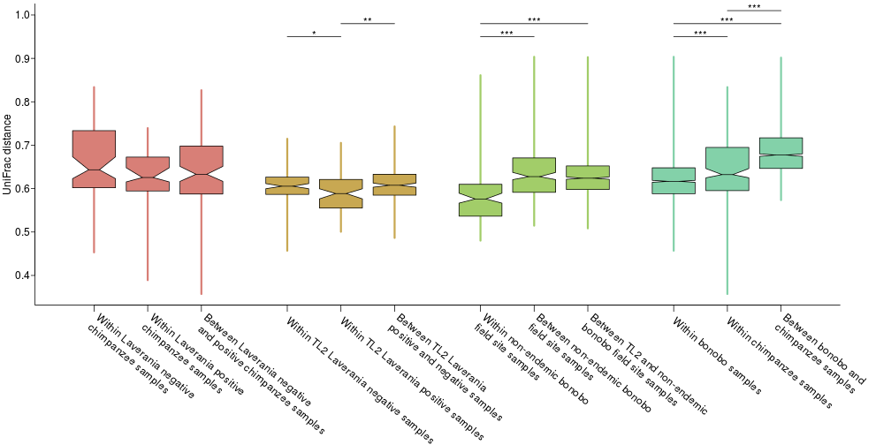

## Beta diversity between samples


```r
#stop on errors
knitr::opts_chunk$set(error=FALSE,tidy=TRUE)
```

### Load libraries

```r
library(dnar)
packageVersion("dnar")
```

```
## [1] '0.1'
```

```r
library(vegan)
```

```
## Loading required package: permute
```

```
## Loading required package: lattice
```

```
## This is vegan 2.4-3
```

```
## 
## Attaching package: 'vegan'
```

```
## The following object is masked from 'package:dnar':
## 
##     rarefy
```

```r
packageVersion("vegan")
```

```
## [1] '2.4.3'
```

### Load data

```r
source("loadData.R")
```

```
## 
## Attaching package: 'ape'
```

```
## The following object is masked from 'package:dnar':
## 
##     read.fastq
```

```
## ape package version 4.1
```

```
## phyloseq package version 1.20.0
```

```
## Requiring samples to have 15000 reads
```

```r
source("../functions.R")
# from plotPcoa.Rmd
load("work/uniDist.Rdat")
```

### Convenience function for getting distances from matrix

```r
pullDists <- function(xx, distMat) {
    isIdentical <- length(xx[[1]]) == length(xx[[2]]) && all(xx[[1]] == xx[[2]])
    select <- distMat[xx[[1]], xx[[2]]]
    if (isIdentical) 
        dists <- select[upper.tri(select)] else dists <- as.vector(select)
    return(dists)
}
```

### Pull out distances for comparisons

```r
comparisons <- withAs(s = samples[isEnough[samples$Code], ], list(list(`Within bonobo samples` = list(s[s$bonobo, 
    "Code"], s[s$bonobo, "Code"]), `Within chimpanzee samples` = list(s[!s$bonobo, 
    "Code"], s[!s$bonobo, "Code"]), `Between bonobo and\nchimpanzee samples` = list(s[s$bonobo, 
    "Code"], s[!s$bonobo, "Code"])), list(`Within non-endemic bonobo\nfield site samples` = list(0, 
    0), `Between non-endemic bonobo\nfield site samples` = list(0, 0), `Between TL2 and non-endemic\nbonobo field site samples` = list(s[s$isTL & 
    s$bonobo, "Code"], s[!s$isTL & s$bonobo, "Code"])), list(`Within TL2 Laverania negative samples` = list(s[s$isTL & 
    !s$malaria, "Code"], s[s$isTL & !s$malaria, "Code"]), `Within TL2 Laverania positive samples` = list(s[s$isTL & 
    s$malaria, "Code"], s[s$isTL & s$malaria, "Code"]), `Between TL2 Laverania\npositive and negative samples` = list(s[s$isTL & 
    s$malaria, "Code"], s[s$isTL & !s$malaria, "Code"])), list(`Within Laverania negative\nchimpanzee samples` = list(s[!s$bonobo & 
    !s$malaria, "Code"], s[!s$bonobo & !s$malaria, "Code"]), `Within Laverania positive\nchimpanzee samples` = list(s[!s$bonobo & 
    s$malaria, "Code"], s[!s$bonobo & s$malaria, "Code"]), `Between Laverania negative\n and positive chimpanzee samples` = list(s[!s$bonobo & 
    s$malaria, "Code"], s[!s$bonobo & !s$malaria, "Code"]))))
nonTL <- unique(samples[samples$bonobo & !samples$isTL, "area"])
names(nonTL) <- nonTL
allCombo <- unique(t(apply(expand.grid(nonTL, nonTL), 1, sort)))
allCombo <- allCombo[allCombo[, 1] != allCombo[, 2], ]
betweenSites <- apply(allCombo, 1, function(xx, distMat) pullDists(list(samples[isEnough[samples$Code] & 
    samples$area == xx[1], "Code"], samples[isEnough[samples$Code] & samples$area == 
    xx[2], "Code"]), distMat), as.matrix(uniDist))
withinSites <- lapply(nonTL, function(xx, distMat) pullDists(list(samples[isEnough[samples$Code] & 
    samples$area == xx, "Code"], samples[isEnough[samples$Code] & samples$area == 
    xx, "Code"]), distMat), as.matrix(uniDist))
distList <- lapply(comparisons, function(xx) lapply(xx, pullDists, as.matrix(uniDist)))
distList <- lapply(distList, function(xx) {
    names(xx) <- ifelse(nchar(names(xx)) > 20, sub(" vs ", " vs\n", names(xx)), 
        names(xx))
    if (any(names(xx) == "Between non-endemic bonobo\nfield site samples")) 
        xx[["Between non-endemic bonobo\nfield site samples"]] <- unlist(betweenSites)
    if (any(names(xx) == "Within non-endemic bonobo\nfield site samples")) 
        xx[["Within non-endemic bonobo\nfield site samples"]] <- unlist(withinSites)
    return(xx)
})
```

### Calculate Wilcoxon test p-values between groups of distances

```r
pVals <- lapply(distList, function(dists) outer(dists, dists, function(xx, yy) mapply(function(xxx, 
    yyy) {
    wilcox.test(xxx, yyy)$p.value
}, xx, yy)))
pVals2 <- lapply(distList, function(dists) outer(dists, dists, function(xx, 
    yy) mapply(function(xxx, yyy) {
    wilcox.test(xxx, yyy, alternative = "less")$p.value
}, xx, yy)))
pVals <- do.call(rbind, mapply(function(xx, yy) {
    n <- nrow(xx)
    # use one sided for comparisons to between
    xx[, ncol(xx)] <- yy[, ncol(xx)]
    cols <- colnames(xx)[matrix(1:n, nrow = n, ncol = n, byrow = TRUE)[upper.tri(xx)]]
    rows <- rownames(xx)[matrix(1:n, nrow = n, ncol = n, byrow = FALSE)[upper.tri(xx)]]
    ps <- xx[upper.tri(xx)]
    data.frame(x = rows, y = cols, p = ps, stringsAsFactors = FALSE)
}, pVals, pVals2, SIMPLIFY = FALSE))
pVals$sig <- symnum(pVals$p, corr = FALSE, na = FALSE, cutpoints = c(0, 1e-06, 
    1e-04, 0.01, 1), symbols = c("***", "**", "*", ""))
pVals <- pVals[pVals$p < 0.01, ]
```

### Setup plotting parameters

```r
spacer <- 0.6
cols <- rainbow.lab(length(distList), start = 1, end = -2)
groupId <- rep(1:length(distList), sapply(distList, length))
```

### Plot comparison of distances between groups

```r
par(mar = c(11, 2.75, 0.3, 4), lheight = 0.8)
compareFactor <- factor(rep(unlist(lapply(distList, names)), unlist(lapply(distList, 
    sapply, length))), levels = unlist(lapply(distList, function(xx) rev(names(xx)))))
stats <- boxplot(unlist(distList) ~ compareFactor, range = Inf, notch = TRUE, 
    plot = FALSE)
betaCI <- tapply(unlist(distList), compareFactor, function(xx) medianCI(xx))
pos <- sum(sapply(distList, length)):1 - rep((1:length(distList) - 1) * spacer, 
    sapply(distList, length))
names(pos) <- levels(compareFactor)
pVals$top <- pos[pVals$x]
pVals$bottom <- pos[pVals$y]
pVals$row <- stackRegions(pVals$top, pVals$bottom)
pVals$middle <- apply(pVals[, c("bottom", "top")], 1, mean)
pVals$xPos <- 0.95 + 0.03 * (pVals$row - 1)
plot(1, 1, type = "n", xlim = range(pos) + c(-0.5 - spacer, 0.5 + spacer), ylim = c(min(unlist(distList)), 
    1), xaxt = "n", xlab = "", ylab = "UniFrac distance", mgp = c(1.75, 0.4, 
    0), tcl = -0.3, xaxs = "i", las = 1, bty = "l")
for (ii in ncol(stats$stats):1) {
    rawDists <- distList[[groupId[ii]]][[stats$names[ii]]]
    thisCI <- betaCI[[stats$names[ii]]]
    xCoords <- c(stats$stats[2, ii], thisCI[1], stats$stats[3, ii], thisCI[2], 
        stats$stats[4, ii])
    yCoords <- c(0.4, 0.4, 0.1, 0.4, 0.4)
    segments(pos[ii], stats$stats[1, ii], pos[ii], stats$stats[5, ii], lwd = 3, 
        col = cols[groupId[ii]])
    polygon(c(yCoords, -rev(yCoords)) + pos[ii], c(xCoords, rev(xCoords)), col = cols[groupId[ii]])
    segments(pos[ii] + yCoords[3], xCoords[3], pos[ii] - yCoords[3], xCoords[3])
}
text(pVals$middle, pVals$xPos + 0.005, pVals$sig, adj = c(0.5, 0.5), xpd = NA)
segments(pVals$bottom, pVals$xPos, pVals$top, pVals$xPos)
breaks <- which(c(FALSE, pos[-1] - pos[-length(pos)] < -1))
slantAxis(1, pos, names(pos), srt = -40)
```



### Calculate PERMANOVA statistics of distances and covariates

```r
adonis(uniDist ~ bonobo + area2 + malaria, data = samples[labels(uniDist), ], 
    permutations = 1e+07, parallel = 20)
```

```
## 
## Call:
## adonis(formula = uniDist ~ bonobo + area2 + malaria, data = samples[labels(uniDist),      ], permutations = 1e+07, parallel = 20) 
## 
## Permutation: free
## Number of permutations: 1e+07
## 
## Terms added sequentially (first to last)
## 
##           Df SumsOfSqs MeanSqs F.Model      R2  Pr(>F)    
## bonobo     1    1.4629 1.46293  8.3600 0.07300   1e-07 ***
## area2      8    3.8192 0.47740  2.7281 0.19059   1e-07 ***
## malaria    1    0.2325 0.23251  1.3287 0.01160 0.05661 .  
## Residuals 83   14.5244 0.17499         0.72481            
## Total     93   20.0390                 1.00000            
## ---
## Signif. codes:  0 '***' 0.001 '**' 0.01 '*' 0.05 '.' 0.1 ' ' 1
```

```r
tlDist <- as.dist(as.matrix(uniDist)[samples[labels(uniDist), "isTL"], samples[labels(uniDist), 
    "isTL"]])
adonis(tlDist ~ area2 + malaria, data = samples[labels(tlDist), ], permutations = 1e+07, 
    parallel = 20)
```

```
## 
## Call:
## adonis(formula = tlDist ~ area2 + malaria, data = samples[labels(tlDist),      ], permutations = 1e+07, parallel = 20) 
## 
## Permutation: free
## Number of permutations: 1e+07
## 
## Terms added sequentially (first to last)
## 
##           Df SumsOfSqs MeanSqs F.Model      R2   Pr(>F)    
## area2      2    0.8726 0.43632  2.6367 0.14301    1e-07 ***
## malaria    1    0.2648 0.26475  1.5999 0.04339 0.003986 ** 
## Residuals 30    4.9644 0.16548         0.81360             
## Total     33    6.1018                 1.00000             
## ---
## Signif. codes:  0 '***' 0.001 '**' 0.01 '*' 0.05 '.' 0.1 ' ' 1
```

```r
chimpDist <- as.dist(as.matrix(uniDist)[!samples[labels(uniDist), "bonobo"], 
    !samples[labels(uniDist), "bonobo"]])
adonis(chimpDist ~ area2 + malaria, data = samples[labels(chimpDist), ], permutations = 1e+07, 
    parallel = 20)
```

```
## 
## Call:
## adonis(formula = chimpDist ~ area2 + malaria, data = samples[labels(chimpDist),      ], permutations = 1e+07, parallel = 20) 
## 
## Permutation: free
## Number of permutations: 1e+07
## 
## Terms added sequentially (first to last)
## 
##           Df SumsOfSqs MeanSqs F.Model      R2   Pr(>F)    
## area2      2    0.9226 0.46129  2.4407 0.17459 2.69e-05 ***
## malaria    1    0.2035 0.20352  1.0768 0.03852   0.3025    
## Residuals 22    4.1580 0.18900         0.78689             
## Total     25    5.2841                 1.00000             
## ---
## Signif. codes:  0 '***' 0.001 '**' 0.01 '*' 0.05 '.' 0.1 ' ' 1
```

