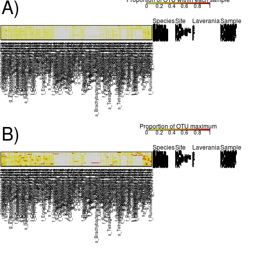
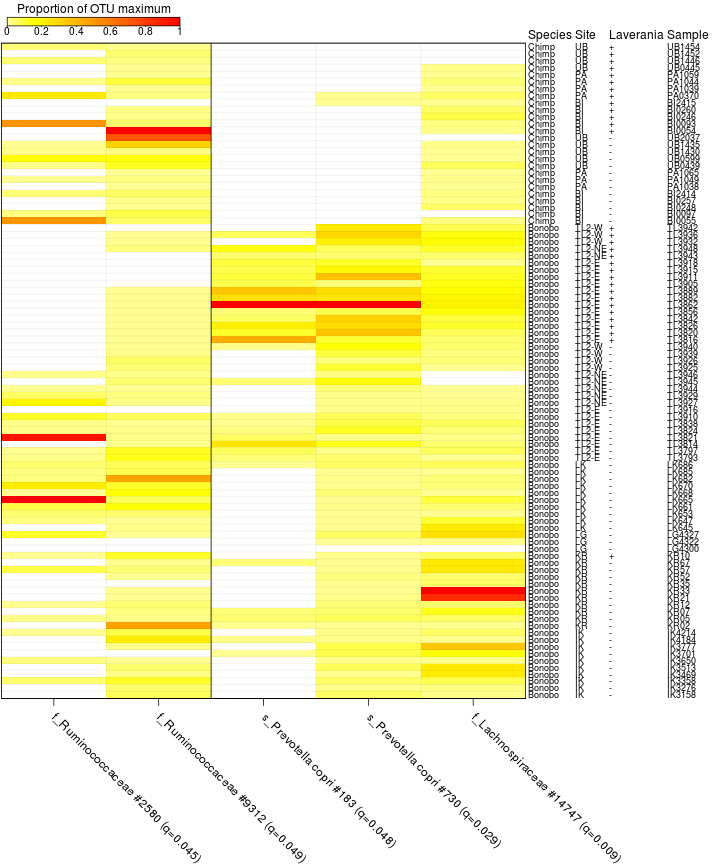

## Bacterial abundances


```r
#stop on errors
knitr::opts_chunk$set(error=FALSE,tidy=TRUE)
```

### Load libraries

```r
library(dnar)
packageVersion("dnar")
```

```
## [1] '0.1'
```

### Load the data

```r
source("loadData.R")
```

```
## 
## Attaching package: 'ape'
```

```
## The following object is masked from 'package:dnar':
## 
##     read.fastq
```

```
## ape package version 4.1
```

```
## phyloseq package version 1.20.0
```

```
## Requiring samples to have 15000 reads
```

### Setup plotting parameters

```r
samples <- samples[order(samples$Species, samples$area2, samples$malaria, samples$Code), 
    ]
moreThanProp <- apply(otuProp[, samples$Code[isEnough[samples$Code]]], 1, max, 
    na.rm = TRUE) > 0.02
cols <- c("white", tail(rev(heat.colors(110)), 99))
plotProp <- t(otuProp[moreThanProp, samples$Code[isEnough[samples$Code]]])
maxProp <- apply(otuProp[moreThanProp, samples$Code[isEnough[samples$Code]]], 
    1, function(x) x/max(x))
colnames(plotProp) <- colnames(maxProp) <- taxa[colnames(plotProp), "bestId"]
plotProp <- plotProp[, order(apply(plotProp, 2, mean), decreasing = TRUE)]
maxTree <- hclust(dist(t(maxProp[, ])))
maxProp <- maxProp[, rev(maxTree$labels[maxTree$order])]
plotProp <- plotProp[, rev(maxTree$labels[maxTree$order])]
breaks <- c(-1e-06, seq(min(plotProp[plotProp > 0]) - 1e-10, max(plotProp) + 
    1e-10, length.out = 100))
breaks2 <- c(-1e-06, seq(min(maxProp[maxProp > 0]) - 1e-10, max(maxProp) + 1e-10, 
    length.out = 100))
```

### Plot heatmap of bacterial proportions

```r
par(mfrow = c(2, 1), mar = c(12, 0.1, 3.5, 14))
image(1:ncol(plotProp), 1:nrow(plotProp), t(plotProp), col = cols, breaks = breaks, 
    xlab = "", ylab = "", xaxt = "n", yaxt = "n")
text(grconvertX(0.005, "nfc", "user"), grconvertY(0.995, "nfc", "user"), "A)", 
    xpd = NA, cex = 3, adj = 0:1)
box()
insetScale(round(breaks2, 6), cols, c(0.97, 0.58, 0.98, 0.83), label = "Proportion of OTU within each sample")
axis(1, 1:ncol(plotProp), colnames(plotProp), cex.axis = 0.7, las = 2, tcl = -0.1, 
    mgp = c(0, 0.3, 0))
metadata <- samples[rownames(plotProp), c("chimpBonobo", "area2", "plasmoPM", 
    "Code")]
colnames(metadata) <- c("Species", "Site", "Laverania", "Sample")
addMetaData(metadata, cex = 0.75)
abline(h = 1:nrow(plotProp) - 0.5, v = 1:ncol(plotProp) + 0.5, col = "#00000011")
image(1:ncol(maxProp), 1:nrow(maxProp), t(maxProp), col = cols, breaks = breaks2, 
    xlab = "", ylab = "", xaxt = "n", yaxt = "n")
text(grconvertX(0.005, "nfc", "user"), grconvertY(0.995, "nfc", "user"), "B)", 
    xpd = NA, cex = 3, adj = 0:1)
box()
insetScale(round(breaks2, 6), cols, c(0.97, 0.58, 0.98, 0.83), label = "Proportion of OTU maximum")
axis(1, 1:ncol(maxProp), colnames(maxProp), cex.axis = 0.7, las = 2, tcl = -0.1, 
    mgp = c(0, 0.3, 0))
abline(h = 1:nrow(maxProp) - 0.5, v = 1:ncol(maxProp) + 0.5, col = "#00000011")
metadata <- samples[rownames(maxProp), c("chimpBonobo", "area2", "plasmoPM", 
    "Code")]
colnames(metadata) <- c("Species", "Site", "Laverania", "Sample")
addMetaData(metadata, cex = 0.75)
```



### Calculate p-values 

```r
sampleOrder <- withAs(s = samples[isEnough[samples$Code], ], s$Code[order(!s$bonobo, 
    ifelse(s$area == "KR", FALSE, s$malaria), s$area2, s$malaria)])
tlPos <- samples$Code[isEnough[samples$Code] & samples$isTL & samples$malaria]
tlNeg <- samples$Code[isEnough[samples$Code] & samples$isTL & !samples$malaria]
# from functions.R
tmp <- setupHeat(tlPos, tlNeg, otuProp[, sampleOrder], taxa, pCut = 0.05)
selectProp <- tmp[[1]]
effectSplit <- tmp[[2]]
```

### Plot OTUs that differ between TL-2 plasmodium positive and negative bonobos

```r
par(mar = c(11.5, 0.1, 3, 13.5), lheight = 0.7)
plotHeat(selectProp, breaks2, cols, yaxt = "n")
abline(v = effectSplit - 0.5)
metadata <- samples[rownames(selectProp), c("chimpBonobo", "area2", "plasmoPM", 
    "Code")]
colnames(metadata) <- c("Species", "Site", "Laverania", "Sample")
addMetaData(metadata, cex = 0.75)
```




