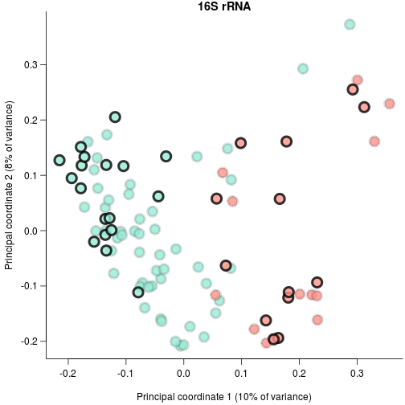

## PCoA and t-SNE of microbial abundances


```r
#stop on errors
knitr::opts_chunk$set(error=FALSE,tidy=TRUE)
```

### Load libraries

```r
library(phyloseq)
packageVersion("phyloseq")
```

```
## [1] '1.20.0'
```

```r
library(Rtsne)
packageVersion("Rtsne")
```

```
## [1] '0.13'
```

```r
library(ape)
packageVersion("ape")
```

```
## [1] '4.1'
```

```r
library(dnar)
```

```
## 
## Attaching package: 'dnar'
```

```
## The following object is masked from 'package:ape':
## 
##     read.fastq
```

```r
packageVersion("dnar")
```

```
## [1] '0.1'
```

### Load the data

```r
source("loadData.R")
```

```
## ape package version 4.1
```

```
## phyloseq package version 1.20.0
```

```
## Requiring samples to have 15000 reads
```

```r
source("../functions.R")
```


### Calculate distance matrices from OTU table

```r
selectSamples <- samples[isEnough[samples$Code], ]
subsampledOtus <- apply(otuTab[rownames(otuTab) %in% tree$tip.label, selectSamples$Code], 
    2, rarefyCounts, nRequiredReads)
phyOtu <- otu_table(subsampledOtus, taxa_are_rows = TRUE)
qiimeData <- phyloseq(otu_table = phyOtu, phy_tree = tree)
uniDist <- UniFrac(qiimeData, weighted = FALSE)
save(uniDist, file = "work/uniDist.Rdat")
phyOtuW <- otu_table(otuProp[rownames(otuTab) %in% tree$tip.label, selectSamples$Code], 
    taxa_are_rows = TRUE)
qiimeDataW <- phyloseq(otu_table = phyOtuW, phy_tree = tree)
uniDistW <- UniFrac(qiimeDataW, weighted = TRUE)
brayDist <- distance(qiimeDataW, "bray")
brayDistUW <- distance(qiimeData, "bray", binary = TRUE)
uniPca <- pcoa(uniDist)
mantels <- list(uniW = ade4::mantel.rtest(uniDist, uniDistW, nrepet = 10000), 
    brayW = ade4::mantel.rtest(uniDist, brayDist, nrepet = 10000), brayUW = ade4::mantel.rtest(uniDist, 
        brayDistUW, nrepet = 10000))
predictors <- model.matrix(~0 + Species + malaria + SIV + area, selectSamples)
colnames(predictors) <- sub("^Species", "", colnames(predictors))
colnames(predictors)[colnames(predictors) == "malariaTRUE"] <- "malariaPos"
```


### Set up plotting parameters

```r
colorBrew <- c("#e41a1cBB", "#377eb8BB", "#4daf4aBB", "#984ea3BB", "#ff7f00BB", 
    "#ffff33BB", "#a65628BB", "#f781bfBB", "#999999BB", "#88ddffBB")
nArea <- length(unique(selectSamples$area2))
if (nArea > length(colorBrew)) stop("Need to adjust colors for more areas")
areaCols <- colorBrew[1:nArea]
names(areaCols) <- unique(selectSamples$area2)
areaPch <- sapply(names(areaCols), function(x) mostAbundant(selectSamples$chimpBonobo[selectSamples$area2 == 
    x]))
malariaCols <- c("#00000022", "#000000CC")
mediumMalariaCol <- "#00000077"
malariaCols3 <- c("#00000022", "#000000CC")
names(malariaCols3) <- names(malariaCols) <- c("Laverania negative", "Laverania positive")
speciesPch <- 20 + 1:length(unique(selectSamples$chimpBonobo))
speciesCols <- rainbow.lab(length(unique(selectSamples$chimpBonobo)), start = -2, 
    end = 1, alpha = 0.8, lightMultiple = 0.8)
names(speciesCols) <- names(speciesPch) <- sort(unique(selectSamples$chimpBonobo))
importance <- uniPca$values$Relative_eig
colnames(uniPca$vectors) <- sprintf("Principal coordinate %d (%d%% of variance)", 
    1:length(importance), round(importance * 100))[1:ncol(uniPca$vectors)]
```
### Plot 16s PCoA

```r
axes <- 1:2
# malaria/species
pos <- my.biplot.pcoa(uniPca, predictors, plot.axes = axes, pch = 21, bg = speciesCols[selectSamples$chimpBonobo], 
    col = malariaCols3[selectSamples$malaria + 1], cex = 2.25, lwd = 4, arrowsFilter = Inf, 
    las = 1, mgp = c(2.75, 0.75, 0), sameAxis = FALSE, bty = "l", type = "n")
points(pos[!selectSamples$malaria, ], col = malariaCols3[1], cex = 2.25, lwd = 4, 
    bg = speciesCols[selectSamples[!selectSamples$malaria, "chimpBonobo"]], 
    pch = 21)
points(pos[selectSamples$malaria, ], col = malariaCols3[2], cex = 2.25, lwd = 4, 
    bg = speciesCols[selectSamples[selectSamples$malaria, "chimpBonobo"]], pch = 21)
title(main = sprintf("16S rRNA", axes[1], axes[2]))
```



### Plot 16s t-SNE

```r
tsne <- Rtsne(uniDist, is_distance = TRUE, verbose = TRUE, perplexity = 15, 
    max_iter = 5000)
```

```
## Read the 94 x 94 data matrix successfully!
## Using no_dims = 2, perplexity = 15.000000, and theta = 0.500000
## Computing input similarities...
## Building tree...
##  - point 0 of 94
## Done in 0.01 seconds (sparsity = 0.616342)!
## Learning embedding...
## Iteration 50: error is 58.437373 (50 iterations in 0.03 seconds)
## Iteration 100: error is 57.957607 (50 iterations in 0.02 seconds)
## Iteration 150: error is 58.143236 (50 iterations in 0.02 seconds)
## Iteration 200: error is 58.662373 (50 iterations in 0.02 seconds)
## Iteration 250: error is 57.750374 (50 iterations in 0.02 seconds)
## Iteration 300: error is 1.756438 (50 iterations in 0.02 seconds)
## Iteration 350: error is 1.022433 (50 iterations in 0.01 seconds)
## Iteration 400: error is 0.644021 (50 iterations in 0.01 seconds)
## Iteration 450: error is 0.354354 (50 iterations in 0.02 seconds)
## Iteration 500: error is 0.331171 (50 iterations in 0.01 seconds)
## Iteration 550: error is 0.327768 (50 iterations in 0.01 seconds)
## Iteration 600: error is 0.326284 (50 iterations in 0.01 seconds)
## Iteration 650: error is 0.327519 (50 iterations in 0.01 seconds)
## Iteration 700: error is 0.328141 (50 iterations in 0.01 seconds)
## Iteration 750: error is 0.327342 (50 iterations in 0.01 seconds)
## Iteration 800: error is 0.324472 (50 iterations in 0.01 seconds)
## Iteration 850: error is 0.318763 (50 iterations in 0.01 seconds)
## Iteration 900: error is 0.321057 (50 iterations in 0.01 seconds)
## Iteration 950: error is 0.324198 (50 iterations in 0.01 seconds)
## Iteration 1000: error is 0.325283 (50 iterations in 0.01 seconds)
## Iteration 1050: error is 0.322956 (50 iterations in 0.01 seconds)
## Iteration 1100: error is 0.319744 (50 iterations in 0.02 seconds)
## Iteration 1150: error is 0.325053 (50 iterations in 0.03 seconds)
## Iteration 1200: error is 0.312315 (50 iterations in 0.03 seconds)
## Iteration 1250: error is 0.307998 (50 iterations in 0.02 seconds)
## Iteration 1300: error is 0.307051 (50 iterations in 0.02 seconds)
## Iteration 1350: error is 0.305888 (50 iterations in 0.02 seconds)
## Iteration 1400: error is 0.305397 (50 iterations in 0.02 seconds)
## Iteration 1450: error is 0.305962 (50 iterations in 0.02 seconds)
## Iteration 1500: error is 0.305236 (50 iterations in 0.02 seconds)
## Iteration 1550: error is 0.304303 (50 iterations in 0.02 seconds)
## Iteration 1600: error is 0.304160 (50 iterations in 0.02 seconds)
## Iteration 1650: error is 0.305535 (50 iterations in 0.02 seconds)
## Iteration 1700: error is 0.303403 (50 iterations in 0.02 seconds)
## Iteration 1750: error is 0.303619 (50 iterations in 0.02 seconds)
## Iteration 1800: error is 0.305301 (50 iterations in 0.02 seconds)
## Iteration 1850: error is 0.307589 (50 iterations in 0.02 seconds)
## Iteration 1900: error is 0.304247 (50 iterations in 0.02 seconds)
## Iteration 1950: error is 0.306426 (50 iterations in 0.02 seconds)
## Iteration 2000: error is 0.305548 (50 iterations in 0.02 seconds)
## Iteration 2050: error is 0.303611 (50 iterations in 0.02 seconds)
## Iteration 2100: error is 0.305331 (50 iterations in 0.02 seconds)
## Iteration 2150: error is 0.305139 (50 iterations in 0.03 seconds)
## Iteration 2200: error is 0.307088 (50 iterations in 0.03 seconds)
## Iteration 2250: error is 0.307213 (50 iterations in 0.02 seconds)
## Iteration 2300: error is 0.305910 (50 iterations in 0.02 seconds)
## Iteration 2350: error is 0.305349 (50 iterations in 0.02 seconds)
## Iteration 2400: error is 0.305939 (50 iterations in 0.02 seconds)
## Iteration 2450: error is 0.305246 (50 iterations in 0.02 seconds)
## Iteration 2500: error is 0.304827 (50 iterations in 0.02 seconds)
## Iteration 2550: error is 0.304775 (50 iterations in 0.02 seconds)
## Iteration 2600: error is 0.304768 (50 iterations in 0.02 seconds)
## Iteration 2650: error is 0.304345 (50 iterations in 0.02 seconds)
## Iteration 2700: error is 0.305367 (50 iterations in 0.02 seconds)
## Iteration 2750: error is 0.305602 (50 iterations in 0.02 seconds)
## Iteration 2800: error is 0.303739 (50 iterations in 0.02 seconds)
## Iteration 2850: error is 0.304716 (50 iterations in 0.02 seconds)
## Iteration 2900: error is 0.304794 (50 iterations in 0.02 seconds)
## Iteration 2950: error is 0.306799 (50 iterations in 0.02 seconds)
## Iteration 3000: error is 0.305167 (50 iterations in 0.02 seconds)
## Iteration 3050: error is 0.307342 (50 iterations in 0.02 seconds)
## Iteration 3100: error is 0.306322 (50 iterations in 0.02 seconds)
## Iteration 3150: error is 0.304973 (50 iterations in 0.02 seconds)
## Iteration 3200: error is 0.305270 (50 iterations in 0.02 seconds)
## Iteration 3250: error is 0.305581 (50 iterations in 0.02 seconds)
## Iteration 3300: error is 0.306318 (50 iterations in 0.02 seconds)
## Iteration 3350: error is 0.304971 (50 iterations in 0.02 seconds)
## Iteration 3400: error is 0.303495 (50 iterations in 0.02 seconds)
## Iteration 3450: error is 0.306078 (50 iterations in 0.02 seconds)
## Iteration 3500: error is 0.305475 (50 iterations in 0.02 seconds)
## Iteration 3550: error is 0.303364 (50 iterations in 0.02 seconds)
## Iteration 3600: error is 0.304528 (50 iterations in 0.02 seconds)
## Iteration 3650: error is 0.308490 (50 iterations in 0.02 seconds)
## Iteration 3700: error is 0.301876 (50 iterations in 0.02 seconds)
## Iteration 3750: error is 0.305483 (50 iterations in 0.01 seconds)
## Iteration 3800: error is 0.306440 (50 iterations in 0.01 seconds)
## Iteration 3850: error is 0.304317 (50 iterations in 0.01 seconds)
## Iteration 3900: error is 0.305378 (50 iterations in 0.01 seconds)
## Iteration 3950: error is 0.305179 (50 iterations in 0.01 seconds)
## Iteration 4000: error is 0.304050 (50 iterations in 0.01 seconds)
## Iteration 4050: error is 0.305314 (50 iterations in 0.01 seconds)
## Iteration 4100: error is 0.304518 (50 iterations in 0.01 seconds)
## Iteration 4150: error is 0.304009 (50 iterations in 0.01 seconds)
## Iteration 4200: error is 0.304108 (50 iterations in 0.01 seconds)
## Iteration 4250: error is 0.303675 (50 iterations in 0.01 seconds)
## Iteration 4300: error is 0.304014 (50 iterations in 0.01 seconds)
## Iteration 4350: error is 0.302212 (50 iterations in 0.02 seconds)
## Iteration 4400: error is 0.303822 (50 iterations in 0.02 seconds)
## Iteration 4450: error is 0.298097 (50 iterations in 0.02 seconds)
## Iteration 4500: error is 0.304026 (50 iterations in 0.02 seconds)
## Iteration 4550: error is 0.304514 (50 iterations in 0.02 seconds)
## Iteration 4600: error is 0.301500 (50 iterations in 0.02 seconds)
## Iteration 4650: error is 0.298263 (50 iterations in 0.02 seconds)
## Iteration 4700: error is 0.300299 (50 iterations in 0.02 seconds)
## Iteration 4750: error is 0.304943 (50 iterations in 0.02 seconds)
## Iteration 4800: error is 0.305162 (50 iterations in 0.02 seconds)
## Iteration 4850: error is 0.298532 (50 iterations in 0.02 seconds)
## Iteration 4900: error is 0.298594 (50 iterations in 0.02 seconds)
## Iteration 4950: error is 0.302466 (50 iterations in 0.02 seconds)
## Iteration 5000: error is 0.301655 (50 iterations in 0.02 seconds)
## Fitting performed in 1.82 seconds.
```

```r
par(mar = c(4, 4, 1.5, 9.5))
plot(tsne$Y, pch = speciesPch[selectSamples$chimpBonobo], bg = areaCols[selectSamples$area2], 
    col = malariaCols[selectSamples$malaria + 1], cex = 2.2, lwd = 2.5, ylab = "t-SNE 2", 
    xlab = "t-SNE 1", main = "", bty = "l")
legend(par("usr")[2] + 0.01 * diff(par("usr")[1:2]), mean(par("usr")[3:4]), 
    c(names(malariaCols), names(areaCols), names(speciesPch)), col = c(malariaCols, 
        rep(c(malariaCols[1], mediumMalariaCol), c(length(areaCols), length(speciesPch)))), 
    pch = c(rep(21, length(malariaCols)), speciesPch[areaPch], speciesPch), 
    pt.bg = c(rep(NA, length(malariaCols)), areaCols, rep(NA, length(speciesPch))), 
    inset = 0.01, pt.lwd = 3, pt.cex = 2.5, xjust = 0, xpd = NA, bty = "n")
```


### Mantel tests for different distance measures

```r
mantels
```

```
## $uniW
## Monte-Carlo test
## Call: mantelnoneuclid(m1 = m1, m2 = m2, nrepet = nrepet)
## 
## Observation: 0.7642008 
## 
## Based on 10000 replicates
## Simulated p-value: 9.999e-05 
## Alternative hypothesis: greater 
## 
##       Std.Obs   Expectation      Variance 
## 11.9919593305 -0.0003860444  0.0040651194 
## 
## $brayW
## Monte-Carlo test
## Call: mantelnoneuclid(m1 = m1, m2 = m2, nrepet = nrepet)
## 
## Observation: 0.8201452 
## 
## Based on 10000 replicates
## Simulated p-value: 9.999e-05 
## Alternative hypothesis: greater 
## 
##      Std.Obs  Expectation     Variance 
## 1.374983e+01 9.936259e-04 3.549230e-03 
## 
## $brayUW
## Monte-Carlo test
## Call: ade4::mantel.rtest(m1 = uniDist, m2 = brayDistUW, nrepet = 10000)
## 
## Observation: 0.9074262 
## 
## Based on 10000 replicates
## Simulated p-value: 9.999e-05 
## Alternative hypothesis: greater 
## 
##      Std.Obs  Expectation     Variance 
## 1.622388e+01 2.466056e-04 3.126634e-03
```
