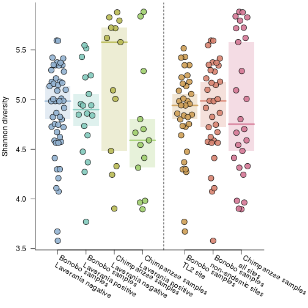

## Shannon diversity of the microbiome


```r
#set seed so reproducible
set.seed(12348)
#stop on errors
knitr::opts_chunk$set(error=FALSE,tidy=TRUE)
```

### Load libraries

```r
library(dnar)
packageVersion("dnar")
```

```
## [1] '0.1'
```

```r
library(vipor)
packageVersion("vipor")
```

```
## [1] '0.4.5'
```

### Load the data

```r
source("loadData.R")
```

```
## 
## Attaching package: 'ape'
```

```
## The following object is masked from 'package:dnar':
## 
##     read.fastq
```

```
## ape package version 4.1
```

```
## phyloseq package version 1.20.0
```

```
## Requiring samples to have 15000 reads
```

### Set up grouping variables


```r
groupings <- paste(ifelse(samples$bonobo[isEnough[samples$Code]], "Bonobo", 
    "Chimpanzee"), ifelse(samples$malaria[isEnough[samples$Code]], "Laverania positive", 
    "Laverania negative"))
groupings2 <- paste(ifelse(samples$bonobo[isEnough[samples$Code]], "Bonobo ", 
    "Chimpanzee "), ifelse(grepl("^TL", samples$area[isEnough[samples$Code]]), 
    "TL2 site", ifelse(samples$bonobo[isEnough[samples$Code]], "non-endemic sites", 
        "all sites")), sep = "")
```

### Set up plotting parameters

```r
# mildly magic number throwing out 3rd color to leave gap in coloring
# between two groups
nGroupings <- length(unique(groupings))
nGroupings2 <- length(unique(groupings2))
groupCols <- rainbow.lab(nGroupings + length(unique(groupings2)) + 1, alpha = 0.9)[1:(nGroupings + 
    1)][-3]
groupCols2 <- rainbow.lab(nGroupings + nGroupings2 + 1, alpha = 0.25)[1:(nGroupings + 
    1)][-3]
names(groupCols) <- names(groupCols2) <- unique(groupings)
group2Cols <- rainbow.lab(nGroupings + nGroupings2 + 1, alpha = 0.9)[1 + nGroupings + 
    1:nGroupings2]
group2Cols2 <- rainbow.lab(nGroupings + nGroupings2 + 1, alpha = 0.25)[1 + nGroupings + 
    1:nGroupings2]
names(group2Cols) <- names(group2Cols2) <- unique(groupings2)
```

### Calculate Shannon diversities

```r
shannons <- apply(otuTab[, samples$Code[isEnough[samples$Code]]], 2, shannon)
groupShannon <- sapply(unique(groupings), function(xx) median(shannons[groupings == 
    xx]))
shannonCI <- sapply(unique(groupings), function(xx) medianCI(shannons[groupings == 
    xx]))
group2Shannon <- sapply(unique(groupings2), function(xx) median(shannons[groupings2 == 
    xx]))
shannon2CI <- sapply(unique(groupings2), function(xx) medianCI(shannons[groupings2 == 
    xx]))
```

### Calculate Wilcoxon test p-values

```r
outer(split(shannons, groupings), split(shannons, groupings), function(xx, yy) mapply(function(xxx, 
    yyy) wilcox.test(xxx, yyy)$p.value, xx, yy))
```

```
## Warning in wilcox.test.default(xxx, yyy): cannot compute exact p-value with
## ties

## Warning in wilcox.test.default(xxx, yyy): cannot compute exact p-value with
## ties

## Warning in wilcox.test.default(xxx, yyy): cannot compute exact p-value with
## ties
```

```
##                               Bonobo Laverania negative
## Bonobo Laverania negative                    1.00000000
## Bonobo Laverania positive                    0.80779871
## Chimpanzee Laverania negative                0.08170533
## Chimpanzee Laverania positive                0.09433924
##                               Bonobo Laverania positive
## Bonobo Laverania negative                    0.80779871
## Bonobo Laverania positive                    1.00000000
## Chimpanzee Laverania negative                0.09707015
## Chimpanzee Laverania positive                0.18265586
##                               Chimpanzee Laverania negative
## Bonobo Laverania negative                        0.08170533
## Bonobo Laverania positive                        0.09707015
## Chimpanzee Laverania negative                    1.00000000
## Chimpanzee Laverania positive                    0.18568852
##                               Chimpanzee Laverania positive
## Bonobo Laverania negative                        0.09433924
## Bonobo Laverania positive                        0.18265586
## Chimpanzee Laverania negative                    0.18568852
## Chimpanzee Laverania positive                    1.00000000
```

```r
outer(split(shannons, groupings2), split(shannons, groupings2), function(xx, 
    yy) mapply(function(xxx, yyy) wilcox.test(xxx, yyy)$p.value, xx, yy))
```

```
## Warning in wilcox.test.default(xxx, yyy): cannot compute exact p-value with
## ties

## Warning in wilcox.test.default(xxx, yyy): cannot compute exact p-value with
## ties

## Warning in wilcox.test.default(xxx, yyy): cannot compute exact p-value with
## ties
```

```
##                          Bonobo non-endemic sites Bonobo TL2 site
## Bonobo non-endemic sites                1.0000000       0.5958866
## Bonobo TL2 site                         0.5958866       1.0000000
## Chimpanzee all sites                    0.9940949       0.8531955
##                          Chimpanzee all sites
## Bonobo non-endemic sites            0.9940949
## Bonobo TL2 site                     0.8531955
## Chimpanzee all sites                1.0000000
```

```r
outer(split(shannons, sub("Plasmodi.*", "", groupings)), split(shannons, sub("Plasmodi.*", 
    "", groupings)), function(xx, yy) mapply(function(xxx, yyy) wilcox.test(xxx, 
    yyy)$p.value, xx, yy))
```

```
## Warning in wilcox.test.default(xxx, yyy): cannot compute exact p-value with
## ties

## Warning in wilcox.test.default(xxx, yyy): cannot compute exact p-value with
## ties

## Warning in wilcox.test.default(xxx, yyy): cannot compute exact p-value with
## ties
```

```
##                               Bonobo Laverania negative
## Bonobo Laverania negative                    1.00000000
## Bonobo Laverania positive                    0.80779871
## Chimpanzee Laverania negative                0.08170533
## Chimpanzee Laverania positive                0.09433924
##                               Bonobo Laverania positive
## Bonobo Laverania negative                    0.80779871
## Bonobo Laverania positive                    1.00000000
## Chimpanzee Laverania negative                0.09707015
## Chimpanzee Laverania positive                0.18265586
##                               Chimpanzee Laverania negative
## Bonobo Laverania negative                        0.08170533
## Bonobo Laverania positive                        0.09707015
## Chimpanzee Laverania negative                    1.00000000
## Chimpanzee Laverania positive                    0.18568852
##                               Chimpanzee Laverania positive
## Bonobo Laverania negative                        0.09433924
## Bonobo Laverania positive                        0.18265586
## Chimpanzee Laverania negative                    0.18568852
## Chimpanzee Laverania positive                    1.00000000
```

### Generate distance comparison figure

```r
spacer <- 0.5
par(mar = c(6.6, 4, 0.3, 5), lheight = 0.85)
plot(1, 1, type = "n", ylab = "Shannon diversity", las = 2, xlim = c(0.5, length(unique(c(groupings, 
    groupings2))) + 0.5 + spacer), ylim = range(shannons), xaxt = "n", xlab = "", 
    bty = "l")
groupFac <- factor(sub(" Plas", "\nPlas", groupings))
xPos <- as.numeric(groupFac) + offsetX(shannons, groupFac, width = 0.3)
width <- 0.45
segments(1:length(levels(groupFac)) - width, groupShannon[sub("\n", " ", levels(groupFac))], 
    1:length(levels(groupFac)) + width, groupShannon[sub("\n", " ", levels(groupFac))], 
    lwd = 3, col = groupCols[sub("\n", " ", levels(groupFac))])
rect(1:length(levels(groupFac)) - width, shannonCI[1, sub("\n", " ", levels(groupFac))], 
    1:length(levels(groupFac)) + width, shannonCI[2, sub("\n", " ", levels(groupFac))], 
    lwd = 2, border = NA, col = groupCols2[sub("\n", " ", levels(groupFac))])
points(xPos, shannons, pch = 21, bg = groupCols[groupings], cex = 1.7)
slantAxis(1, 1:length(levels(groupFac)), sub("(Chimpanzee|Bonobo)", "\\1 samples", 
    sub(" Laverania", "\nLaverania", levels(groupFac))), srt = -30)
groupFac2 <- factor(groupings2, levels = unique(groupings2))
offset <- max(as.numeric(groupFac)) + spacer
abline(v = offset + 0.5 - spacer/2, lty = 2)
xPos <- offset + as.numeric(groupFac2) + offsetX(shannons, groupFac2, width = 0.3)
width <- 0.45
segments(offset + 1:length(levels(groupFac2)) - width, group2Shannon[sub("\n", 
    " ", levels(groupFac2))], offset + 1:length(levels(groupFac2)) + width, 
    group2Shannon[sub("\n", " ", levels(groupFac2))], lwd = 3, col = group2Cols[sub("\n", 
        " ", levels(groupFac2))])
rect(offset + 1:length(levels(groupFac2)) - width, shannon2CI[1, sub("\n", " ", 
    levels(groupFac2))], offset + 1:length(levels(groupFac2)) + width, shannon2CI[2, 
    sub("\n", " ", levels(groupFac2))], lwd = 2, border = NA, col = group2Cols2[sub("\n", 
    " ", levels(groupFac2))])
points(xPos, shannons, pch = 21, bg = group2Cols[groupings2], cex = 1.7)
# replacing first space with \n
slantAxis(1, offset + 1:length(levels(groupFac2)), sub("(Chimpanzee|Bonobo)", 
    "\\1 samples", sub(" ", "\n", levels(groupFac2))), srt = -30)
```


