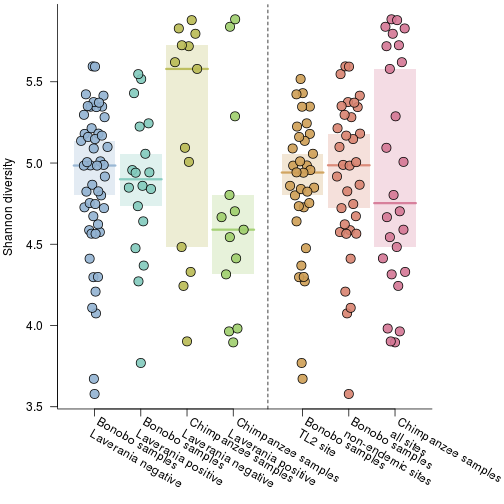

## Load libraries

```r
library(dnar)
packageVersion('dnar')
```

```
## [1] '0.1'
```

```r
library(vipor)
packageVersion('vipor')
```

```
## [1] '0.4.5'
```

## Load the data

```r
source('readData.R')
```

```
## 
## Attaching package: 'ape'
```

```
## The following object is masked from 'package:dnar':
## 
##     read.fastq
```

```
## ape package version 4.1
```

```
## phyloseq package version 1.20.0
```

```
## Requiring samples to have 15000 reads
```

## Set up grouping variables


```r
groupings<-paste(ifelse(samples$bonobo[isEnough[samples$Code]],'Bonobo','Chimpanzee'),ifelse(samples$malaria[isEnough[samples$Code]],'Laverania positive','Laverania negative'))
groupings2<-paste(ifelse(samples$bonobo[isEnough[samples$Code]],'Bonobo ','Chimpanzee '),ifelse(grepl('^TL',samples$area[isEnough[samples$Code]]),'TL2 site',ifelse(samples$bonobo[isEnough[samples$Code]],'non-endemic sites','all sites')),sep='')
```

## Set up plotting parameters

```r
#mildly magic number throwing out 3rd color to leave gap in coloring between two groups
nGroupings<-length(unique(groupings))
nGroupings2<-length(unique(groupings2))
groupCols<-rainbow.lab(nGroupings+length(unique(groupings2))+1,alpha=.9)[1:(nGroupings+1)][-3]
groupCols2<-rainbow.lab(nGroupings+nGroupings2+1,alpha=.25)[1:(nGroupings+1)][-3]
names(groupCols)<-names(groupCols2)<-unique(groupings)
group2Cols<-rainbow.lab(nGroupings+nGroupings2+1,alpha=.9)[1+nGroupings+1:nGroupings2]
group2Cols2<-rainbow.lab(nGroupings+nGroupings2+1,alpha=.25)[1+nGroupings+1:nGroupings2]
names(group2Cols)<-names(group2Cols2)<-unique(groupings2)
```

## Calculate Shannon diversities

```r
shannons<-apply(otuTab[,samples$Code[isEnough[samples$Code]]],2,shannon)
groupShannon<-sapply(unique(groupings),function(xx)median(shannons[groupings==xx]))
shannonCI<-sapply(unique(groupings),function(xx)medianCI(shannons[groupings==xx]))
group2Shannon<-sapply(unique(groupings2),function(xx)median(shannons[groupings2==xx]))
shannon2CI<-sapply(unique(groupings2),function(xx)medianCI(shannons[groupings2==xx]))
```

## Calculate Wilcoxon test p-values

```r
outer(split(shannons,groupings),split(shannons,groupings),function(xx,yy)mapply(function(xxx,yyy)wilcox.test(xxx,yyy)$p.value,xx,yy))
```

```
## Warning in wilcox.test.default(xxx, yyy): cannot compute exact p-value with
## ties

## Warning in wilcox.test.default(xxx, yyy): cannot compute exact p-value with
## ties

## Warning in wilcox.test.default(xxx, yyy): cannot compute exact p-value with
## ties
```

```
##                               Bonobo Laverania negative
## Bonobo Laverania negative                    1.00000000
## Bonobo Laverania positive                    0.80779871
## Chimpanzee Laverania negative                0.08170533
## Chimpanzee Laverania positive                0.09433924
##                               Bonobo Laverania positive
## Bonobo Laverania negative                    0.80779871
## Bonobo Laverania positive                    1.00000000
## Chimpanzee Laverania negative                0.09707015
## Chimpanzee Laverania positive                0.18265586
##                               Chimpanzee Laverania negative
## Bonobo Laverania negative                        0.08170533
## Bonobo Laverania positive                        0.09707015
## Chimpanzee Laverania negative                    1.00000000
## Chimpanzee Laverania positive                    0.18568852
##                               Chimpanzee Laverania positive
## Bonobo Laverania negative                        0.09433924
## Bonobo Laverania positive                        0.18265586
## Chimpanzee Laverania negative                    0.18568852
## Chimpanzee Laverania positive                    1.00000000
```

```r
outer(split(shannons,groupings2),split(shannons,groupings2),function(xx,yy)mapply(function(xxx,yyy)wilcox.test(xxx,yyy)$p.value,xx,yy))
```

```
## Warning in wilcox.test.default(xxx, yyy): cannot compute exact p-value with
## ties

## Warning in wilcox.test.default(xxx, yyy): cannot compute exact p-value with
## ties

## Warning in wilcox.test.default(xxx, yyy): cannot compute exact p-value with
## ties
```

```
##                          Bonobo non-endemic sites Bonobo TL2 site
## Bonobo non-endemic sites                1.0000000       0.5958866
## Bonobo TL2 site                         0.5958866       1.0000000
## Chimpanzee all sites                    0.9940949       0.8531955
##                          Chimpanzee all sites
## Bonobo non-endemic sites            0.9940949
## Bonobo TL2 site                     0.8531955
## Chimpanzee all sites                1.0000000
```

```r
outer(split(shannons,sub('Plasmodi.*','',groupings)),split(shannons,sub('Plasmodi.*','',groupings)),function(xx,yy)mapply(function(xxx,yyy)wilcox.test(xxx,yyy)$p.value,xx,yy))
```

```
## Warning in wilcox.test.default(xxx, yyy): cannot compute exact p-value with
## ties

## Warning in wilcox.test.default(xxx, yyy): cannot compute exact p-value with
## ties

## Warning in wilcox.test.default(xxx, yyy): cannot compute exact p-value with
## ties
```

```
##                               Bonobo Laverania negative
## Bonobo Laverania negative                    1.00000000
## Bonobo Laverania positive                    0.80779871
## Chimpanzee Laverania negative                0.08170533
## Chimpanzee Laverania positive                0.09433924
##                               Bonobo Laverania positive
## Bonobo Laverania negative                    0.80779871
## Bonobo Laverania positive                    1.00000000
## Chimpanzee Laverania negative                0.09707015
## Chimpanzee Laverania positive                0.18265586
##                               Chimpanzee Laverania negative
## Bonobo Laverania negative                        0.08170533
## Bonobo Laverania positive                        0.09707015
## Chimpanzee Laverania negative                    1.00000000
## Chimpanzee Laverania positive                    0.18568852
##                               Chimpanzee Laverania positive
## Bonobo Laverania negative                        0.09433924
## Bonobo Laverania positive                        0.18265586
## Chimpanzee Laverania negative                    0.18568852
## Chimpanzee Laverania positive                    1.00000000
```

## Generate distance comparison figure

```r
spacer<-.5
par(mar=c(6.6,4,.3,5),lheight=.85)
plot(1,1,type='n',ylab='Shannon diversity',las=2,xlim=c(.5,length(unique(c(groupings,groupings2)))+.5+spacer),ylim=range(shannons),xaxt='n',xlab='',bty='l')
groupFac<-factor(sub(' Plas','\nPlas',groupings))
xPos<-as.numeric(groupFac)+offsetX(shannons,groupFac,width=.3)
width<-.45
segments(1:length(levels(groupFac))-width,groupShannon[sub('\n',' ',levels(groupFac))],1:length(levels(groupFac))+width,groupShannon[sub('\n',' ',levels(groupFac))],lwd=3,col=groupCols[sub('\n',' ',levels(groupFac))])
rect(1:length(levels(groupFac))-width,shannonCI[1,sub('\n',' ',levels(groupFac))],1:length(levels(groupFac))+width,shannonCI[2,sub('\n',' ',levels(groupFac))],lwd=2,border=NA,col=groupCols2[sub('\n',' ',levels(groupFac))])
points(xPos,shannons,pch=21,bg=groupCols[groupings],cex=1.7)
slantAxis(1,1:length(levels(groupFac)),sub('(Chimpanzee|Bonobo)','\\1 samples',sub(' Laverania','\nLaverania',levels(groupFac))),srt=-30)
groupFac2<-factor(groupings2,levels=unique(groupings2))
offset<-max(as.numeric(groupFac))+spacer
abline(v=offset+.5-spacer/2,lty=2)
xPos<-offset+as.numeric(groupFac2)+offsetX(shannons,groupFac2,width=.3)
width<-.45
segments(offset+1:length(levels(groupFac2))-width,group2Shannon[sub('\n',' ',levels(groupFac2))],offset+1:length(levels(groupFac2))+width,group2Shannon[sub('\n',' ',levels(groupFac2))],lwd=3,col=group2Cols[sub('\n',' ',levels(groupFac2))])
rect(offset+1:length(levels(groupFac2))-width,shannon2CI[1,sub('\n',' ',levels(groupFac2))],offset+1:length(levels(groupFac2))+width,shannon2CI[2,sub('\n',' ',levels(groupFac2))],lwd=2,border=NA,col=group2Cols2[sub('\n',' ',levels(groupFac2))])
points(xPos,shannons,pch=21,bg=group2Cols[groupings2],cex=1.7)
#replacing first space with \n
slantAxis(1,offset+1:length(levels(groupFac2)),sub('(Chimpanzee|Bonobo)','\\1 samples',sub(' ','\n',levels(groupFac2))),srt=-30)
```


