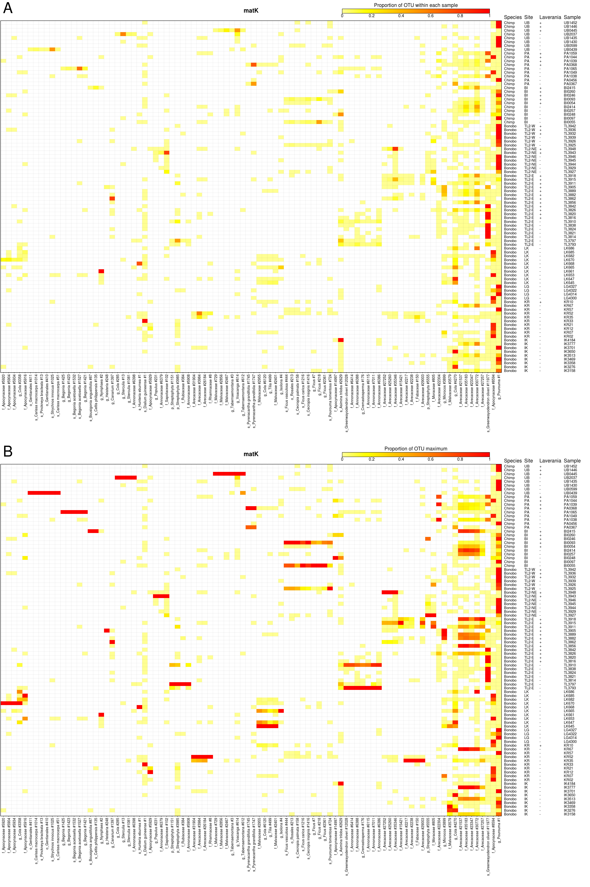
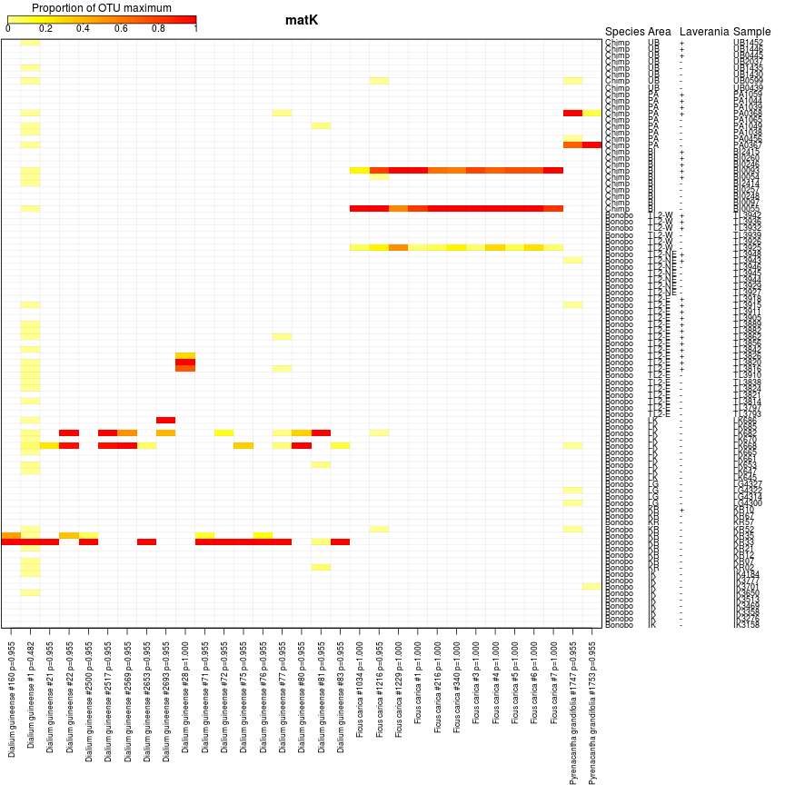
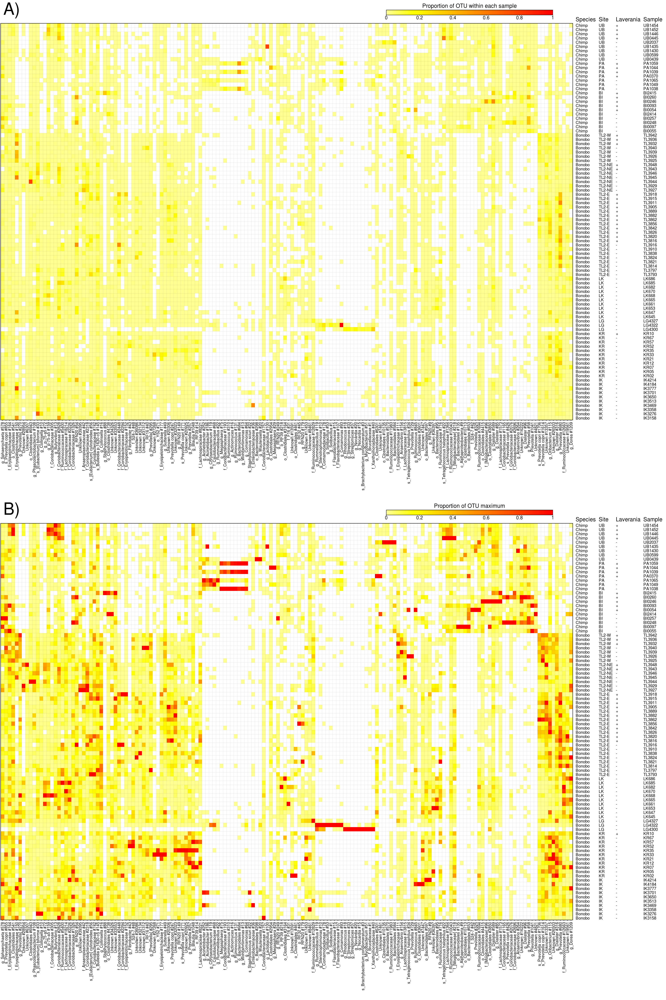
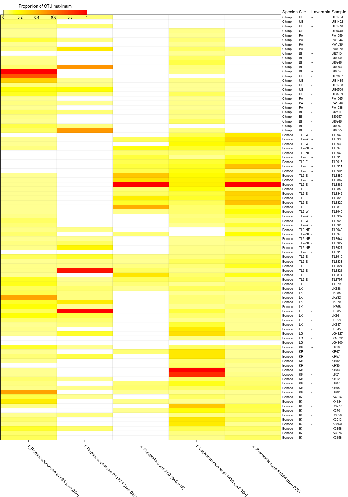
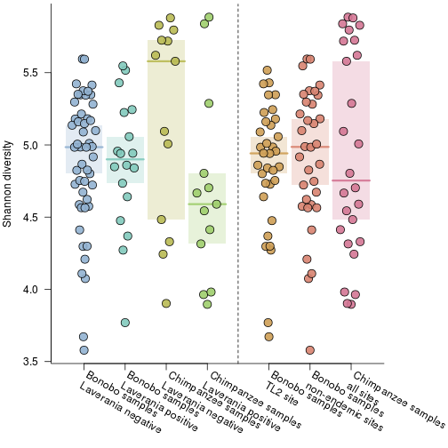
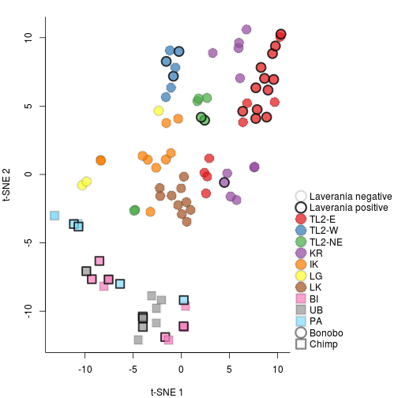

# Analysis code for "Geographically restricted malaria infections of wild bonobos include a new Laverania species"

To regenerate this document, run `make clean;make` in this directory. Note that the code is fairly processor and memory hungry so you would not want to run this on a small machine.

The code depends on R packages available from CRAN:

* library(actuar)
* library(ade4)
* library(ape)
* library(parallel)
* library(phyloseq)
* library(Rtsne)
* library(vegan)
* library(vipor)
* library(taxonomizr)

And convenience function in the package:

* library(dnar)

installable with `devtools::install_github('sherrillmix/dnar')`.

And programs:

* [makeblastdb](https://packages.ubuntu.com/xenial/ncbi-blast+)
* [blastn](https://packages.ubuntu.com/xenial/ncbi-blast+)
* [miniconda](https://conda.io/miniconda.html)
* [pick_de_novo_otus.py](http://qiime.org/install/install.html)
* [fastq-dump](https://www.ncbi.nlm.nih.gov/sra/docs/toolkitsoft/)
* [swarm](https://github.com/torognes/swarm)
* [mafft](http://mafft.cbrc.jp/alignment/software/source.html)
* [bbmerge.sh](http://jgi.doe.gov/data-and-tools/bbtools/bb-tools-user-guide/installation-guide/)
* [fasttree](https://packages.ubuntu.com/xenial/fasttree)
* [parallel](https://packages.ubuntu.com/xenial/parallel)
* R
* zcat
* gzip
* bash
* make


## Download data from SRA


```r
#set seed so reproducible
set.seed(12353)
#stop on errors
knitr::opts_chunk$set(error=FALSE,tidy=TRUE)
```

### Software versions

```r
system("fastq-dump --version", intern = TRUE)
```

```
## [1] ""                   "fastq-dump : 2.8.0" ""
```

### Read in SRA run table
The SRA run table was downloaded from [https://www.ncbi.nlm.nih.gov/Traces/study/?acc=SRP108776](https://www.ncbi.nlm.nih.gov/Traces/study/?acc=SRP108776).

```r
samples <- read.table("SraRunTable.txt", sep = "\t", header = TRUE, stringsAsFactors = FALSE)
rownames(samples) <- samples$Run_s
samples[, c("sample", "primer")] <- do.call(rbind, strsplit(samples$Library_Name_s, 
    "_"))
```

### Download data from SRA

```r
system("fastq-dump --version 2>&1", intern = TRUE)
```

```
## [1] ""                   "fastq-dump : 2.8.0" ""
```


```r
if (!dir.exists("sra")) dir.create("sra")
for (ii in samples$Run_s) {
    outFiles <- sprintf("sra/%s_%d.fastq.gz", ii, 1:2)
    cmd <- sprintf("fastq-dump --gzip --split-files --outdir sra %s", ii)
    message(cmd)
    if (any(!file.exists(outFiles))) 
        system(cmd)
    if (any(!file.exists(outFiles))) 
        stop("fastq-dump unsucessful")
}
```

```
## fastq-dump --gzip --split-files --outdir sra SRR5656515
```

```
## fastq-dump --gzip --split-files --outdir sra SRR5656723
```

```
## fastq-dump --gzip --split-files --outdir sra SRR5656724
```

```
## fastq-dump --gzip --split-files --outdir sra SRR5656721
```

```
## fastq-dump --gzip --split-files --outdir sra SRR5656722
```

```
## fastq-dump --gzip --split-files --outdir sra SRR5656520
```

```
## fastq-dump --gzip --split-files --outdir sra SRR5656517
```

```
## fastq-dump --gzip --split-files --outdir sra SRR5656719
```

```
## fastq-dump --gzip --split-files --outdir sra SRR5656720
```

```
## fastq-dump --gzip --split-files --outdir sra SRR5656717
```

```
## fastq-dump --gzip --split-files --outdir sra SRR5656514
```

```
## fastq-dump --gzip --split-files --outdir sra SRR5656521
```

```
## fastq-dump --gzip --split-files --outdir sra SRR5656581
```

```
## fastq-dump --gzip --split-files --outdir sra SRR5656582
```

```
## fastq-dump --gzip --split-files --outdir sra SRR5656620
```

```
## fastq-dump --gzip --split-files --outdir sra SRR5656621
```

```
## fastq-dump --gzip --split-files --outdir sra SRR5656646
```

```
## fastq-dump --gzip --split-files --outdir sra SRR5656647
```

```
## fastq-dump --gzip --split-files --outdir sra SRR5656699
```

```
## fastq-dump --gzip --split-files --outdir sra SRR5656700
```

```
## fastq-dump --gzip --split-files --outdir sra SRR5656701
```

```
## fastq-dump --gzip --split-files --outdir sra SRR5656702
```

```
## fastq-dump --gzip --split-files --outdir sra SRR5656710
```

```
## fastq-dump --gzip --split-files --outdir sra SRR5656711
```

```
## fastq-dump --gzip --split-files --outdir sra SRR5656712
```

```
## fastq-dump --gzip --split-files --outdir sra SRR5656713
```

```
## fastq-dump --gzip --split-files --outdir sra SRR5656714
```

```
## fastq-dump --gzip --split-files --outdir sra SRR5656715
```

```
## fastq-dump --gzip --split-files --outdir sra SRR5656716
```

```
## fastq-dump --gzip --split-files --outdir sra SRR5656718
```

```
## fastq-dump --gzip --split-files --outdir sra SRR5656432
```

```
## fastq-dump --gzip --split-files --outdir sra SRR5656433
```

```
## fastq-dump --gzip --split-files --outdir sra SRR5656479
```

```
## fastq-dump --gzip --split-files --outdir sra SRR5656604
```

```
## fastq-dump --gzip --split-files --outdir sra SRR5656642
```

```
## fastq-dump --gzip --split-files --outdir sra SRR5656643
```

```
## fastq-dump --gzip --split-files --outdir sra SRR5656644
```

```
## fastq-dump --gzip --split-files --outdir sra SRR5656645
```

```
## fastq-dump --gzip --split-files --outdir sra SRR5656648
```

```
## fastq-dump --gzip --split-files --outdir sra SRR5656649
```

```
## fastq-dump --gzip --split-files --outdir sra SRR5656652
```

```
## fastq-dump --gzip --split-files --outdir sra SRR5656654
```

```
## fastq-dump --gzip --split-files --outdir sra SRR5656655
```

```
## fastq-dump --gzip --split-files --outdir sra SRR5656662
```

```
## fastq-dump --gzip --split-files --outdir sra SRR5656664
```

```
## fastq-dump --gzip --split-files --outdir sra SRR5656665
```

```
## fastq-dump --gzip --split-files --outdir sra SRR5656666
```

```
## fastq-dump --gzip --split-files --outdir sra SRR5656667
```

```
## fastq-dump --gzip --split-files --outdir sra SRR5656674
```

```
## fastq-dump --gzip --split-files --outdir sra SRR5656675
```

```
## fastq-dump --gzip --split-files --outdir sra SRR5656686
```

```
## fastq-dump --gzip --split-files --outdir sra SRR5656687
```

```
## fastq-dump --gzip --split-files --outdir sra SRR5656688
```

```
## fastq-dump --gzip --split-files --outdir sra SRR5656689
```

```
## fastq-dump --gzip --split-files --outdir sra SRR5656690
```

```
## fastq-dump --gzip --split-files --outdir sra SRR5656691
```

```
## fastq-dump --gzip --split-files --outdir sra SRR5656692
```

```
## fastq-dump --gzip --split-files --outdir sra SRR5656693
```

```
## fastq-dump --gzip --split-files --outdir sra SRR5656694
```

```
## fastq-dump --gzip --split-files --outdir sra SRR5656695
```

```
## fastq-dump --gzip --split-files --outdir sra SRR5656696
```

```
## fastq-dump --gzip --split-files --outdir sra SRR5656697
```

```
## fastq-dump --gzip --split-files --outdir sra SRR5656698
```

```
## fastq-dump --gzip --split-files --outdir sra SRR5656703
```

```
## fastq-dump --gzip --split-files --outdir sra SRR5656704
```

```
## fastq-dump --gzip --split-files --outdir sra SRR5656705
```

```
## fastq-dump --gzip --split-files --outdir sra SRR5656706
```

```
## fastq-dump --gzip --split-files --outdir sra SRR5656707
```

```
## fastq-dump --gzip --split-files --outdir sra SRR5656708
```

```
## fastq-dump --gzip --split-files --outdir sra SRR5656709
```

```
## fastq-dump --gzip --split-files --outdir sra SRR5656431
```

```
## fastq-dump --gzip --split-files --outdir sra SRR5656434
```

```
## fastq-dump --gzip --split-files --outdir sra SRR5656440
```

```
## fastq-dump --gzip --split-files --outdir sra SRR5656441
```

```
## fastq-dump --gzip --split-files --outdir sra SRR5656442
```

```
## fastq-dump --gzip --split-files --outdir sra SRR5656451
```

```
## fastq-dump --gzip --split-files --outdir sra SRR5656462
```

```
## fastq-dump --gzip --split-files --outdir sra SRR5656463
```

```
## fastq-dump --gzip --split-files --outdir sra SRR5656464
```

```
## fastq-dump --gzip --split-files --outdir sra SRR5656465
```

```
## fastq-dump --gzip --split-files --outdir sra SRR5656483
```

```
## fastq-dump --gzip --split-files --outdir sra SRR5656488
```

```
## fastq-dump --gzip --split-files --outdir sra SRR5656489
```

```
## fastq-dump --gzip --split-files --outdir sra SRR5656490
```

```
## fastq-dump --gzip --split-files --outdir sra SRR5656491
```

```
## fastq-dump --gzip --split-files --outdir sra SRR5656492
```

```
## fastq-dump --gzip --split-files --outdir sra SRR5656493
```

```
## fastq-dump --gzip --split-files --outdir sra SRR5656497
```

```
## fastq-dump --gzip --split-files --outdir sra SRR5656498
```

```
## fastq-dump --gzip --split-files --outdir sra SRR5656499
```

```
## fastq-dump --gzip --split-files --outdir sra SRR5656500
```

```
## fastq-dump --gzip --split-files --outdir sra SRR5656501
```

```
## fastq-dump --gzip --split-files --outdir sra SRR5656512
```

```
## fastq-dump --gzip --split-files --outdir sra SRR5656513
```

```
## fastq-dump --gzip --split-files --outdir sra SRR5656524
```

```
## fastq-dump --gzip --split-files --outdir sra SRR5656525
```

```
## fastq-dump --gzip --split-files --outdir sra SRR5656528
```

```
## fastq-dump --gzip --split-files --outdir sra SRR5656529
```

```
## fastq-dump --gzip --split-files --outdir sra SRR5656535
```

```
## fastq-dump --gzip --split-files --outdir sra SRR5656544
```

```
## fastq-dump --gzip --split-files --outdir sra SRR5656545
```

```
## fastq-dump --gzip --split-files --outdir sra SRR5656546
```

```
## fastq-dump --gzip --split-files --outdir sra SRR5656548
```

```
## fastq-dump --gzip --split-files --outdir sra SRR5656566
```

```
## fastq-dump --gzip --split-files --outdir sra SRR5656568
```

```
## fastq-dump --gzip --split-files --outdir sra SRR5656579
```

```
## fastq-dump --gzip --split-files --outdir sra SRR5656601
```

```
## fastq-dump --gzip --split-files --outdir sra SRR5656602
```

```
## fastq-dump --gzip --split-files --outdir sra SRR5656603
```

```
## fastq-dump --gzip --split-files --outdir sra SRR5656612
```

```
## fastq-dump --gzip --split-files --outdir sra SRR5656619
```

```
## fastq-dump --gzip --split-files --outdir sra SRR5656629
```

```
## fastq-dump --gzip --split-files --outdir sra SRR5656630
```

```
## fastq-dump --gzip --split-files --outdir sra SRR5656631
```

```
## fastq-dump --gzip --split-files --outdir sra SRR5656632
```

```
## fastq-dump --gzip --split-files --outdir sra SRR5656633
```

```
## fastq-dump --gzip --split-files --outdir sra SRR5656634
```

```
## fastq-dump --gzip --split-files --outdir sra SRR5656635
```

```
## fastq-dump --gzip --split-files --outdir sra SRR5656636
```

```
## fastq-dump --gzip --split-files --outdir sra SRR5656637
```

```
## fastq-dump --gzip --split-files --outdir sra SRR5656638
```

```
## fastq-dump --gzip --split-files --outdir sra SRR5656639
```

```
## fastq-dump --gzip --split-files --outdir sra SRR5656640
```

```
## fastq-dump --gzip --split-files --outdir sra SRR5656641
```

```
## fastq-dump --gzip --split-files --outdir sra SRR5656650
```

```
## fastq-dump --gzip --split-files --outdir sra SRR5656651
```

```
## fastq-dump --gzip --split-files --outdir sra SRR5656653
```

```
## fastq-dump --gzip --split-files --outdir sra SRR5656656
```

```
## fastq-dump --gzip --split-files --outdir sra SRR5656657
```

```
## fastq-dump --gzip --split-files --outdir sra SRR5656658
```

```
## fastq-dump --gzip --split-files --outdir sra SRR5656659
```

```
## fastq-dump --gzip --split-files --outdir sra SRR5656660
```

```
## fastq-dump --gzip --split-files --outdir sra SRR5656661
```

```
## fastq-dump --gzip --split-files --outdir sra SRR5656663
```

```
## fastq-dump --gzip --split-files --outdir sra SRR5656668
```

```
## fastq-dump --gzip --split-files --outdir sra SRR5656669
```

```
## fastq-dump --gzip --split-files --outdir sra SRR5656670
```

```
## fastq-dump --gzip --split-files --outdir sra SRR5656671
```

```
## fastq-dump --gzip --split-files --outdir sra SRR5656672
```

```
## fastq-dump --gzip --split-files --outdir sra SRR5656673
```

```
## fastq-dump --gzip --split-files --outdir sra SRR5656676
```

```
## fastq-dump --gzip --split-files --outdir sra SRR5656677
```

```
## fastq-dump --gzip --split-files --outdir sra SRR5656678
```

```
## fastq-dump --gzip --split-files --outdir sra SRR5656679
```

```
## fastq-dump --gzip --split-files --outdir sra SRR5656680
```

```
## fastq-dump --gzip --split-files --outdir sra SRR5656681
```

```
## fastq-dump --gzip --split-files --outdir sra SRR5656682
```

```
## fastq-dump --gzip --split-files --outdir sra SRR5656683
```

```
## fastq-dump --gzip --split-files --outdir sra SRR5656684
```

```
## fastq-dump --gzip --split-files --outdir sra SRR5656685
```

```
## fastq-dump --gzip --split-files --outdir sra SRR5656435
```

```
## fastq-dump --gzip --split-files --outdir sra SRR5656436
```

```
## fastq-dump --gzip --split-files --outdir sra SRR5656437
```

```
## fastq-dump --gzip --split-files --outdir sra SRR5656438
```

```
## fastq-dump --gzip --split-files --outdir sra SRR5656439
```

```
## fastq-dump --gzip --split-files --outdir sra SRR5656443
```

```
## fastq-dump --gzip --split-files --outdir sra SRR5656444
```

```
## fastq-dump --gzip --split-files --outdir sra SRR5656445
```

```
## fastq-dump --gzip --split-files --outdir sra SRR5656446
```

```
## fastq-dump --gzip --split-files --outdir sra SRR5656447
```

```
## fastq-dump --gzip --split-files --outdir sra SRR5656448
```

```
## fastq-dump --gzip --split-files --outdir sra SRR5656449
```

```
## fastq-dump --gzip --split-files --outdir sra SRR5656450
```

```
## fastq-dump --gzip --split-files --outdir sra SRR5656452
```

```
## fastq-dump --gzip --split-files --outdir sra SRR5656453
```

```
## fastq-dump --gzip --split-files --outdir sra SRR5656454
```

```
## fastq-dump --gzip --split-files --outdir sra SRR5656455
```

```
## fastq-dump --gzip --split-files --outdir sra SRR5656456
```

```
## fastq-dump --gzip --split-files --outdir sra SRR5656457
```

```
## fastq-dump --gzip --split-files --outdir sra SRR5656458
```

```
## fastq-dump --gzip --split-files --outdir sra SRR5656459
```

```
## fastq-dump --gzip --split-files --outdir sra SRR5656460
```

```
## fastq-dump --gzip --split-files --outdir sra SRR5656461
```

```
## fastq-dump --gzip --split-files --outdir sra SRR5656466
```

```
## fastq-dump --gzip --split-files --outdir sra SRR5656467
```

```
## fastq-dump --gzip --split-files --outdir sra SRR5656468
```

```
## fastq-dump --gzip --split-files --outdir sra SRR5656469
```

```
## fastq-dump --gzip --split-files --outdir sra SRR5656470
```

```
## fastq-dump --gzip --split-files --outdir sra SRR5656471
```

```
## fastq-dump --gzip --split-files --outdir sra SRR5656472
```

```
## fastq-dump --gzip --split-files --outdir sra SRR5656473
```

```
## fastq-dump --gzip --split-files --outdir sra SRR5656474
```

```
## fastq-dump --gzip --split-files --outdir sra SRR5656475
```

```
## fastq-dump --gzip --split-files --outdir sra SRR5656476
```

```
## fastq-dump --gzip --split-files --outdir sra SRR5656477
```

```
## fastq-dump --gzip --split-files --outdir sra SRR5656478
```

```
## fastq-dump --gzip --split-files --outdir sra SRR5656480
```

```
## fastq-dump --gzip --split-files --outdir sra SRR5656481
```

```
## fastq-dump --gzip --split-files --outdir sra SRR5656482
```

```
## fastq-dump --gzip --split-files --outdir sra SRR5656484
```

```
## fastq-dump --gzip --split-files --outdir sra SRR5656485
```

```
## fastq-dump --gzip --split-files --outdir sra SRR5656486
```

```
## fastq-dump --gzip --split-files --outdir sra SRR5656487
```

```
## fastq-dump --gzip --split-files --outdir sra SRR5656494
```

```
## fastq-dump --gzip --split-files --outdir sra SRR5656495
```

```
## fastq-dump --gzip --split-files --outdir sra SRR5656496
```

```
## fastq-dump --gzip --split-files --outdir sra SRR5656502
```

```
## fastq-dump --gzip --split-files --outdir sra SRR5656503
```

```
## fastq-dump --gzip --split-files --outdir sra SRR5656504
```

```
## fastq-dump --gzip --split-files --outdir sra SRR5656505
```

```
## fastq-dump --gzip --split-files --outdir sra SRR5656506
```

```
## fastq-dump --gzip --split-files --outdir sra SRR5656507
```

```
## fastq-dump --gzip --split-files --outdir sra SRR5656508
```

```
## fastq-dump --gzip --split-files --outdir sra SRR5656509
```

```
## fastq-dump --gzip --split-files --outdir sra SRR5656510
```

```
## fastq-dump --gzip --split-files --outdir sra SRR5656511
```

```
## fastq-dump --gzip --split-files --outdir sra SRR5656516
```

```
## fastq-dump --gzip --split-files --outdir sra SRR5656518
```

```
## fastq-dump --gzip --split-files --outdir sra SRR5656519
```

```
## fastq-dump --gzip --split-files --outdir sra SRR5656522
```

```
## fastq-dump --gzip --split-files --outdir sra SRR5656523
```

```
## fastq-dump --gzip --split-files --outdir sra SRR5656526
```

```
## fastq-dump --gzip --split-files --outdir sra SRR5656527
```

```
## fastq-dump --gzip --split-files --outdir sra SRR5656530
```

```
## fastq-dump --gzip --split-files --outdir sra SRR5656531
```

```
## fastq-dump --gzip --split-files --outdir sra SRR5656532
```

```
## fastq-dump --gzip --split-files --outdir sra SRR5656533
```

```
## fastq-dump --gzip --split-files --outdir sra SRR5656534
```

```
## fastq-dump --gzip --split-files --outdir sra SRR5656536
```

```
## fastq-dump --gzip --split-files --outdir sra SRR5656537
```

```
## fastq-dump --gzip --split-files --outdir sra SRR5656538
```

```
## fastq-dump --gzip --split-files --outdir sra SRR5656539
```

```
## fastq-dump --gzip --split-files --outdir sra SRR5656540
```

```
## fastq-dump --gzip --split-files --outdir sra SRR5656541
```

```
## fastq-dump --gzip --split-files --outdir sra SRR5656542
```

```
## fastq-dump --gzip --split-files --outdir sra SRR5656543
```

```
## fastq-dump --gzip --split-files --outdir sra SRR5656547
```

```
## fastq-dump --gzip --split-files --outdir sra SRR5656549
```

```
## fastq-dump --gzip --split-files --outdir sra SRR5656550
```

```
## fastq-dump --gzip --split-files --outdir sra SRR5656551
```

```
## fastq-dump --gzip --split-files --outdir sra SRR5656552
```

```
## fastq-dump --gzip --split-files --outdir sra SRR5656553
```

```
## fastq-dump --gzip --split-files --outdir sra SRR5656554
```

```
## fastq-dump --gzip --split-files --outdir sra SRR5656555
```

```
## fastq-dump --gzip --split-files --outdir sra SRR5656556
```

```
## fastq-dump --gzip --split-files --outdir sra SRR5656557
```

```
## fastq-dump --gzip --split-files --outdir sra SRR5656558
```

```
## fastq-dump --gzip --split-files --outdir sra SRR5656559
```

```
## fastq-dump --gzip --split-files --outdir sra SRR5656560
```

```
## fastq-dump --gzip --split-files --outdir sra SRR5656561
```

```
## fastq-dump --gzip --split-files --outdir sra SRR5656562
```

```
## fastq-dump --gzip --split-files --outdir sra SRR5656563
```

```
## fastq-dump --gzip --split-files --outdir sra SRR5656564
```

```
## fastq-dump --gzip --split-files --outdir sra SRR5656565
```

```
## fastq-dump --gzip --split-files --outdir sra SRR5656567
```

```
## fastq-dump --gzip --split-files --outdir sra SRR5656569
```

```
## fastq-dump --gzip --split-files --outdir sra SRR5656570
```

```
## fastq-dump --gzip --split-files --outdir sra SRR5656571
```

```
## fastq-dump --gzip --split-files --outdir sra SRR5656572
```

```
## fastq-dump --gzip --split-files --outdir sra SRR5656573
```

```
## fastq-dump --gzip --split-files --outdir sra SRR5656574
```

```
## fastq-dump --gzip --split-files --outdir sra SRR5656575
```

```
## fastq-dump --gzip --split-files --outdir sra SRR5656576
```

```
## fastq-dump --gzip --split-files --outdir sra SRR5656577
```

```
## fastq-dump --gzip --split-files --outdir sra SRR5656578
```

```
## fastq-dump --gzip --split-files --outdir sra SRR5656580
```

```
## fastq-dump --gzip --split-files --outdir sra SRR5656583
```

```
## fastq-dump --gzip --split-files --outdir sra SRR5656584
```

```
## fastq-dump --gzip --split-files --outdir sra SRR5656585
```

```
## fastq-dump --gzip --split-files --outdir sra SRR5656586
```

```
## fastq-dump --gzip --split-files --outdir sra SRR5656587
```

```
## fastq-dump --gzip --split-files --outdir sra SRR5656588
```

```
## fastq-dump --gzip --split-files --outdir sra SRR5656589
```

```
## fastq-dump --gzip --split-files --outdir sra SRR5656590
```

```
## fastq-dump --gzip --split-files --outdir sra SRR5656591
```

```
## fastq-dump --gzip --split-files --outdir sra SRR5656592
```

```
## fastq-dump --gzip --split-files --outdir sra SRR5656593
```

```
## fastq-dump --gzip --split-files --outdir sra SRR5656594
```

```
## fastq-dump --gzip --split-files --outdir sra SRR5656595
```

```
## fastq-dump --gzip --split-files --outdir sra SRR5656596
```

```
## fastq-dump --gzip --split-files --outdir sra SRR5656597
```

```
## fastq-dump --gzip --split-files --outdir sra SRR5656598
```

```
## fastq-dump --gzip --split-files --outdir sra SRR5656599
```

```
## fastq-dump --gzip --split-files --outdir sra SRR5656600
```

```
## fastq-dump --gzip --split-files --outdir sra SRR5656605
```

```
## fastq-dump --gzip --split-files --outdir sra SRR5656606
```

```
## fastq-dump --gzip --split-files --outdir sra SRR5656607
```

```
## fastq-dump --gzip --split-files --outdir sra SRR5656608
```

```
## fastq-dump --gzip --split-files --outdir sra SRR5656609
```

```
## fastq-dump --gzip --split-files --outdir sra SRR5656610
```

```
## fastq-dump --gzip --split-files --outdir sra SRR5656611
```

```
## fastq-dump --gzip --split-files --outdir sra SRR5656613
```

```
## fastq-dump --gzip --split-files --outdir sra SRR5656614
```

```
## fastq-dump --gzip --split-files --outdir sra SRR5656615
```

```
## fastq-dump --gzip --split-files --outdir sra SRR5656616
```

```
## fastq-dump --gzip --split-files --outdir sra SRR5656617
```

```
## fastq-dump --gzip --split-files --outdir sra SRR5656618
```

```
## fastq-dump --gzip --split-files --outdir sra SRR5656622
```

```
## fastq-dump --gzip --split-files --outdir sra SRR5656623
```

```
## fastq-dump --gzip --split-files --outdir sra SRR5656624
```

```
## fastq-dump --gzip --split-files --outdir sra SRR5656625
```

```
## fastq-dump --gzip --split-files --outdir sra SRR5656626
```

```
## fastq-dump --gzip --split-files --outdir sra SRR5656627
```

```
## fastq-dump --gzip --split-files --outdir sra SRR5656628
```

### Rename into convenient form

```r
if (!dir.exists("16s/data")) dir.create("16s/data")
if (!dir.exists("data")) dir.create("data")
for (ii in samples$Run_s) {
    sraNames <- sprintf("sra/%s_%d.fastq.gz", ii, 1:2)
    newNames <- sprintf("%s/%s_%s_R%d_.fastq.gz", ifelse(samples[ii, "primer"] == 
        "16s", "16s/data", "data"), samples[ii, "sample"], samples[ii, "primer"], 
        1:2)
    message("Moving ", paste(sraNames, collapse = " "), " to ", paste(newNames, 
        collapse = " "))
    file.rename(sraNames, newNames)
}
```

```
## Moving sra/SRR5656515_1.fastq.gz sra/SRR5656515_2.fastq.gz to 16s/data/TL3814_16s_R1_.fastq.gz 16s/data/TL3814_16s_R2_.fastq.gz
```

```
## Moving sra/SRR5656723_1.fastq.gz sra/SRR5656723_2.fastq.gz to data/TL3814_matK_R1_.fastq.gz data/TL3814_matK_R2_.fastq.gz
```

```
## Moving sra/SRR5656724_1.fastq.gz sra/SRR5656724_2.fastq.gz to data/TL3814_rbcL_R1_.fastq.gz data/TL3814_rbcL_R2_.fastq.gz
```

```
## Moving sra/SRR5656721_1.fastq.gz sra/SRR5656721_2.fastq.gz to data/TL3816_matK_R1_.fastq.gz data/TL3816_matK_R2_.fastq.gz
```

```
## Moving sra/SRR5656722_1.fastq.gz sra/SRR5656722_2.fastq.gz to data/TL3816_rbcL_R1_.fastq.gz data/TL3816_rbcL_R2_.fastq.gz
```

```
## Moving sra/SRR5656520_1.fastq.gz sra/SRR5656520_2.fastq.gz to 16s/data/TL3816_16s_R1_.fastq.gz 16s/data/TL3816_16s_R2_.fastq.gz
```

```
## Moving sra/SRR5656517_1.fastq.gz sra/SRR5656517_2.fastq.gz to 16s/data/TL3793_16s_R1_.fastq.gz 16s/data/TL3793_16s_R2_.fastq.gz
```

```
## Moving sra/SRR5656719_1.fastq.gz sra/SRR5656719_2.fastq.gz to data/TL3793_matK_R1_.fastq.gz data/TL3793_matK_R2_.fastq.gz
```

```
## Moving sra/SRR5656720_1.fastq.gz sra/SRR5656720_2.fastq.gz to data/TL3793_rbcL_R1_.fastq.gz data/TL3793_rbcL_R2_.fastq.gz
```

```
## Moving sra/SRR5656717_1.fastq.gz sra/SRR5656717_2.fastq.gz to data/TL3797_matK_R1_.fastq.gz data/TL3797_matK_R2_.fastq.gz
```

```
## Moving sra/SRR5656514_1.fastq.gz sra/SRR5656514_2.fastq.gz to 16s/data/TL3797_16s_R1_.fastq.gz 16s/data/TL3797_16s_R2_.fastq.gz
```

```
## Moving sra/SRR5656521_1.fastq.gz sra/SRR5656521_2.fastq.gz to 16s/data/TL3820_16s_R1_.fastq.gz 16s/data/TL3820_16s_R2_.fastq.gz
```

```
## Moving sra/SRR5656581_1.fastq.gz sra/SRR5656581_2.fastq.gz to data/TL3943_rbcL_R1_.fastq.gz data/TL3943_rbcL_R2_.fastq.gz
```

```
## Moving sra/SRR5656582_1.fastq.gz sra/SRR5656582_2.fastq.gz to data/TL3943_matK_R1_.fastq.gz data/TL3943_matK_R2_.fastq.gz
```

```
## Moving sra/SRR5656620_1.fastq.gz sra/SRR5656620_2.fastq.gz to data/TL3944_matK_R1_.fastq.gz data/TL3944_matK_R2_.fastq.gz
```

```
## Moving sra/SRR5656621_1.fastq.gz sra/SRR5656621_2.fastq.gz to data/TL3944_rbcL_R1_.fastq.gz data/TL3944_rbcL_R2_.fastq.gz
```

```
## Moving sra/SRR5656646_1.fastq.gz sra/SRR5656646_2.fastq.gz to data/IK3358_rbcL_R1_.fastq.gz data/IK3358_rbcL_R2_.fastq.gz
```

```
## Moving sra/SRR5656647_1.fastq.gz sra/SRR5656647_2.fastq.gz to data/IK3358_matK_R1_.fastq.gz data/IK3358_matK_R2_.fastq.gz
```

```
## Moving sra/SRR5656699_1.fastq.gz sra/SRR5656699_2.fastq.gz to data/TL3946_matK_R1_.fastq.gz data/TL3946_matK_R2_.fastq.gz
```

```
## Moving sra/SRR5656700_1.fastq.gz sra/SRR5656700_2.fastq.gz to data/TL3946_rbcL_R1_.fastq.gz data/TL3946_rbcL_R2_.fastq.gz
```

```
## Moving sra/SRR5656701_1.fastq.gz sra/SRR5656701_2.fastq.gz to data/TL3945_matK_R1_.fastq.gz data/TL3945_matK_R2_.fastq.gz
```

```
## Moving sra/SRR5656702_1.fastq.gz sra/SRR5656702_2.fastq.gz to data/TL3945_rbcL_R1_.fastq.gz data/TL3945_rbcL_R2_.fastq.gz
```

```
## Moving sra/SRR5656710_1.fastq.gz sra/SRR5656710_2.fastq.gz to 16s/data/IK3358_16s_R1_.fastq.gz 16s/data/IK3358_16s_R2_.fastq.gz
```

```
## Moving sra/SRR5656711_1.fastq.gz sra/SRR5656711_2.fastq.gz to 16s/data/TL3944_16s_R1_.fastq.gz 16s/data/TL3944_16s_R2_.fastq.gz
```

```
## Moving sra/SRR5656712_1.fastq.gz sra/SRR5656712_2.fastq.gz to 16s/data/TL3943_16s_R1_.fastq.gz 16s/data/TL3943_16s_R2_.fastq.gz
```

```
## Moving sra/SRR5656713_1.fastq.gz sra/SRR5656713_2.fastq.gz to 16s/data/TL3946_16s_R1_.fastq.gz 16s/data/TL3946_16s_R2_.fastq.gz
```

```
## Moving sra/SRR5656714_1.fastq.gz sra/SRR5656714_2.fastq.gz to 16s/data/TL3945_16s_R1_.fastq.gz 16s/data/TL3945_16s_R2_.fastq.gz
```

```
## Moving sra/SRR5656715_1.fastq.gz sra/SRR5656715_2.fastq.gz to data/TL3820_matK_R1_.fastq.gz data/TL3820_matK_R2_.fastq.gz
```

```
## Moving sra/SRR5656716_1.fastq.gz sra/SRR5656716_2.fastq.gz to data/TL3820_rbcL_R1_.fastq.gz data/TL3820_rbcL_R2_.fastq.gz
```

```
## Moving sra/SRR5656718_1.fastq.gz sra/SRR5656718_2.fastq.gz to data/TL3797_rbcL_R1_.fastq.gz data/TL3797_rbcL_R2_.fastq.gz
```

```
## Moving sra/SRR5656432_1.fastq.gz sra/SRR5656432_2.fastq.gz to 16s/data/BI0260_16s_R1_.fastq.gz 16s/data/BI0260_16s_R2_.fastq.gz
```

```
## Moving sra/SRR5656433_1.fastq.gz sra/SRR5656433_2.fastq.gz to 16s/data/BI2414_16s_R1_.fastq.gz 16s/data/BI2414_16s_R2_.fastq.gz
```

```
## Moving sra/SRR5656479_1.fastq.gz sra/SRR5656479_2.fastq.gz to 16s/data/IK4184_16s_R1_.fastq.gz 16s/data/IK4184_16s_R2_.fastq.gz
```

```
## Moving sra/SRR5656604_1.fastq.gz sra/SRR5656604_2.fastq.gz to data/IK4184_matK_R1_.fastq.gz data/IK4184_matK_R2_.fastq.gz
```

```
## Moving sra/SRR5656642_1.fastq.gz sra/SRR5656642_2.fastq.gz to data/IK3158_rbcL_R1_.fastq.gz data/IK3158_rbcL_R2_.fastq.gz
```

```
## Moving sra/SRR5656643_1.fastq.gz sra/SRR5656643_2.fastq.gz to data/IK3158_matK_R1_.fastq.gz data/IK3158_matK_R2_.fastq.gz
```

```
## Moving sra/SRR5656644_1.fastq.gz sra/SRR5656644_2.fastq.gz to data/IK3276_rbcL_R1_.fastq.gz data/IK3276_rbcL_R2_.fastq.gz
```

```
## Moving sra/SRR5656645_1.fastq.gz sra/SRR5656645_2.fastq.gz to data/IK3276_matK_R1_.fastq.gz data/IK3276_matK_R2_.fastq.gz
```

```
## Moving sra/SRR5656648_1.fastq.gz sra/SRR5656648_2.fastq.gz to data/IK3469_rbcL_R1_.fastq.gz data/IK3469_rbcL_R2_.fastq.gz
```

```
## Moving sra/SRR5656649_1.fastq.gz sra/SRR5656649_2.fastq.gz to data/IK3469_matK_R1_.fastq.gz data/IK3469_matK_R2_.fastq.gz
```

```
## Moving sra/SRR5656652_1.fastq.gz sra/SRR5656652_2.fastq.gz to data/UB1452_rbcL_R1_.fastq.gz data/UB1452_rbcL_R2_.fastq.gz
```

```
## Moving sra/SRR5656654_1.fastq.gz sra/SRR5656654_2.fastq.gz to data/UB1454_rbcL_R1_.fastq.gz data/UB1454_rbcL_R2_.fastq.gz
```

```
## Moving sra/SRR5656655_1.fastq.gz sra/SRR5656655_2.fastq.gz to data/UB1454_matK_R1_.fastq.gz data/UB1454_matK_R2_.fastq.gz
```

```
## Moving sra/SRR5656662_1.fastq.gz sra/SRR5656662_2.fastq.gz to 16s/data/BI2415_16s_R1_.fastq.gz 16s/data/BI2415_16s_R2_.fastq.gz
```

```
## Moving sra/SRR5656664_1.fastq.gz sra/SRR5656664_2.fastq.gz to data/UB2037_rbcL_R1_.fastq.gz data/UB2037_rbcL_R2_.fastq.gz
```

```
## Moving sra/SRR5656665_1.fastq.gz sra/SRR5656665_2.fastq.gz to data/UB2037_matK_R1_.fastq.gz data/UB2037_matK_R2_.fastq.gz
```

```
## Moving sra/SRR5656666_1.fastq.gz sra/SRR5656666_2.fastq.gz to 16s/data/BI0248_16s_R1_.fastq.gz 16s/data/BI0248_16s_R2_.fastq.gz
```

```
## Moving sra/SRR5656667_1.fastq.gz sra/SRR5656667_2.fastq.gz to 16s/data/BI0257_16s_R1_.fastq.gz 16s/data/BI0257_16s_R2_.fastq.gz
```

```
## Moving sra/SRR5656674_1.fastq.gz sra/SRR5656674_2.fastq.gz to data/BI0054_matK_R1_.fastq.gz data/BI0054_matK_R2_.fastq.gz
```

```
## Moving sra/SRR5656675_1.fastq.gz sra/SRR5656675_2.fastq.gz to data/BI0054_rbcL_R1_.fastq.gz data/BI0054_rbcL_R2_.fastq.gz
```

```
## Moving sra/SRR5656686_1.fastq.gz sra/SRR5656686_2.fastq.gz to 16s/data/UB1454_16s_R1_.fastq.gz 16s/data/UB1454_16s_R2_.fastq.gz
```

```
## Moving sra/SRR5656687_1.fastq.gz sra/SRR5656687_2.fastq.gz to 16s/data/UB2037_16s_R1_.fastq.gz 16s/data/UB2037_16s_R2_.fastq.gz
```

```
## Moving sra/SRR5656688_1.fastq.gz sra/SRR5656688_2.fastq.gz to data/BI2415_matK_R1_.fastq.gz data/BI2415_matK_R2_.fastq.gz
```

```
## Moving sra/SRR5656689_1.fastq.gz sra/SRR5656689_2.fastq.gz to data/BI2415_rbcL_R1_.fastq.gz data/BI2415_rbcL_R2_.fastq.gz
```

```
## Moving sra/SRR5656690_1.fastq.gz sra/SRR5656690_2.fastq.gz to data/BI0260_matK_R1_.fastq.gz data/BI0260_matK_R2_.fastq.gz
```

```
## Moving sra/SRR5656691_1.fastq.gz sra/SRR5656691_2.fastq.gz to data/BI0260_rbcL_R1_.fastq.gz data/BI0260_rbcL_R2_.fastq.gz
```

```
## Moving sra/SRR5656692_1.fastq.gz sra/SRR5656692_2.fastq.gz to data/BI2414_matK_R1_.fastq.gz data/BI2414_matK_R2_.fastq.gz
```

```
## Moving sra/SRR5656693_1.fastq.gz sra/SRR5656693_2.fastq.gz to data/BI2414_rbcL_R1_.fastq.gz data/BI2414_rbcL_R2_.fastq.gz
```

```
## Moving sra/SRR5656694_1.fastq.gz sra/SRR5656694_2.fastq.gz to data/BI0248_matK_R1_.fastq.gz data/BI0248_matK_R2_.fastq.gz
```

```
## Moving sra/SRR5656695_1.fastq.gz sra/SRR5656695_2.fastq.gz to data/BI0248_rbcL_R1_.fastq.gz data/BI0248_rbcL_R2_.fastq.gz
```

```
## Moving sra/SRR5656696_1.fastq.gz sra/SRR5656696_2.fastq.gz to data/BI0257_matK_R1_.fastq.gz data/BI0257_matK_R2_.fastq.gz
```

```
## Moving sra/SRR5656697_1.fastq.gz sra/SRR5656697_2.fastq.gz to data/BI0257_rbcL_R1_.fastq.gz data/BI0257_rbcL_R2_.fastq.gz
```

```
## Moving sra/SRR5656698_1.fastq.gz sra/SRR5656698_2.fastq.gz to data/IK4184_rbcL_R1_.fastq.gz data/IK4184_rbcL_R2_.fastq.gz
```

```
## Moving sra/SRR5656703_1.fastq.gz sra/SRR5656703_2.fastq.gz to 16s/data/IK3276_16s_R1_.fastq.gz 16s/data/IK3276_16s_R2_.fastq.gz
```

```
## Moving sra/SRR5656704_1.fastq.gz sra/SRR5656704_2.fastq.gz to 16s/data/IK3158_16s_R1_.fastq.gz 16s/data/IK3158_16s_R2_.fastq.gz
```

```
## Moving sra/SRR5656705_1.fastq.gz sra/SRR5656705_2.fastq.gz to data/TL3948_matK_R1_.fastq.gz data/TL3948_matK_R2_.fastq.gz
```

```
## Moving sra/SRR5656706_1.fastq.gz sra/SRR5656706_2.fastq.gz to data/TL3948_rbcL_R1_.fastq.gz data/TL3948_rbcL_R2_.fastq.gz
```

```
## Moving sra/SRR5656707_1.fastq.gz sra/SRR5656707_2.fastq.gz to 16s/data/BI0054_16s_R1_.fastq.gz 16s/data/BI0054_16s_R2_.fastq.gz
```

```
## Moving sra/SRR5656708_1.fastq.gz sra/SRR5656708_2.fastq.gz to 16s/data/TL3948_16s_R1_.fastq.gz 16s/data/TL3948_16s_R2_.fastq.gz
```

```
## Moving sra/SRR5656709_1.fastq.gz sra/SRR5656709_2.fastq.gz to 16s/data/IK3469_16s_R1_.fastq.gz 16s/data/IK3469_16s_R2_.fastq.gz
```

```
## Moving sra/SRR5656431_1.fastq.gz sra/SRR5656431_2.fastq.gz to 16s/data/PA1038_16s_R1_.fastq.gz 16s/data/PA1038_16s_R2_.fastq.gz
```

```
## Moving sra/SRR5656434_1.fastq.gz sra/SRR5656434_2.fastq.gz to 16s/data/PA1059_16s_R1_.fastq.gz 16s/data/PA1059_16s_R2_.fastq.gz
```

```
## Moving sra/SRR5656440_1.fastq.gz sra/SRR5656440_2.fastq.gz to data/LK682_rbcL_R1_.fastq.gz data/LK682_rbcL_R2_.fastq.gz
```

```
## Moving sra/SRR5656441_1.fastq.gz sra/SRR5656441_2.fastq.gz to data/LK682_matK_R1_.fastq.gz data/LK682_matK_R2_.fastq.gz
```

```
## Moving sra/SRR5656442_1.fastq.gz sra/SRR5656442_2.fastq.gz to data/BI0097_matK_R1_.fastq.gz data/BI0097_matK_R2_.fastq.gz
```

```
## Moving sra/SRR5656451_1.fastq.gz sra/SRR5656451_2.fastq.gz to 16s/data/KR57_16s_R1_.fastq.gz 16s/data/KR57_16s_R2_.fastq.gz
```

```
## Moving sra/SRR5656462_1.fastq.gz sra/SRR5656462_2.fastq.gz to data/BI0055_matK_R1_.fastq.gz data/BI0055_matK_R2_.fastq.gz
```

```
## Moving sra/SRR5656463_1.fastq.gz sra/SRR5656463_2.fastq.gz to data/TL3842_rbcL_R1_.fastq.gz data/TL3842_rbcL_R2_.fastq.gz
```

```
## Moving sra/SRR5656464_1.fastq.gz sra/SRR5656464_2.fastq.gz to data/TL3842_matK_R1_.fastq.gz data/TL3842_matK_R2_.fastq.gz
```

```
## Moving sra/SRR5656465_1.fastq.gz sra/SRR5656465_2.fastq.gz to data/BI0055_rbcL_R1_.fastq.gz data/BI0055_rbcL_R2_.fastq.gz
```

```
## Moving sra/SRR5656483_1.fastq.gz sra/SRR5656483_2.fastq.gz to 16s/data/IK3513_16s_R1_.fastq.gz 16s/data/IK3513_16s_R2_.fastq.gz
```

```
## Moving sra/SRR5656488_1.fastq.gz sra/SRR5656488_2.fastq.gz to data/TL3889_matK_R1_.fastq.gz data/TL3889_matK_R2_.fastq.gz
```

```
## Moving sra/SRR5656489_1.fastq.gz sra/SRR5656489_2.fastq.gz to data/TL3889_rbcL_R1_.fastq.gz data/TL3889_rbcL_R2_.fastq.gz
```

```
## Moving sra/SRR5656490_1.fastq.gz sra/SRR5656490_2.fastq.gz to data/TL3856_matK_R1_.fastq.gz data/TL3856_matK_R2_.fastq.gz
```

```
## Moving sra/SRR5656491_1.fastq.gz sra/SRR5656491_2.fastq.gz to data/TL3856_rbcL_R1_.fastq.gz data/TL3856_rbcL_R2_.fastq.gz
```

```
## Moving sra/SRR5656492_1.fastq.gz sra/SRR5656492_2.fastq.gz to data/TL3862_matK_R1_.fastq.gz data/TL3862_matK_R2_.fastq.gz
```

```
## Moving sra/SRR5656493_1.fastq.gz sra/SRR5656493_2.fastq.gz to data/TL3862_rbcL_R1_.fastq.gz data/TL3862_rbcL_R2_.fastq.gz
```

```
## Moving sra/SRR5656497_1.fastq.gz sra/SRR5656497_2.fastq.gz to 16s/data/PA1065_16s_R1_.fastq.gz 16s/data/PA1065_16s_R2_.fastq.gz
```

```
## Moving sra/SRR5656498_1.fastq.gz sra/SRR5656498_2.fastq.gz to data/TL3905_matK_R1_.fastq.gz data/TL3905_matK_R2_.fastq.gz
```

```
## Moving sra/SRR5656499_1.fastq.gz sra/SRR5656499_2.fastq.gz to data/TL3905_rbcL_R1_.fastq.gz data/TL3905_rbcL_R2_.fastq.gz
```

```
## Moving sra/SRR5656500_1.fastq.gz sra/SRR5656500_2.fastq.gz to 16s/data/PA1044_16s_R1_.fastq.gz 16s/data/PA1044_16s_R2_.fastq.gz
```

```
## Moving sra/SRR5656501_1.fastq.gz sra/SRR5656501_2.fastq.gz to 16s/data/PA1039_16s_R1_.fastq.gz 16s/data/PA1039_16s_R2_.fastq.gz
```

```
## Moving sra/SRR5656512_1.fastq.gz sra/SRR5656512_2.fastq.gz to data/PA1038_rbcL_R1_.fastq.gz data/PA1038_rbcL_R2_.fastq.gz
```

```
## Moving sra/SRR5656513_1.fastq.gz sra/SRR5656513_2.fastq.gz to data/PA0367_matK_R1_.fastq.gz data/PA0367_matK_R2_.fastq.gz
```

```
## Moving sra/SRR5656524_1.fastq.gz sra/SRR5656524_2.fastq.gz to data/TL3910_rbcL_R1_.fastq.gz data/TL3910_rbcL_R2_.fastq.gz
```

```
## Moving sra/SRR5656525_1.fastq.gz sra/SRR5656525_2.fastq.gz to data/TL3910_matK_R1_.fastq.gz data/TL3910_matK_R2_.fastq.gz
```

```
## Moving sra/SRR5656528_1.fastq.gz sra/SRR5656528_2.fastq.gz to data/TL3915_rbcL_R1_.fastq.gz data/TL3915_rbcL_R2_.fastq.gz
```

```
## Moving sra/SRR5656529_1.fastq.gz sra/SRR5656529_2.fastq.gz to data/TL3915_matK_R1_.fastq.gz data/TL3915_matK_R2_.fastq.gz
```

```
## Moving sra/SRR5656535_1.fastq.gz sra/SRR5656535_2.fastq.gz to data/PA0367_rbcL_R1_.fastq.gz data/PA0367_rbcL_R2_.fastq.gz
```

```
## Moving sra/SRR5656544_1.fastq.gz sra/SRR5656544_2.fastq.gz to 16s/data/UB1435_16s_R1_.fastq.gz 16s/data/UB1435_16s_R2_.fastq.gz
```

```
## Moving sra/SRR5656545_1.fastq.gz sra/SRR5656545_2.fastq.gz to data/KR57_rbcL_R1_.fastq.gz data/KR57_rbcL_R2_.fastq.gz
```

```
## Moving sra/SRR5656546_1.fastq.gz sra/SRR5656546_2.fastq.gz to data/LK685_matK_R1_.fastq.gz data/LK685_matK_R2_.fastq.gz
```

```
## Moving sra/SRR5656548_1.fastq.gz sra/SRR5656548_2.fastq.gz to data/PA0368_matK_R1_.fastq.gz data/PA0368_matK_R2_.fastq.gz
```

```
## Moving sra/SRR5656566_1.fastq.gz sra/SRR5656566_2.fastq.gz to 16s/data/PA1049_16s_R1_.fastq.gz 16s/data/PA1049_16s_R2_.fastq.gz
```

```
## Moving sra/SRR5656568_1.fastq.gz sra/SRR5656568_2.fastq.gz to data/PA0368_rbcL_R1_.fastq.gz data/PA0368_rbcL_R2_.fastq.gz
```

```
## Moving sra/SRR5656579_1.fastq.gz sra/SRR5656579_2.fastq.gz to data/LK685_rbcL_R1_.fastq.gz data/LK685_rbcL_R2_.fastq.gz
```

```
## Moving sra/SRR5656601_1.fastq.gz sra/SRR5656601_2.fastq.gz to data/PA0370_matK_R1_.fastq.gz data/PA0370_matK_R2_.fastq.gz
```

```
## Moving sra/SRR5656602_1.fastq.gz sra/SRR5656602_2.fastq.gz to data/PA0456_rbcL_R1_.fastq.gz data/PA0456_rbcL_R2_.fastq.gz
```

```
## Moving sra/SRR5656603_1.fastq.gz sra/SRR5656603_2.fastq.gz to data/PA0370_rbcL_R1_.fastq.gz data/PA0370_rbcL_R2_.fastq.gz
```

```
## Moving sra/SRR5656612_1.fastq.gz sra/SRR5656612_2.fastq.gz to 16s/data/PA0456_16s_R1_.fastq.gz 16s/data/PA0456_16s_R2_.fastq.gz
```

```
## Moving sra/SRR5656619_1.fastq.gz sra/SRR5656619_2.fastq.gz to 16s/data/BI0097_16s_R1_.fastq.gz 16s/data/BI0097_16s_R2_.fastq.gz
```

```
## Moving sra/SRR5656629_1.fastq.gz sra/SRR5656629_2.fastq.gz to 16s/data/TL3862_16s_R1_.fastq.gz 16s/data/TL3862_16s_R2_.fastq.gz
```

```
## Moving sra/SRR5656630_1.fastq.gz sra/SRR5656630_2.fastq.gz to 16s/data/TL3856_16s_R1_.fastq.gz 16s/data/TL3856_16s_R2_.fastq.gz
```

```
## Moving sra/SRR5656631_1.fastq.gz sra/SRR5656631_2.fastq.gz to 16s/data/TL3842_16s_R1_.fastq.gz 16s/data/TL3842_16s_R2_.fastq.gz
```

```
## Moving sra/SRR5656632_1.fastq.gz sra/SRR5656632_2.fastq.gz to 16s/data/LK685_16s_R1_.fastq.gz 16s/data/LK685_16s_R2_.fastq.gz
```

```
## Moving sra/SRR5656633_1.fastq.gz sra/SRR5656633_2.fastq.gz to 16s/data/TL3910_16s_R1_.fastq.gz 16s/data/TL3910_16s_R2_.fastq.gz
```

```
## Moving sra/SRR5656634_1.fastq.gz sra/SRR5656634_2.fastq.gz to 16s/data/TL3905_16s_R1_.fastq.gz 16s/data/TL3905_16s_R2_.fastq.gz
```

```
## Moving sra/SRR5656635_1.fastq.gz sra/SRR5656635_2.fastq.gz to 16s/data/TL3889_16s_R1_.fastq.gz 16s/data/TL3889_16s_R2_.fastq.gz
```

```
## Moving sra/SRR5656636_1.fastq.gz sra/SRR5656636_2.fastq.gz to 16s/data/LK682_16s_R1_.fastq.gz 16s/data/LK682_16s_R2_.fastq.gz
```

```
## Moving sra/SRR5656637_1.fastq.gz sra/SRR5656637_2.fastq.gz to 16s/data/TL3915_16s_R1_.fastq.gz 16s/data/TL3915_16s_R2_.fastq.gz
```

```
## Moving sra/SRR5656638_1.fastq.gz sra/SRR5656638_2.fastq.gz to 16s/data/BI0093_16s_R1_.fastq.gz 16s/data/BI0093_16s_R2_.fastq.gz
```

```
## Moving sra/SRR5656639_1.fastq.gz sra/SRR5656639_2.fastq.gz to 16s/data/BI0055_16s_R1_.fastq.gz 16s/data/BI0055_16s_R2_.fastq.gz
```

```
## Moving sra/SRR5656640_1.fastq.gz sra/SRR5656640_2.fastq.gz to data/PA0456_matK_R1_.fastq.gz data/PA0456_matK_R2_.fastq.gz
```

```
## Moving sra/SRR5656641_1.fastq.gz sra/SRR5656641_2.fastq.gz to data/PA1038_matK_R1_.fastq.gz data/PA1038_matK_R2_.fastq.gz
```

```
## Moving sra/SRR5656650_1.fastq.gz sra/SRR5656650_2.fastq.gz to data/IK3513_rbcL_R1_.fastq.gz data/IK3513_rbcL_R2_.fastq.gz
```

```
## Moving sra/SRR5656651_1.fastq.gz sra/SRR5656651_2.fastq.gz to data/IK3513_matK_R1_.fastq.gz data/IK3513_matK_R2_.fastq.gz
```

```
## Moving sra/SRR5656653_1.fastq.gz sra/SRR5656653_2.fastq.gz to data/UB1452_matK_R1_.fastq.gz data/UB1452_matK_R2_.fastq.gz
```

```
## Moving sra/SRR5656656_1.fastq.gz sra/SRR5656656_2.fastq.gz to data/UB1435_rbcL_R1_.fastq.gz data/UB1435_rbcL_R2_.fastq.gz
```

```
## Moving sra/SRR5656657_1.fastq.gz sra/SRR5656657_2.fastq.gz to data/UB1435_matK_R1_.fastq.gz data/UB1435_matK_R2_.fastq.gz
```

```
## Moving sra/SRR5656658_1.fastq.gz sra/SRR5656658_2.fastq.gz to data/UB1446_rbcL_R1_.fastq.gz data/UB1446_rbcL_R2_.fastq.gz
```

```
## Moving sra/SRR5656659_1.fastq.gz sra/SRR5656659_2.fastq.gz to data/UB1446_matK_R1_.fastq.gz data/UB1446_matK_R2_.fastq.gz
```

```
## Moving sra/SRR5656660_1.fastq.gz sra/SRR5656660_2.fastq.gz to 16s/data/PA0368_16s_R1_.fastq.gz 16s/data/PA0368_16s_R2_.fastq.gz
```

```
## Moving sra/SRR5656661_1.fastq.gz sra/SRR5656661_2.fastq.gz to 16s/data/PA0370_16s_R1_.fastq.gz 16s/data/PA0370_16s_R2_.fastq.gz
```

```
## Moving sra/SRR5656663_1.fastq.gz sra/SRR5656663_2.fastq.gz to 16s/data/PA0367_16s_R1_.fastq.gz 16s/data/PA0367_16s_R2_.fastq.gz
```

```
## Moving sra/SRR5656668_1.fastq.gz sra/SRR5656668_2.fastq.gz to data/KR57_matK_R1_.fastq.gz data/KR57_matK_R2_.fastq.gz
```

```
## Moving sra/SRR5656669_1.fastq.gz sra/SRR5656669_2.fastq.gz to data/BI0097_rbcL_R1_.fastq.gz data/BI0097_rbcL_R2_.fastq.gz
```

```
## Moving sra/SRR5656670_1.fastq.gz sra/SRR5656670_2.fastq.gz to data/BI0093_matK_R1_.fastq.gz data/BI0093_matK_R2_.fastq.gz
```

```
## Moving sra/SRR5656671_1.fastq.gz sra/SRR5656671_2.fastq.gz to data/BI0093_rbcL_R1_.fastq.gz data/BI0093_rbcL_R2_.fastq.gz
```

```
## Moving sra/SRR5656672_1.fastq.gz sra/SRR5656672_2.fastq.gz to data/PA1065_rbcL_R1_.fastq.gz data/PA1065_rbcL_R2_.fastq.gz
```

```
## Moving sra/SRR5656673_1.fastq.gz sra/SRR5656673_2.fastq.gz to data/PA1065_matK_R1_.fastq.gz data/PA1065_matK_R2_.fastq.gz
```

```
## Moving sra/SRR5656676_1.fastq.gz sra/SRR5656676_2.fastq.gz to data/PA1049_rbcL_R1_.fastq.gz data/PA1049_rbcL_R2_.fastq.gz
```

```
## Moving sra/SRR5656677_1.fastq.gz sra/SRR5656677_2.fastq.gz to data/PA1049_matK_R1_.fastq.gz data/PA1049_matK_R2_.fastq.gz
```

```
## Moving sra/SRR5656678_1.fastq.gz sra/SRR5656678_2.fastq.gz to data/PA1059_rbcL_R1_.fastq.gz data/PA1059_rbcL_R2_.fastq.gz
```

```
## Moving sra/SRR5656679_1.fastq.gz sra/SRR5656679_2.fastq.gz to data/PA1059_matK_R1_.fastq.gz data/PA1059_matK_R2_.fastq.gz
```

```
## Moving sra/SRR5656680_1.fastq.gz sra/SRR5656680_2.fastq.gz to data/PA1039_rbcL_R1_.fastq.gz data/PA1039_rbcL_R2_.fastq.gz
```

```
## Moving sra/SRR5656681_1.fastq.gz sra/SRR5656681_2.fastq.gz to data/PA1039_matK_R1_.fastq.gz data/PA1039_matK_R2_.fastq.gz
```

```
## Moving sra/SRR5656682_1.fastq.gz sra/SRR5656682_2.fastq.gz to data/PA1044_rbcL_R1_.fastq.gz data/PA1044_rbcL_R2_.fastq.gz
```

```
## Moving sra/SRR5656683_1.fastq.gz sra/SRR5656683_2.fastq.gz to data/PA1044_matK_R1_.fastq.gz data/PA1044_matK_R2_.fastq.gz
```

```
## Moving sra/SRR5656684_1.fastq.gz sra/SRR5656684_2.fastq.gz to 16s/data/UB1446_16s_R1_.fastq.gz 16s/data/UB1446_16s_R2_.fastq.gz
```

```
## Moving sra/SRR5656685_1.fastq.gz sra/SRR5656685_2.fastq.gz to 16s/data/UB1452_16s_R1_.fastq.gz 16s/data/UB1452_16s_R2_.fastq.gz
```

```
## Moving sra/SRR5656435_1.fastq.gz sra/SRR5656435_2.fastq.gz to data/BI0246_rbcL_R1_.fastq.gz data/BI0246_rbcL_R2_.fastq.gz
```

```
## Moving sra/SRR5656436_1.fastq.gz sra/SRR5656436_2.fastq.gz to data/BI0246_matK_R1_.fastq.gz data/BI0246_matK_R2_.fastq.gz
```

```
## Moving sra/SRR5656437_1.fastq.gz sra/SRR5656437_2.fastq.gz to 16s/data/TL3916_16s_R1_.fastq.gz 16s/data/TL3916_16s_R2_.fastq.gz
```

```
## Moving sra/SRR5656438_1.fastq.gz sra/SRR5656438_2.fastq.gz to 16s/data/LG4314_16s_R1_.fastq.gz 16s/data/LG4314_16s_R2_.fastq.gz
```

```
## Moving sra/SRR5656439_1.fastq.gz sra/SRR5656439_2.fastq.gz to 16s/data/LG4322_16s_R1_.fastq.gz 16s/data/LG4322_16s_R2_.fastq.gz
```

```
## Moving sra/SRR5656443_1.fastq.gz sra/SRR5656443_2.fastq.gz to data/LK670_matK_R1_.fastq.gz data/LK670_matK_R2_.fastq.gz
```

```
## Moving sra/SRR5656444_1.fastq.gz sra/SRR5656444_2.fastq.gz to data/LK668_rbcL_R1_.fastq.gz data/LK668_rbcL_R2_.fastq.gz
```

```
## Moving sra/SRR5656445_1.fastq.gz sra/SRR5656445_2.fastq.gz to data/LK668_matK_R1_.fastq.gz data/LK668_matK_R2_.fastq.gz
```

```
## Moving sra/SRR5656446_1.fastq.gz sra/SRR5656446_2.fastq.gz to 16s/data/KR12_16s_R1_.fastq.gz 16s/data/KR12_16s_R2_.fastq.gz
```

```
## Moving sra/SRR5656447_1.fastq.gz sra/SRR5656447_2.fastq.gz to 16s/data/KR21_16s_R1_.fastq.gz 16s/data/KR21_16s_R2_.fastq.gz
```

```
## Moving sra/SRR5656448_1.fastq.gz sra/SRR5656448_2.fastq.gz to 16s/data/KR33_16s_R1_.fastq.gz 16s/data/KR33_16s_R2_.fastq.gz
```

```
## Moving sra/SRR5656449_1.fastq.gz sra/SRR5656449_2.fastq.gz to 16s/data/KR35_16s_R1_.fastq.gz 16s/data/KR35_16s_R2_.fastq.gz
```

```
## Moving sra/SRR5656450_1.fastq.gz sra/SRR5656450_2.fastq.gz to 16s/data/KR52_16s_R1_.fastq.gz 16s/data/KR52_16s_R2_.fastq.gz
```

```
## Moving sra/SRR5656452_1.fastq.gz sra/SRR5656452_2.fastq.gz to 16s/data/KR67_16s_R1_.fastq.gz 16s/data/KR67_16s_R2_.fastq.gz
```

```
## Moving sra/SRR5656453_1.fastq.gz sra/SRR5656453_2.fastq.gz to 16s/data/LG4300_16s_R1_.fastq.gz 16s/data/LG4300_16s_R2_.fastq.gz
```

```
## Moving sra/SRR5656454_1.fastq.gz sra/SRR5656454_2.fastq.gz to data/TL3838_rbcL_R1_.fastq.gz data/TL3838_rbcL_R2_.fastq.gz
```

```
## Moving sra/SRR5656455_1.fastq.gz sra/SRR5656455_2.fastq.gz to data/TL3838_matK_R1_.fastq.gz data/TL3838_matK_R2_.fastq.gz
```

```
## Moving sra/SRR5656456_1.fastq.gz sra/SRR5656456_2.fastq.gz to data/TL3826_rbcL_R1_.fastq.gz data/TL3826_rbcL_R2_.fastq.gz
```

```
## Moving sra/SRR5656457_1.fastq.gz sra/SRR5656457_2.fastq.gz to data/TL3826_matK_R1_.fastq.gz data/TL3826_matK_R2_.fastq.gz
```

```
## Moving sra/SRR5656458_1.fastq.gz sra/SRR5656458_2.fastq.gz to data/TL3824_rbcL_R1_.fastq.gz data/TL3824_rbcL_R2_.fastq.gz
```

```
## Moving sra/SRR5656459_1.fastq.gz sra/SRR5656459_2.fastq.gz to data/TL3824_matK_R1_.fastq.gz data/TL3824_matK_R2_.fastq.gz
```

```
## Moving sra/SRR5656460_1.fastq.gz sra/SRR5656460_2.fastq.gz to data/TL3821_rbcL_R1_.fastq.gz data/TL3821_rbcL_R2_.fastq.gz
```

```
## Moving sra/SRR5656461_1.fastq.gz sra/SRR5656461_2.fastq.gz to data/TL3821_matK_R1_.fastq.gz data/TL3821_matK_R2_.fastq.gz
```

```
## Moving sra/SRR5656466_1.fastq.gz sra/SRR5656466_2.fastq.gz to data/LK665_rbcL_R1_.fastq.gz data/LK665_rbcL_R2_.fastq.gz
```

```
## Moving sra/SRR5656467_1.fastq.gz sra/SRR5656467_2.fastq.gz to data/LK647_matK_R1_.fastq.gz data/LK647_matK_R2_.fastq.gz
```

```
## Moving sra/SRR5656468_1.fastq.gz sra/SRR5656468_2.fastq.gz to data/LK647_rbcL_R1_.fastq.gz data/LK647_rbcL_R2_.fastq.gz
```

```
## Moving sra/SRR5656469_1.fastq.gz sra/SRR5656469_2.fastq.gz to data/LK645_matK_R1_.fastq.gz data/LK645_matK_R2_.fastq.gz
```

```
## Moving sra/SRR5656470_1.fastq.gz sra/SRR5656470_2.fastq.gz to data/LK645_rbcL_R1_.fastq.gz data/LK645_rbcL_R2_.fastq.gz
```

```
## Moving sra/SRR5656471_1.fastq.gz sra/SRR5656471_2.fastq.gz to data/LK661_matK_R1_.fastq.gz data/LK661_matK_R2_.fastq.gz
```

```
## Moving sra/SRR5656472_1.fastq.gz sra/SRR5656472_2.fastq.gz to data/LK661_rbcL_R1_.fastq.gz data/LK661_rbcL_R2_.fastq.gz
```

```
## Moving sra/SRR5656473_1.fastq.gz sra/SRR5656473_2.fastq.gz to data/LK653_matK_R1_.fastq.gz data/LK653_matK_R2_.fastq.gz
```

```
## Moving sra/SRR5656474_1.fastq.gz sra/SRR5656474_2.fastq.gz to data/LK653_rbcL_R1_.fastq.gz data/LK653_rbcL_R2_.fastq.gz
```

```
## Moving sra/SRR5656475_1.fastq.gz sra/SRR5656475_2.fastq.gz to data/LK665_matK_R1_.fastq.gz data/LK665_matK_R2_.fastq.gz
```

```
## Moving sra/SRR5656476_1.fastq.gz sra/SRR5656476_2.fastq.gz to 16s/data/KR05_16s_R1_.fastq.gz 16s/data/KR05_16s_R2_.fastq.gz
```

```
## Moving sra/SRR5656477_1.fastq.gz sra/SRR5656477_2.fastq.gz to 16s/data/KR02_16s_R1_.fastq.gz 16s/data/KR02_16s_R2_.fastq.gz
```

```
## Moving sra/SRR5656478_1.fastq.gz sra/SRR5656478_2.fastq.gz to 16s/data/IK4214_16s_R1_.fastq.gz 16s/data/IK4214_16s_R2_.fastq.gz
```

```
## Moving sra/SRR5656480_1.fastq.gz sra/SRR5656480_2.fastq.gz to 16s/data/IK3777_16s_R1_.fastq.gz 16s/data/IK3777_16s_R2_.fastq.gz
```

```
## Moving sra/SRR5656481_1.fastq.gz sra/SRR5656481_2.fastq.gz to 16s/data/IK3701_16s_R1_.fastq.gz 16s/data/IK3701_16s_R2_.fastq.gz
```

```
## Moving sra/SRR5656482_1.fastq.gz sra/SRR5656482_2.fastq.gz to 16s/data/IK3650_16s_R1_.fastq.gz 16s/data/IK3650_16s_R2_.fastq.gz
```

```
## Moving sra/SRR5656484_1.fastq.gz sra/SRR5656484_2.fastq.gz to 16s/data/KR10_16s_R1_.fastq.gz 16s/data/KR10_16s_R2_.fastq.gz
```

```
## Moving sra/SRR5656485_1.fastq.gz sra/SRR5656485_2.fastq.gz to 16s/data/KR07_16s_R1_.fastq.gz 16s/data/KR07_16s_R2_.fastq.gz
```

```
## Moving sra/SRR5656486_1.fastq.gz sra/SRR5656486_2.fastq.gz to data/TL3882_matK_R1_.fastq.gz data/TL3882_matK_R2_.fastq.gz
```

```
## Moving sra/SRR5656487_1.fastq.gz sra/SRR5656487_2.fastq.gz to data/TL3882_rbcL_R1_.fastq.gz data/TL3882_rbcL_R2_.fastq.gz
```

```
## Moving sra/SRR5656494_1.fastq.gz sra/SRR5656494_2.fastq.gz to 16s/data/UB0599_16s_R1_.fastq.gz 16s/data/UB0599_16s_R2_.fastq.gz
```

```
## Moving sra/SRR5656495_1.fastq.gz sra/SRR5656495_2.fastq.gz to 16s/data/UB0445_16s_R1_.fastq.gz 16s/data/UB0445_16s_R2_.fastq.gz
```

```
## Moving sra/SRR5656496_1.fastq.gz sra/SRR5656496_2.fastq.gz to 16s/data/UB0439_16s_R1_.fastq.gz 16s/data/UB0439_16s_R2_.fastq.gz
```

```
## Moving sra/SRR5656502_1.fastq.gz sra/SRR5656502_2.fastq.gz to data/LG4314_rbcL_R1_.fastq.gz data/LG4314_rbcL_R2_.fastq.gz
```

```
## Moving sra/SRR5656503_1.fastq.gz sra/SRR5656503_2.fastq.gz to data/LG4314_matK_R1_.fastq.gz data/LG4314_matK_R2_.fastq.gz
```

```
## Moving sra/SRR5656504_1.fastq.gz sra/SRR5656504_2.fastq.gz to data/LG4322_rbcL_R1_.fastq.gz data/LG4322_rbcL_R2_.fastq.gz
```

```
## Moving sra/SRR5656505_1.fastq.gz sra/SRR5656505_2.fastq.gz to data/LG4322_matK_R1_.fastq.gz data/LG4322_matK_R2_.fastq.gz
```

```
## Moving sra/SRR5656506_1.fastq.gz sra/SRR5656506_2.fastq.gz to data/KR67_rbcL_R1_.fastq.gz data/KR67_rbcL_R2_.fastq.gz
```

```
## Moving sra/SRR5656507_1.fastq.gz sra/SRR5656507_2.fastq.gz to data/KR67_matK_R1_.fastq.gz data/KR67_matK_R2_.fastq.gz
```

```
## Moving sra/SRR5656508_1.fastq.gz sra/SRR5656508_2.fastq.gz to data/LG4300_rbcL_R1_.fastq.gz data/LG4300_rbcL_R2_.fastq.gz
```

```
## Moving sra/SRR5656509_1.fastq.gz sra/SRR5656509_2.fastq.gz to data/LG4300_matK_R1_.fastq.gz data/LG4300_matK_R2_.fastq.gz
```

```
## Moving sra/SRR5656510_1.fastq.gz sra/SRR5656510_2.fastq.gz to data/LG4327_rbcL_R1_.fastq.gz data/LG4327_rbcL_R2_.fastq.gz
```

```
## Moving sra/SRR5656511_1.fastq.gz sra/SRR5656511_2.fastq.gz to data/LG4327_matK_R1_.fastq.gz data/LG4327_matK_R2_.fastq.gz
```

```
## Moving sra/SRR5656516_1.fastq.gz sra/SRR5656516_2.fastq.gz to 16s/data/LK686_16s_R1_.fastq.gz 16s/data/LK686_16s_R2_.fastq.gz
```

```
## Moving sra/SRR5656518_1.fastq.gz sra/SRR5656518_2.fastq.gz to 16s/data/TL3821_16s_R1_.fastq.gz 16s/data/TL3821_16s_R2_.fastq.gz
```

```
## Moving sra/SRR5656519_1.fastq.gz sra/SRR5656519_2.fastq.gz to 16s/data/TL3824_16s_R1_.fastq.gz 16s/data/TL3824_16s_R2_.fastq.gz
```

```
## Moving sra/SRR5656522_1.fastq.gz sra/SRR5656522_2.fastq.gz to 16s/data/TL3826_16s_R1_.fastq.gz 16s/data/TL3826_16s_R2_.fastq.gz
```

```
## Moving sra/SRR5656523_1.fastq.gz sra/SRR5656523_2.fastq.gz to 16s/data/TL3838_16s_R1_.fastq.gz 16s/data/TL3838_16s_R2_.fastq.gz
```

```
## Moving sra/SRR5656526_1.fastq.gz sra/SRR5656526_2.fastq.gz to data/TL3911_rbcL_R1_.fastq.gz data/TL3911_rbcL_R2_.fastq.gz
```

```
## Moving sra/SRR5656527_1.fastq.gz sra/SRR5656527_2.fastq.gz to data/TL3911_matK_R1_.fastq.gz data/TL3911_matK_R2_.fastq.gz
```

```
## Moving sra/SRR5656530_1.fastq.gz sra/SRR5656530_2.fastq.gz to data/TL3916_rbcL_R1_.fastq.gz data/TL3916_rbcL_R2_.fastq.gz
```

```
## Moving sra/SRR5656531_1.fastq.gz sra/SRR5656531_2.fastq.gz to data/TL3916_matK_R1_.fastq.gz data/TL3916_matK_R2_.fastq.gz
```

```
## Moving sra/SRR5656532_1.fastq.gz sra/SRR5656532_2.fastq.gz to data/TL3918_rbcL_R1_.fastq.gz data/TL3918_rbcL_R2_.fastq.gz
```

```
## Moving sra/SRR5656533_1.fastq.gz sra/SRR5656533_2.fastq.gz to data/TL3918_matK_R1_.fastq.gz data/TL3918_matK_R2_.fastq.gz
```

```
## Moving sra/SRR5656534_1.fastq.gz sra/SRR5656534_2.fastq.gz to 16s/data/TL3911_16s_R1_.fastq.gz 16s/data/TL3911_16s_R2_.fastq.gz
```

```
## Moving sra/SRR5656536_1.fastq.gz sra/SRR5656536_2.fastq.gz to data/KR21_matK_R1_.fastq.gz data/KR21_matK_R2_.fastq.gz
```

```
## Moving sra/SRR5656537_1.fastq.gz sra/SRR5656537_2.fastq.gz to data/KR21_rbcL_R1_.fastq.gz data/KR21_rbcL_R2_.fastq.gz
```

```
## Moving sra/SRR5656538_1.fastq.gz sra/SRR5656538_2.fastq.gz to data/KR33_matK_R1_.fastq.gz data/KR33_matK_R2_.fastq.gz
```

```
## Moving sra/SRR5656539_1.fastq.gz sra/SRR5656539_2.fastq.gz to data/KR33_rbcL_R1_.fastq.gz data/KR33_rbcL_R2_.fastq.gz
```

```
## Moving sra/SRR5656540_1.fastq.gz sra/SRR5656540_2.fastq.gz to data/KR35_matK_R1_.fastq.gz data/KR35_matK_R2_.fastq.gz
```

```
## Moving sra/SRR5656541_1.fastq.gz sra/SRR5656541_2.fastq.gz to data/KR35_rbcL_R1_.fastq.gz data/KR35_rbcL_R2_.fastq.gz
```

```
## Moving sra/SRR5656542_1.fastq.gz sra/SRR5656542_2.fastq.gz to data/KR52_matK_R1_.fastq.gz data/KR52_matK_R2_.fastq.gz
```

```
## Moving sra/SRR5656543_1.fastq.gz sra/SRR5656543_2.fastq.gz to data/KR52_rbcL_R1_.fastq.gz data/KR52_rbcL_R2_.fastq.gz
```

```
## Moving sra/SRR5656547_1.fastq.gz sra/SRR5656547_2.fastq.gz to 16s/data/UB1430_16s_R1_.fastq.gz 16s/data/UB1430_16s_R2_.fastq.gz
```

```
## Moving sra/SRR5656549_1.fastq.gz sra/SRR5656549_2.fastq.gz to data/LK670_rbcL_R1_.fastq.gz data/LK670_rbcL_R2_.fastq.gz
```

```
## Moving sra/SRR5656550_1.fastq.gz sra/SRR5656550_2.fastq.gz to 16s/data/LK645_16s_R1_.fastq.gz 16s/data/LK645_16s_R2_.fastq.gz
```

```
## Moving sra/SRR5656551_1.fastq.gz sra/SRR5656551_2.fastq.gz to 16s/data/LG4327_16s_R1_.fastq.gz 16s/data/LG4327_16s_R2_.fastq.gz
```

```
## Moving sra/SRR5656552_1.fastq.gz sra/SRR5656552_2.fastq.gz to 16s/data/LK653_16s_R1_.fastq.gz 16s/data/LK653_16s_R2_.fastq.gz
```

```
## Moving sra/SRR5656553_1.fastq.gz sra/SRR5656553_2.fastq.gz to 16s/data/LK647_16s_R1_.fastq.gz 16s/data/LK647_16s_R2_.fastq.gz
```

```
## Moving sra/SRR5656554_1.fastq.gz sra/SRR5656554_2.fastq.gz to 16s/data/LK665_16s_R1_.fastq.gz 16s/data/LK665_16s_R2_.fastq.gz
```

```
## Moving sra/SRR5656555_1.fastq.gz sra/SRR5656555_2.fastq.gz to 16s/data/LK661_16s_R1_.fastq.gz 16s/data/LK661_16s_R2_.fastq.gz
```

```
## Moving sra/SRR5656556_1.fastq.gz sra/SRR5656556_2.fastq.gz to data/TL3932_matK_R1_.fastq.gz data/TL3932_matK_R2_.fastq.gz
```

```
## Moving sra/SRR5656557_1.fastq.gz sra/SRR5656557_2.fastq.gz to data/TL3932_rbcL_R1_.fastq.gz data/TL3932_rbcL_R2_.fastq.gz
```

```
## Moving sra/SRR5656558_1.fastq.gz sra/SRR5656558_2.fastq.gz to data/TL3929_matK_R1_.fastq.gz data/TL3929_matK_R2_.fastq.gz
```

```
## Moving sra/SRR5656559_1.fastq.gz sra/SRR5656559_2.fastq.gz to data/TL3929_rbcL_R1_.fastq.gz data/TL3929_rbcL_R2_.fastq.gz
```

```
## Moving sra/SRR5656560_1.fastq.gz sra/SRR5656560_2.fastq.gz to data/TL3927_matK_R1_.fastq.gz data/TL3927_matK_R2_.fastq.gz
```

```
## Moving sra/SRR5656561_1.fastq.gz sra/SRR5656561_2.fastq.gz to data/TL3927_rbcL_R1_.fastq.gz data/TL3927_rbcL_R2_.fastq.gz
```

```
## Moving sra/SRR5656562_1.fastq.gz sra/SRR5656562_2.fastq.gz to data/TL3926_matK_R1_.fastq.gz data/TL3926_matK_R2_.fastq.gz
```

```
## Moving sra/SRR5656563_1.fastq.gz sra/SRR5656563_2.fastq.gz to data/TL3926_rbcL_R1_.fastq.gz data/TL3926_rbcL_R2_.fastq.gz
```

```
## Moving sra/SRR5656564_1.fastq.gz sra/SRR5656564_2.fastq.gz to data/TL3925_matK_R1_.fastq.gz data/TL3925_matK_R2_.fastq.gz
```

```
## Moving sra/SRR5656565_1.fastq.gz sra/SRR5656565_2.fastq.gz to data/TL3925_rbcL_R1_.fastq.gz data/TL3925_rbcL_R2_.fastq.gz
```

```
## Moving sra/SRR5656567_1.fastq.gz sra/SRR5656567_2.fastq.gz to 16s/data/TL3939_16s_R1_.fastq.gz 16s/data/TL3939_16s_R2_.fastq.gz
```

```
## Moving sra/SRR5656569_1.fastq.gz sra/SRR5656569_2.fastq.gz to data/KR05_rbcL_R1_.fastq.gz data/KR05_rbcL_R2_.fastq.gz
```

```
## Moving sra/SRR5656570_1.fastq.gz sra/SRR5656570_2.fastq.gz to data/KR05_matK_R1_.fastq.gz data/KR05_matK_R2_.fastq.gz
```

```
## Moving sra/SRR5656571_1.fastq.gz sra/SRR5656571_2.fastq.gz to data/KR02_rbcL_R1_.fastq.gz data/KR02_rbcL_R2_.fastq.gz
```

```
## Moving sra/SRR5656572_1.fastq.gz sra/SRR5656572_2.fastq.gz to data/KR02_matK_R1_.fastq.gz data/KR02_matK_R2_.fastq.gz
```

```
## Moving sra/SRR5656573_1.fastq.gz sra/SRR5656573_2.fastq.gz to data/KR10_rbcL_R1_.fastq.gz data/KR10_rbcL_R2_.fastq.gz
```

```
## Moving sra/SRR5656574_1.fastq.gz sra/SRR5656574_2.fastq.gz to data/KR10_matK_R1_.fastq.gz data/KR10_matK_R2_.fastq.gz
```

```
## Moving sra/SRR5656575_1.fastq.gz sra/SRR5656575_2.fastq.gz to data/KR07_rbcL_R1_.fastq.gz data/KR07_rbcL_R2_.fastq.gz
```

```
## Moving sra/SRR5656576_1.fastq.gz sra/SRR5656576_2.fastq.gz to data/KR07_matK_R1_.fastq.gz data/KR07_matK_R2_.fastq.gz
```

```
## Moving sra/SRR5656577_1.fastq.gz sra/SRR5656577_2.fastq.gz to data/KR12_rbcL_R1_.fastq.gz data/KR12_rbcL_R2_.fastq.gz
```

```
## Moving sra/SRR5656578_1.fastq.gz sra/SRR5656578_2.fastq.gz to data/KR12_matK_R1_.fastq.gz data/KR12_matK_R2_.fastq.gz
```

```
## Moving sra/SRR5656580_1.fastq.gz sra/SRR5656580_2.fastq.gz to data/LK686_matK_R1_.fastq.gz data/LK686_matK_R2_.fastq.gz
```

```
## Moving sra/SRR5656583_1.fastq.gz sra/SRR5656583_2.fastq.gz to data/TL3939_rbcL_R1_.fastq.gz data/TL3939_rbcL_R2_.fastq.gz
```

```
## Moving sra/SRR5656584_1.fastq.gz sra/SRR5656584_2.fastq.gz to data/TL3939_matK_R1_.fastq.gz data/TL3939_matK_R2_.fastq.gz
```

```
## Moving sra/SRR5656585_1.fastq.gz sra/SRR5656585_2.fastq.gz to data/TL3936_rbcL_R1_.fastq.gz data/TL3936_rbcL_R2_.fastq.gz
```

```
## Moving sra/SRR5656586_1.fastq.gz sra/SRR5656586_2.fastq.gz to data/TL3936_matK_R1_.fastq.gz data/TL3936_matK_R2_.fastq.gz
```

```
## Moving sra/SRR5656587_1.fastq.gz sra/SRR5656587_2.fastq.gz to data/TL3942_rbcL_R1_.fastq.gz data/TL3942_rbcL_R2_.fastq.gz
```

```
## Moving sra/SRR5656588_1.fastq.gz sra/SRR5656588_2.fastq.gz to data/TL3942_matK_R1_.fastq.gz data/TL3942_matK_R2_.fastq.gz
```

```
## Moving sra/SRR5656589_1.fastq.gz sra/SRR5656589_2.fastq.gz to data/TL3940_rbcL_R1_.fastq.gz data/TL3940_rbcL_R2_.fastq.gz
```

```
## Moving sra/SRR5656590_1.fastq.gz sra/SRR5656590_2.fastq.gz to data/TL3940_matK_R1_.fastq.gz data/TL3940_matK_R2_.fastq.gz
```

```
## Moving sra/SRR5656591_1.fastq.gz sra/SRR5656591_2.fastq.gz to 16s/data/TL3929_16s_R1_.fastq.gz 16s/data/TL3929_16s_R2_.fastq.gz
```

```
## Moving sra/SRR5656592_1.fastq.gz sra/SRR5656592_2.fastq.gz to 16s/data/TL3932_16s_R1_.fastq.gz 16s/data/TL3932_16s_R2_.fastq.gz
```

```
## Moving sra/SRR5656593_1.fastq.gz sra/SRR5656593_2.fastq.gz to 16s/data/TL3936_16s_R1_.fastq.gz 16s/data/TL3936_16s_R2_.fastq.gz
```

```
## Moving sra/SRR5656594_1.fastq.gz sra/SRR5656594_2.fastq.gz to 16s/data/LK670_16s_R1_.fastq.gz 16s/data/LK670_16s_R2_.fastq.gz
```

```
## Moving sra/SRR5656595_1.fastq.gz sra/SRR5656595_2.fastq.gz to 16s/data/TL3918_16s_R1_.fastq.gz 16s/data/TL3918_16s_R2_.fastq.gz
```

```
## Moving sra/SRR5656596_1.fastq.gz sra/SRR5656596_2.fastq.gz to 16s/data/TL3925_16s_R1_.fastq.gz 16s/data/TL3925_16s_R2_.fastq.gz
```

```
## Moving sra/SRR5656597_1.fastq.gz sra/SRR5656597_2.fastq.gz to 16s/data/TL3926_16s_R1_.fastq.gz 16s/data/TL3926_16s_R2_.fastq.gz
```

```
## Moving sra/SRR5656598_1.fastq.gz sra/SRR5656598_2.fastq.gz to 16s/data/TL3927_16s_R1_.fastq.gz 16s/data/TL3927_16s_R2_.fastq.gz
```

```
## Moving sra/SRR5656599_1.fastq.gz sra/SRR5656599_2.fastq.gz to 16s/data/TL3940_16s_R1_.fastq.gz 16s/data/TL3940_16s_R2_.fastq.gz
```

```
## Moving sra/SRR5656600_1.fastq.gz sra/SRR5656600_2.fastq.gz to 16s/data/TL3942_16s_R1_.fastq.gz 16s/data/TL3942_16s_R2_.fastq.gz
```

```
## Moving sra/SRR5656605_1.fastq.gz sra/SRR5656605_2.fastq.gz to 16s/data/LK668_16s_R1_.fastq.gz 16s/data/LK668_16s_R2_.fastq.gz
```

```
## Moving sra/SRR5656606_1.fastq.gz sra/SRR5656606_2.fastq.gz to data/IK3777_matK_R1_.fastq.gz data/IK3777_matK_R2_.fastq.gz
```

```
## Moving sra/SRR5656607_1.fastq.gz sra/SRR5656607_2.fastq.gz to data/IK3777_rbcL_R1_.fastq.gz data/IK3777_rbcL_R2_.fastq.gz
```

```
## Moving sra/SRR5656608_1.fastq.gz sra/SRR5656608_2.fastq.gz to data/IK3701_matK_R1_.fastq.gz data/IK3701_matK_R2_.fastq.gz
```

```
## Moving sra/SRR5656609_1.fastq.gz sra/SRR5656609_2.fastq.gz to data/IK3701_rbcL_R1_.fastq.gz data/IK3701_rbcL_R2_.fastq.gz
```

```
## Moving sra/SRR5656610_1.fastq.gz sra/SRR5656610_2.fastq.gz to data/IK3650_matK_R1_.fastq.gz data/IK3650_matK_R2_.fastq.gz
```

```
## Moving sra/SRR5656611_1.fastq.gz sra/SRR5656611_2.fastq.gz to data/IK3650_rbcL_R1_.fastq.gz data/IK3650_rbcL_R2_.fastq.gz
```

```
## Moving sra/SRR5656613_1.fastq.gz sra/SRR5656613_2.fastq.gz to 16s/data/BI0246_16s_R1_.fastq.gz 16s/data/BI0246_16s_R2_.fastq.gz
```

```
## Moving sra/SRR5656614_1.fastq.gz sra/SRR5656614_2.fastq.gz to data/LK686_rbcL_R1_.fastq.gz data/LK686_rbcL_R2_.fastq.gz
```

```
## Moving sra/SRR5656615_1.fastq.gz sra/SRR5656615_2.fastq.gz to data/IK4214_matK_R1_.fastq.gz data/IK4214_matK_R2_.fastq.gz
```

```
## Moving sra/SRR5656616_1.fastq.gz sra/SRR5656616_2.fastq.gz to data/IK4214_rbcL_R1_.fastq.gz data/IK4214_rbcL_R2_.fastq.gz
```

```
## Moving sra/SRR5656617_1.fastq.gz sra/SRR5656617_2.fastq.gz to data/UB1430_matK_R1_.fastq.gz data/UB1430_matK_R2_.fastq.gz
```

```
## Moving sra/SRR5656618_1.fastq.gz sra/SRR5656618_2.fastq.gz to data/UB1430_rbcL_R1_.fastq.gz data/UB1430_rbcL_R2_.fastq.gz
```

```
## Moving sra/SRR5656622_1.fastq.gz sra/SRR5656622_2.fastq.gz to data/UB0439_matK_R1_.fastq.gz data/UB0439_matK_R2_.fastq.gz
```

```
## Moving sra/SRR5656623_1.fastq.gz sra/SRR5656623_2.fastq.gz to data/UB0439_rbcL_R1_.fastq.gz data/UB0439_rbcL_R2_.fastq.gz
```

```
## Moving sra/SRR5656624_1.fastq.gz sra/SRR5656624_2.fastq.gz to data/UB0445_matK_R1_.fastq.gz data/UB0445_matK_R2_.fastq.gz
```

```
## Moving sra/SRR5656625_1.fastq.gz sra/SRR5656625_2.fastq.gz to data/UB0445_rbcL_R1_.fastq.gz data/UB0445_rbcL_R2_.fastq.gz
```

```
## Moving sra/SRR5656626_1.fastq.gz sra/SRR5656626_2.fastq.gz to data/UB0599_matK_R1_.fastq.gz data/UB0599_matK_R2_.fastq.gz
```

```
## Moving sra/SRR5656627_1.fastq.gz sra/SRR5656627_2.fastq.gz to data/UB0599_rbcL_R1_.fastq.gz data/UB0599_rbcL_R2_.fastq.gz
```

```
## Moving sra/SRR5656628_1.fastq.gz sra/SRR5656628_2.fastq.gz to 16s/data/TL3882_16s_R1_.fastq.gz 16s/data/TL3882_16s_R2_.fastq.gz
```


## Make rbcL and matK OTUs


```r
#set seed so reproducible
set.seed(12354)
#stop on errors
knitr::opts_chunk$set(error=FALSE,tidy=TRUE)
```

### Load libraries

```r
# installed from https://github.com/sherrillmix/dnar
library(dnar)
packageVersion("dnar")
```

```
## [1] '0.1'
```

```r
library(parallel)
packageVersion("parallel")
```

```
## [1] '3.4.1'
```

```r
source("functions.R")
```
### Check software versions

```r
suppressWarnings(system("mafft --help 2>&1", intern = TRUE))
```

```
##  [1] ""                                                                               
##  [2] "------------------------------------------------------------------------------" 
##  [3] "  MAFFT v7.310 (2017/Mar/17)"                                                   
##  [4] "  http://mafft.cbrc.jp/alignment/software/"                                     
##  [5] "  MBE 30:772-780 (2013), NAR 30:3059-3066 (2002)"                               
##  [6] "------------------------------------------------------------------------------" 
##  [7] "High speed:"                                                                    
##  [8] "  % mafft in > out"                                                             
##  [9] "  % mafft --retree 1 in > out (fast)"                                           
## [10] ""                                                                               
## [11] "High accuracy (for <~200 sequences x <~2,000 aa/nt):"                           
## [12] "  % mafft --maxiterate 1000 --localpair  in > out (% linsi in > out is also ok)"
## [13] "  % mafft --maxiterate 1000 --genafpair  in > out (% einsi in > out)"           
## [14] "  % mafft --maxiterate 1000 --globalpair in > out (% ginsi in > out)"           
## [15] ""                                                                               
## [16] "If unsure which option to use:"                                                 
## [17] "  % mafft --auto in > out"                                                      
## [18] ""                                                                               
## [19] "--op # :         Gap opening penalty, default: 1.53"                            
## [20] "--ep # :         Offset (works like gap extension penalty), default: 0.0"       
## [21] "--maxiterate # : Maximum number of iterative refinement, default: 0"            
## [22] "--clustalout :   Output: clustal format, default: fasta"                        
## [23] "--reorder :      Outorder: aligned, default: input order"                       
## [24] "--quiet :        Do not report progress"                                        
## [25] "--thread # :     Number of threads (if unsure, --thread -1)"                    
## attr(,"status")
## [1] 1
```

```r
system("test -x `which dpkg` && dpkg -s fasttree", intern = TRUE)
```

```
##  [1] "Package: fasttree"                                                                            
##  [2] "Status: install ok installed"                                                                 
##  [3] "Priority: optional"                                                                           
##  [4] "Section: science"                                                                             
##  [5] "Installed-Size: 432"                                                                          
##  [6] "Maintainer: Ubuntu Developers <ubuntu-devel-discuss@lists.ubuntu.com>"                        
##  [7] "Architecture: amd64"                                                                          
##  [8] "Version: 2.1.8-2"                                                                             
##  [9] "Depends: libc6 (>= 2.14), libgomp1 (>= 4.9)"                                                  
## [10] "Description: phylogenetic trees from alignments of nucleotide or protein sequences"           
## [11] " FastTree infers approximately-maximum-likelihood phylogenetic trees from"                    
## [12] " alignments of nucleotide or protein sequences. It handles alignments"                        
## [13] " with up to a million of sequences in a reasonable amount of time and"                        
## [14] " memory. For large alignments, FastTree is 100-1,000 times faster than"                       
## [15] " PhyML 3.0 or RAxML 7."                                                                       
## [16] " ."                                                                                           
## [17] " FastTree is more accurate than PhyML 3 with default settings, and much"                      
## [18] " more accurate than the distance-matrix methods that are traditionally"                       
## [19] " used for large alignments. FastTree uses the Jukes-Cantor or generalized"                    
## [20] " time-reversible (GTR) models of nucleotide evolution and the JTT"                            
## [21] " (Jones-Taylor-Thornton 1992) model of amino acid evolution. To account"                      
## [22] " for the varying rates of evolution across sites, FastTree uses a single"                     
## [23] " rate for each site (the \"CAT\" approximation). To quickly estimate the"                     
## [24] " reliability of each split in the tree, FastTree computes local support"                      
## [25] " values with the Shimodaira-Hasegawa test (these are the same as PhyML 3's"                   
## [26] " \"SH-like local supports\")."                                                                
## [27] " ."                                                                                           
## [28] " This package contains a single threaded version (fasttree) and a"                            
## [29] " parallel version which uses OpenMP (fasttreMP)."                                             
## [30] "Original-Maintainer: Debian Med Packaging Team <debian-med-packaging@lists.alioth.debian.org>"
## [31] "Homepage: http://www.microbesonline.org/fasttree/"
```

```r
suppressWarnings(system("swarm --version 2>&1", intern = TRUE))
```

```
## [1] "Swarm 2.1.1 [Mar 31 2015 15:55:38]"                                     
## [2] "Copyright (C) 2012-2015 Torbjorn Rognes and Frederic Mahe"              
## [3] "https://github.com/torognes/swarm"                                      
## [4] ""                                                                       
## [5] "Please cite: Mahe F, Rognes T, Quince C, de Vargas C, Dunthorn M (2014)"
## [6] "Swarm: robust and fast clustering method for amplicon-based studies."   
## [7] "PeerJ 2:e593 https://dx.doi.org/10.7717/peerj.593"                      
## [8] ""                                                                       
## attr(,"status")
## [1] 1
```

### Primers used

```r
primerSeqs <- list(rbcl = c(rbcL634F = "ATGCGTTGGAGAGACCGTTTC", rbcLbR = "TCGGTYAGAGCRGGCATRTGCCA"), 
    matk = c(matK472F = "CCCRTYCATCTGGAAATCTTGGTTC", matK1248R = "GCTRTRATAATGAGAAAGATTTCTGC"))
```

### Find fastqs

```r
fastqs <- list.files("data/", "_R[12]_.*\\.fastq\\.gz$", recursive = TRUE, full.names = TRUE)
fastqs <- fastqs[!grepl("Undetermined", fastqs)]
primers <- sub(".*(matK|rbcL).*_R([0-9]+)_.*", "\\1\\2", basename(fastqs))
primerBases <- sub("[0-9]$", "", primers)
```


### Run swarm, mafft and fasttree

```r
for (primerBase in unique(primerBases)) {
    message("Working on ", primerBase)
    if (!dir.exists("work/swarmPair")) 
        dir.create("work/swarmPair", recursive = TRUE)
    outMat <- sprintf("work/swarmPair/%s.Rdat", primerBase)
    outFa <- sprintf("work/swarmPair/%s.fa.gz", primerBase)
    outAlign <- sprintf("work/swarmPair/%s_align.fa.gz", primerBase)
    outTree <- sprintf("work/swarmPair/%s_align.tre", primerBase)
    message("Trimming primers off the start of reads")
    trimReads <- lapply(sprintf("%s%d", primerBase, 1:2), function(ii) {
        thisPrimer <- primerSeqs[[sub("[12]$", "", tolower(ii))]][as.numeric(substring(ii, 
            nchar(ii)))]
        thisFiles <- fastqs[primers == ii]
        reads <- mclapply(thisFiles, dnar::read.fastq, mc.cores = 20, mc.preschedule = FALSE)
        if (mean(unlist(lapply(reads, function(xx) substring(xx$seq, 1, nchar(thisPrimer)))) %in% 
            expandAmbiguous(thisPrimer)[[1]]) < 0.75) 
            stop(simpleError("Expected primer does not match read start"))
        trimReads <- lapply(reads, function(xx) {
            xx$primerMatch <- substring(xx$seq, 1, nchar(thisPrimer)) %in% expandAmbiguous(thisPrimer)[[1]]
            xx$seq <- substring(xx$seq, nchar(thisPrimer) + 1)
            return(xx)
        })
        names(trimReads) <- thisFiles
        return(trimReads)
    })
    if (any(names(trimReads[[1]]) != sub("_R2_", "_R1_", names(trimReads[[2]])))) 
        stop("Read 1 vs reads 2 file name mismatch")
    message("Discarding reads with >1 expected error in left or right read and concatenating left-right")
    trimReads <- mcmapply(function(left, right, ...) {
        cat(".")
        if (any(sub(" .*$", "", left$name) != sub(" .*$", "", right$name))) 
            stop("Read 1 vs read 2 name mismatch")
        # last base always low qual so ignore
        q1 <- sapply(qualToInts(substring(left$qual, 1, nchar(left$qual) - 1)), 
            function(xx) sum(10^(-xx/10)))
        q2 <- sapply(qualToInts(substring(right$qual, 1, nchar(right$qual) - 
            1)), function(xx) sum(10^(-xx/10)))
        # less than 1 expected error in both reads, no Ns and primer match
        selector <- q1 < 1 & q2 < 1 & !grepl("[^ACTG]", left$seq) & !grepl("[^ACTG]", 
            right$seq) & left$primerMatch & right$primerMatch
        seqs <- paste(left[selector, "seq"], revComp(right[selector, "seq"]), 
            sep = "")
        return(seqs)
    }, trimReads[[1]], trimReads[[2]], mc.cores = 10, SIMPLIFY = FALSE)
    samples <- rep(basename(names(trimReads)), sapply(trimReads, length))
    message("Running swarm")
    otus <- runSwarm(unlist(trimReads), swarmArgs = "-f -t 40")
    swarmOtus <- as.data.frame.matrix(table(samples, otus[["otus"]]))
    write.fa(otus[["seqs"]]$name, otus[["seqs"]]$seq, outFa)
    save(swarmOtus, file = outMat)
    load(outMat)
    tmpFile <- tempfile()
    message("Discarding singleton OTUs")
    swarmOtus <- swarmOtus[, apply(swarmOtus, 2, sum) > 1]
    seqs <- otus[["seqs"]]
    rownames(seqs) <- seqs$name
    write.fa(colnames(swarmOtus), seqs[colnames(swarmOtus), "seq"], tmpFile)
    message("Aligning with mafft")
    cmd <- sprintf("mafft --thread 50 %s|gzip>%s", tmpFile, outAlign)
    message(cmd)
    system(cmd)
    message("Creating tree with fasttree")
    cmd <- sprintf("zcat %s|fasttree -gtr -nt>%s", outAlign, outTree)
    message(cmd)
    system(cmd)
    message("Output files in:")
    message("    ", outMat)
    message("    ", outFa)
    message("    ", outAlign)
    message("    ", outTree)
}
```

```
## Working on matK
```

```
## Trimming primers off the start of reads
```

```
## Discarding reads with >1 expected error in left or right read and concatenating left-right
```

```
## Running swarm
```

```
## swarm -f -t 40 /tmp/RtmppEgiBM/file29f750e0cfaf -o /tmp/RtmppEgiBM/file29f797b4330 -w /tmp/RtmppEgiBM/file29f73e1183fe
```

```
## Discarding singleton OTUs
```

```
## Aligning with mafft
```

```
## mafft --thread 50 /tmp/RtmppEgiBM/file29f739e6d6d|gzip>work/swarmPair/matK_align.fa.gz
```

```
## Creating tree with fasttree
```

```
## zcat work/swarmPair/matK_align.fa.gz|fasttree -gtr -nt>work/swarmPair/matK_align.tre
```

```
## Output files in:
```

```
##     work/swarmPair/matK.Rdat
```

```
##     work/swarmPair/matK.fa.gz
```

```
##     work/swarmPair/matK_align.fa.gz
```

```
##     work/swarmPair/matK_align.tre
```

```
## Working on rbcL
```

```
## Trimming primers off the start of reads
```

```
## Discarding reads with >1 expected error in left or right read and concatenating left-right
```

```
## Running swarm
```

```
## swarm -f -t 40 /tmp/RtmppEgiBM/file29f7263fd323 -o /tmp/RtmppEgiBM/file29f722ba70c8 -w /tmp/RtmppEgiBM/file29f76248ff3b
```

```
## Discarding singleton OTUs
```

```
## Aligning with mafft
```

```
## mafft --thread 50 /tmp/RtmppEgiBM/file29f72c533751|gzip>work/swarmPair/rbcL_align.fa.gz
```

```
## Creating tree with fasttree
```

```
## zcat work/swarmPair/rbcL_align.fa.gz|fasttree -gtr -nt>work/swarmPair/rbcL_align.tre
```

```
## Output files in:
```

```
##     work/swarmPair/rbcL.Rdat
```

```
##     work/swarmPair/rbcL.fa.gz
```

```
##     work/swarmPair/rbcL_align.fa.gz
```

```
##     work/swarmPair/rbcL_align.tre
```


## Blast OTUs against rbcL and matK databases


```r
#set seed so reproducible
set.seed(12350)
#stop on errors
knitr::opts_chunk$set(error=FALSE,tidy=TRUE)
```

### Software versions

```r
system("makeblastdb -version", intern = TRUE)
```

```
## [1] "makeblastdb: 2.2.31+"                             
## [2] "Package: blast 2.2.31, build Jan  7 2016 23:17:17"
```

```r
system("blastn -version", intern = TRUE)
```

```
## [1] "blastn: 2.2.31+"                                  
## [2] "Package: blast 2.2.31, build Jan  7 2016 23:17:17"
```

```r
system("parallel --version", intern = TRUE)
```

```
##  [1] "GNU parallel 20141022"                                                                             
##  [2] "Copyright (C) 2007,2008,2009,2010,2011,2012,2013,2014 Ole Tange and Free Software Foundation, Inc."
##  [3] "License GPLv3+: GNU GPL version 3 or later <http://gnu.org/licenses/gpl.html>"                     
##  [4] "This is free software: you are free to change and redistribute it."                                
##  [5] "GNU parallel comes with no warranty."                                                              
##  [6] ""                                                                                                  
##  [7] "Web site: http://www.gnu.org/software/parallel"                                                    
##  [8] ""                                                                                                  
##  [9] "When using programs that use GNU Parallel to process data for publication please cite:"            
## [10] ""                                                                                                  
## [11] "O. Tange (2011): GNU Parallel - The Command-Line Power Tool, "                                     
## [12] ";login: The USENIX Magazine, February 2011:42-47."                                                 
## [13] ""                                                                                                  
## [14] "Or you can get GNU Parallel without this requirement by paying 10000 EUR."
```

### Prepare rbcL and matK blast databases from downloaded sequences


```r
if (!file.exists("ebi/rbcl.fa.gz")) stop("Please download rbcl data from http://www.ebi.ac.uk/ena/data/search?query=rbcl to ebi/rbcl.fa.gz")
if (!file.exists("ebi/matk.fa.gz")) stop("Please download matk data from http://www.ebi.ac.uk/ena/data/search?query=matk to ebi/matk.fa.gz")
system("zcat ebi/matk.fa.gz | makeblastdb -in - -title matk -dbtype nucl -out work/matk")
system("zcat ebi/rbcl.fa.gz | makeblastdb -in - -title rbcl -dbtype nucl -out work/rbcl")
```

### Blast swarm OTUs against rbcl/matk databases

```r
contigFa <- list.files("work/swarmPair", ".fa.gz$", full.names = TRUE)
contigFa <- contigFa[!grepl("_align", contigFa)]
for (fasta in contigFa) {
    outFile <- sub("fa.gz$", "blast.gz", fasta)
    if (grepl("rbcL", fasta)) 
        gene <- "rbcl" else if (grepl("matK", fasta)) 
        gene <- "matk" else stop("Unknown gene")
    cmd <- sprintf("zcat %s|parallel --block 1m --recstart '>' -L2 -j 14 --pipe blastn -db work/%s -num_threads 5 -culling_limit 30 -outfmt 6 -query -|gzip > %s", 
        fasta, gene, outFile)
    message(cmd)
    system(cmd)
}
```

```
## zcat work/swarmPair/matK.fa.gz|parallel --block 1m --recstart '>' -L2 -j 14 --pipe blastn -db work/matk -num_threads 5 -culling_limit 30 -outfmt 6 -query -|gzip > work/swarmPair/matK.blast.gz
```

```
## zcat work/swarmPair/rbcL.fa.gz|parallel --block 1m --recstart '>' -L2 -j 14 --pipe blastn -db work/rbcl -num_threads 5 -culling_limit 30 -outfmt 6 -query -|gzip > work/swarmPair/rbcL.blast.gz
```

## Assign taxonomy based on BLAST results


```r
#set seed so reproducible
set.seed(12355)
#stop on errors
knitr::opts_chunk$set(error=FALSE,tidy=TRUE)
```

### Load libraries

```r
library(dnar)
packageVersion("dnar")
```

```
## [1] '0.1'
```

```r
library(taxonomizr)
packageVersion("taxonomizr")
```

```
## [1] '0.3.0'
```

```r
library(parallel)
packageVersion("parallel")
```

```
## [1] '3.4.1'
```

### Download NCBI accession numbers and taxonomy

```r
sqlFile <- "work/accessionTaxa.sql"
getNamesAndNodes("work")
```

```
## work/names.dmp, work/nodes.dmp already exist. Delete to redownload
```

```
## [1] "work/names.dmp" "work/nodes.dmp"
```

```r
# this is a big download
getAccession2taxid("work")
```

```
## This can be a big (several gigabytes) download. Please be patient and use a fast connection.
```

```
## [1] "work/nucl_gb.accession2taxid.gz"  "work/nucl_est.accession2taxid.gz"
## [3] "work/nucl_gss.accession2taxid.gz" "work/nucl_wgs.accession2taxid.gz"
```

### Prepare database of accession numbers and taxonomy

```r
read.nodes2("work/nodes.dmp", sqlFile)
read.names2("work/names.dmp", sqlFile)
read.accession2taxid(list.files("work", "accession2taxid.gz$", full.names = TRUE), 
    sqlFile, overwrite = TRUE)
```

```
## Reading work/nucl_est.accession2taxid.gz.
```

```
## Reading work/nucl_gb.accession2taxid.gz.
```

```
## Reading work/nucl_gss.accession2taxid.gz.
```

```
## Reading work/nucl_wgs.accession2taxid.gz.
```

```
## Reading in values. This may take a while.
```

```
## Adding index. This may also take a while.
```

### Assign taxonomy to blast hits

```r
blastFiles <- list.files("work/swarmPair", "\\.blast\\.gz$", full.names = TRUE)

mclapply(blastFiles, function(ii, sqlFile, ...) {
    message("Parsing blast hits in ", ii)
    outFile <- sub(".blast.gz$", "_taxa.csv", ii)
    outFile2 <- sub(".blast.gz$", "_allHits.csv", ii)
    message(" Creating ", outFile)
    message("  Reading blast")
    x <- read.blast(ii)
    x <- x[x$tName != "ref", ]
    x$accession <- sapply(strsplit(x$tName, "\\|"), "[[", 3)
    message("  Accession to taxonomy")
    x$taxa <- accessionToTaxa(x$accession, sqlFile)
    x$sumScore <- ave(x$bit, paste(x$tName, x$qName, sep = "_-_"), FUN = sum)
    x$maxScore <- ave(x$sumScore, x$qName, FUN = max)
    x <- x[x$sumScore > x$maxScore * 0.98 & !is.na(x$taxa), ]
    message("  Getting upstream taxonomy")
    taxonomy <- getTaxonomy2(x$taxa, sqlFile)
    taxonomy <- as.data.frame(taxonomy, stringsAsFactors = FALSE)
    message("  Condensing taxonomy")
    taxaAssigns <- condenseTaxa2(taxonomy, x$qName)
    taxaAssigns <- as.data.frame(taxaAssigns, stringsAsFactors = FALSE)
    rownames(taxaAssigns) <- taxaAssigns$id
    taxaAssigns <- taxaAssigns[, colnames(taxaAssigns) != "id"]
    taxonomy$qName <- x$qName
    write.csv(taxonomy, outFile2)
    taxaAssigns$best <- apply(taxaAssigns, 1, lastNotNa)
    bestScore <- x[x$sumScore == x$maxScore, c("qName", "alignLength", "percID", 
        "sumScore")]
    bestScore <- bestScore[!duplicated(bestScore$qName), ]
    rownames(bestScore) <- bestScore$qName
    taxaAssigns <- cbind(taxaAssigns, bestScore = bestScore[rownames(taxaAssigns), 
        c("sumScore")])
    write.csv(taxaAssigns, outFile)
    return(c(taxa = outFile, allHits = outFile2))
}, sqlFile, mc.cores = 2)
```

```
## [[1]]
##                              taxa                           allHits 
##    "work/swarmPair/matK_taxa.csv" "work/swarmPair/matK_allHits.csv" 
## 
## [[2]]
##                              taxa                           allHits 
##    "work/swarmPair/rbcL_taxa.csv" "work/swarmPair/rbcL_allHits.csv"
```

## rbcL and matK abundances


```r
#set seed so reproducible
set.seed(12356)
#stop on errors
knitr::opts_chunk$set(error=FALSE,tidy=TRUE)
```

### Load libraries


```r
library(dnar)
packageVersion("dnar")
```

```
## [1] '0.1'
```

```r
source("functions.R")
```

### Load data


```r
source("loadData.R")
```

```
## matK
```

```
## Cache work/matK_rarefyOtus.Rdat does exist. Loading data
```

```
## rbcL
```

```
## Cache work/rbcL_rarefyOtus.Rdat does exist. Loading data
```

### Make heatmap of OTU abundances

```r
sortSamples <- samples[order(samples$Species, samples$area2, samples$malaria, 
    samples$Code), ]
cols <- c("white", tail(rev(heat.colors(110)), 99))

minProp <- 0.02
for (ii in names(swarmData)) {
    if (ii == "matK") 
        subLetters <- c("A", "B") else subLetters <- c("C", "D")
    message(ii)
    plotProp <- swarmData[[ii]][["props"]][swarmData[[ii]][["isEnough"]], ]
    plotProp <- plotProp[, apply(plotProp, 2, max) > minProp]
    colnames(plotProp) <- swarmData[[ii]][["taxa"]][colnames(plotProp), "bestId"]
    plotProp <- plotProp[, order(apply(plotProp, 2, mean), decreasing = TRUE)]
    plotProp <- plotProp[orderIn(rownames(plotProp), rownames(sortSamples)), 
        ]
    maxProp <- apply(plotProp, 2, function(x) x/max(x))
    maxTree <- hclust(dist(t(maxProp[, ])))
    maxProp <- maxProp[, rev(maxTree$labels[maxTree$order])]
    plotProp <- plotProp[, rev(maxTree$labels[maxTree$order])]
    breaks <- c(-1e-06, seq(min(plotProp[plotProp > 0]) - 1e-10, max(plotProp) + 
        1e-10, length.out = 100))
    breaks2 <- c(-1e-06, seq(min(maxProp[maxProp > 0]) - 1e-10, max(maxProp) + 
        1e-10, length.out = 100))
    plotAndSavePdf(function() {
        par(mfrow = c(2, 1), mar = c(12, 0.1, 3.5, 15))
        image(1:ncol(plotProp), 1:nrow(plotProp), t(plotProp), col = cols, breaks = breaks, 
            xlab = "", ylab = "", xaxt = "n", yaxt = "n", main = ii)
        text(grconvertX(0.005, "nfc", "user"), grconvertY(0.995, "nfc", "user"), 
            subLetters[1], xpd = NA, cex = 3, adj = 0:1)
        insetScale(round(breaks2, 6), cols, c(0.97, 0.58, 0.98, 0.83), label = "Proportion of OTU within each sample")
        box()
        axis(1, 1:ncol(plotProp), colnames(plotProp), cex.axis = 0.7, las = 2, 
            tcl = -0.1, mgp = c(0, 0.3, 0))
        metadata <- sortSamples[rownames(plotProp), c("chimpBonobo", "area2", 
            "plasmoPM", "Code")]
        colnames(metadata) <- c("Species", "Site", "Laverania", "Sample")
        addMetaData(metadata, cex = 0.75)
        abline(h = 1:nrow(plotProp) - 0.5, v = 1:ncol(plotProp) + 0.5, col = "#00000011")
        image(1:ncol(maxProp), 1:nrow(maxProp), t(maxProp), col = cols, breaks = breaks2, 
            xlab = "", ylab = "", xaxt = "n", yaxt = "n", main = ii)
        text(grconvertX(0.005, "nfc", "user"), grconvertY(0.995, "nfc", "user"), 
            subLetters[2], xpd = NA, cex = 3, adj = 0:1)
        box()
        insetScale(round(breaks2, 6), cols, c(0.97, 0.58, 0.98, 0.83), label = "Proportion of OTU maximum")
        axis(1, 1:ncol(maxProp), colnames(maxProp), cex.axis = 0.7, las = 2, 
            tcl = -0.1, mgp = c(0, 0.3, 0))
        abline(h = 1:nrow(maxProp) - 0.5, v = 1:ncol(maxProp) + 0.5, col = "#00000011")
        metadata <- sortSamples[rownames(maxProp), c("chimpBonobo", "area2", 
            "plasmoPM", "Code")]
        colnames(metadata) <- c("Species", "Site", "Laverania", "Sample")
        addMetaData(metadata, cex = 0.75)
    }, sprintf("figure/SupplementaryFigure4_%s.pdf", ii), height = 30, width = 30)
}
```

```
## matK
```

```
## rbcL
```



### Count reads

```r
for (ii in names(swarmData)) {
    message(ii)
    print(swarmData[[ii]][["nReads"]])
    print(mean(swarmData[[ii]][["nReads"]]))
}
```

```
## matK
```

```
## BI0054 BI0055 BI0093 BI0097 BI0246 BI0248 BI0257 BI0260 BI2414 BI2415 
##  20681  16785   6138  18241  14555  22069  25117  11974  22075  10745 
## IK3158 IK3276 IK3358 IK3469 IK3513 IK3650 IK3701 IK3777 IK4184 IK4214 
##  13214  31517  13822  22060  23806  23584  33665  11927  13565    394 
##   KR02   KR05   KR07   KR10   KR12   KR21   KR33   KR35   KR52   KR57 
##  14646   4771  26741  21173   9687  15947  17083  23884  27954   7079 
##   KR67 LG4300 LG4314 LG4322 LG4327  LK645  LK647  LK653  LK661  LK665 
##   9515  15492  14440  16035  22440  16112  24322  23559  12913  30148 
##  LK668  LK670  LK682  LK685  LK686 PA0367 PA0368 PA0370 PA0456 PA1038 
##  17828  23314  17084   6461   6785   8961   6949   2121   6184  12362 
## PA1039 PA1044 PA1049 PA1059 PA1065 TL3793 TL3797 TL3814 TL3816 TL3820 
##  12770  29407  27144  17838  15533   7947   5722  23741  22541  15980 
## TL3821 TL3824 TL3826 TL3838 TL3842 TL3856 TL3862 TL3882 TL3889 TL3905 
##  10483  14012  27873  17244  16785  17809  16211   8264  17953   9894 
## TL3910 TL3911 TL3915 TL3916 TL3918 TL3925 TL3926 TL3927 TL3929 TL3932 
##   8891   6004  12350      4   5461  17959  14300   7431   9298  10320 
## TL3936 TL3939 TL3940 TL3942 TL3943 TL3944 TL3945 TL3946 TL3948 UB0439 
##   8064   8503   4968  38565  27889  27335  29458  19068  28899  14645 
## UB0445 UB0599 UB1430 UB1435 UB1446 UB1452 UB1454 UB2037 
##   6465  18716  20021  28602  10862  16446   4718  15020 
## [1] 16054.46
```

```
## rbcL
```

```
## BI0054 BI0055 BI0093 BI0097 BI0246 BI0248 BI0257 BI0260 BI2414 BI2415 
##  47084   8170  24965  19367  43796  27501  24624  37047  34955  42345 
## IK3158 IK3276 IK3358 IK3469 IK3513 IK3650 IK3701 IK3777 IK4184 IK4214 
##  28955  26904  33260  26309  34224  20059  37953  35568  18817  12082 
##   KR02   KR05   KR07   KR10   KR12   KR21   KR33   KR35   KR52   KR57 
##  21960   2036  33636  20332  25001  22351  20760  25620  12586  12881 
##   KR67 LG4300 LG4314 LG4322 LG4327  LK645  LK647  LK653  LK661  LK665 
##  39674  19342  41723    233  40332  24076  17476  29513  39493  31451 
##  LK668  LK670  LK682  LK685  LK686 PA0367 PA0368 PA0370 PA0456 PA1038 
##  28286  23285   3625   5684   6631  12530  32878  19918  10997  35343 
## PA1039 PA1044 PA1049 PA1059 PA1065 TL3793 TL3797 TL3814 TL3816 TL3820 
##  38723  12169  18341  36066  36026  15360  20919  23377  18222  12504 
## TL3821 TL3824 TL3826 TL3838 TL3842 TL3856 TL3862 TL3882 TL3889 TL3905 
##  18662  24745  17856  20509  25138  26892  29615  18803  15524  19654 
## TL3910 TL3911 TL3915 TL3916 TL3918 TL3925 TL3926 TL3927 TL3929 TL3932 
##  20337  20126  24011  14324   6455  13637  17784   4185   8935  16768 
## TL3936 TL3939 TL3940 TL3942 TL3943 TL3944 TL3945 TL3946 TL3948 UB0439 
##   5543  21353  15543  13599  14550   2675  11265   8706   9829  23095 
## UB0445 UB0599 UB1430 UB1435 UB1446 UB1452 UB1454 UB2037 
##  13292   5956  50333  17081  52110  13066  14353  23895 
## [1] 21995.4
```

## PCoA and t-SNE of matK and rbcL abundances


```r
#set seed so reproducible
set.seed(12357)
#stop on errors
knitr::opts_chunk$set(error=FALSE,tidy=TRUE)
```

### Load libraries

```r
library(phyloseq)
packageVersion("phyloseq")
```

```
## [1] '1.20.0'
```

```r
library(ape)
packageVersion("ape")
```

```
## [1] '4.1'
```

```r
library(Rtsne)
packageVersion("Rtsne")
```

```
## [1] '0.13'
```

```r
library(vegan)
```

```
## Loading required package: permute
```

```
## Loading required package: lattice
```

```
## This is vegan 2.4-3
```

```r
packageVersion("vegan")
```

```
## [1] '2.4.3'
```

```r
library(ade4)
```

```
## 
## Attaching package: 'ade4'
```

```
## The following object is masked from 'package:vegan':
## 
##     cca
```

```r
packageVersion("ade4")
```

```
## [1] '1.7.6'
```

```r
source("functions.R")
```

### Load data

```r
source("loadData.R")
```

```
## matK
```

```
## Cache work/matK_rarefyOtus.Rdat does exist. Loading data
```

```
## rbcL
```

```
## Cache work/rbcL_rarefyOtus.Rdat does exist. Loading data
```

### Plot plant PCoA and t-SNE

```r
tlAdonis <- interactAdonis <- plantAdonis <- chimpAdonis <- bonoboAdonis <- list()
mantels <- list()
for (ii in names(swarmData)) {
    message(ii)
    plotProp <- swarmData[[ii]][["props"]][swarmData[[ii]][["isEnough"]] & rownames(swarmData[[ii]][["props"]]) %in% 
        rownames(samples), ]
    plotProp2 <- swarmData[[ii]][["rare"]][swarmData[[ii]][["isEnough"]] & rownames(swarmData[[ii]][["rare"]]) %in% 
        rownames(samples), ]
    phyOtuW <- otu_table(plotProp, taxa_are_rows = FALSE)
    phyOtuU <- otu_table(plotProp2, taxa_are_rows = FALSE)
    qiimeDataW <- phyloseq(otu_table = phyOtuW, phy_tree = swarmData[[ii]][["tree"]])
    qiimeDataU <- phyloseq(otu_table = phyOtuU, phy_tree = swarmData[[ii]][["tree"]])
    brayDist <- distance(qiimeDataU, "bray", binary = TRUE)
    brayDistW <- distance(qiimeDataW, "bray", binary = FALSE)
    uniDist <- UniFrac(qiimeDataU, weighted = FALSE)
    uniDistW <- UniFrac(qiimeDataW, weighted = TRUE)
    mantels[[ii]] <- list(uniW = par.mantel.rtest(uniDist, uniDistW, nrepet = 1e+06, 
        mc.cores = 50), brayW = par.mantel.rtest(uniDist, brayDistW, nrepet = 1e+06, 
        mc.cores = 50), brayUW = par.mantel.rtest(uniDist, brayDist, nrepet = 1e+06, 
        mc.cores = 50))
    uniPca <- pcoa(uniDist)
    tsneUni <- Rtsne(uniDist, is_distance = TRUE, verbose = TRUE, perplexity = 15, 
        max_iter = 3000)
    selectDist <- uniDist
    
    importance <- uniPca$values$Relative_eig
    colnames(uniPca$vectors) <- sprintf("Principal coordinate %d (%d%% of variance)", 
        1:length(importance), round(importance * 100))[1:ncol(uniPca$vectors)]
    selectSamples <- samples[rownames(plotProp), ]
    selectSamples <- selectSamples[order(selectSamples$bonobo, selectSamples$area2, 
        selectSamples$malaria), ]
    colorBrew <- c("#e41a1cBB", "#377eb8BB", "#4daf4aBB", "#984ea3BB", "#ff7f00BB", 
        "#ffff33BB", "#a65628BB", "#f781bfBB", "#999999BB", "#88ddffBB")
    nArea <- length(unique(selectSamples$area2))
    if (nArea > length(colorBrew)) 
        stop("Need to adjust colors for more areas")
    areaCols <- colorBrew[1:nArea]
    names(areaCols) <- unique(selectSamples$area2[order(selectSamples$chimpBonobo)])
    areaPch <- sapply(names(areaCols), function(x) mostAbundant(selectSamples$chimpBonobo[selectSamples$area2 == 
        x]))
    malariaCols3 <- c("#00000022", "#000000CC")
    mediumMalariaCol <- "#00000077"
    malariaCols <- c("#00000022", "#000000CC")
    malariaCols2 <- rainbow.lab(2, alpha = 0.9, lightMultiple = 0.7)
    names(malariaCols3) <- names(malariaCols2) <- names(malariaCols) <- c("Laverania negative", 
        "Laverania positive")
    speciesPch <- 20 + 1:length(unique(selectSamples$Species))
    speciesCols <- rainbow.lab(length(unique(selectSamples$Species)), start = -2, 
        end = 1, alpha = 0.8, lightMultiple = 0.8)
    names(speciesCols) <- names(speciesPch) <- sort(unique(selectSamples$chimpBonobo))
    
    predictors <- model.matrix(~0 + Species + malaria + SIV + area, selectSamples)
    
    # pcoa
    plotAndSavePdf(function() {
        pos <- my.biplot.pcoa(uniPca, predictors, plot.axes = 1:2, pch = 21, 
            bg = speciesCols[selectSamples$chimpBonobo], col = malariaCols3[selectSamples$malaria + 
                1], cex = 2.25, lwd = 4, arrowsFilter = Inf, las = 1, mgp = c(2.75, 
                0.75, 0), sameAxis = FALSE, bty = "l", type = "n")
        points(pos[!selectSamples$malaria, ], col = malariaCols3[1], cex = 2.25, 
            lwd = 4, bg = speciesCols[selectSamples[!selectSamples$malaria, 
                "chimpBonobo"]], pch = 21)
        points(pos[selectSamples$malaria, ], col = malariaCols3[2], cex = 2.25, 
            lwd = 4, bg = speciesCols[selectSamples[selectSamples$malaria, "chimpBonobo"]], 
            pch = 21)
        title(main = sprintf("%s", ii, 1, 2))
    }, sprintf("figure/Figure6_%s.pdf", ii), width = 6, height = 6)
    
    # tsne
    plotAndSavePdf(function() {
        par(mar = c(4, 4, 1.5, 10))
        plot(tsneUni$Y, pch = speciesPch[selectSamples$chimpBonobo], bg = areaCols[selectSamples$area2], 
            col = malariaCols[selectSamples$malaria + 1], cex = 2.5, lwd = 3, 
            ylab = "t-SNE 2", xlab = "t-SNE 1", main = sprintf("%s", ii), bty = "l", 
            las = 1)
        legend(par("usr")[2] + 0.01 * diff(par("usr")[1:2]), mean(par("usr")[3:4]), 
            c(names(malariaCols), names(areaCols), names(speciesPch)), col = c(malariaCols, 
                rep(c(malariaCols[1], mediumMalariaCol), c(length(areaCols), 
                  length(speciesPch)))), pch = c(rep(21, length(malariaCols)), 
                speciesPch[areaPch], speciesPch), pt.bg = c(rep(NA, length(malariaCols)), 
                areaCols, rep(NA, length(speciesPch))), inset = 0.01, pt.lwd = 3, 
            pt.cex = 2.5, xjust = 0, xpd = NA, bty = "n")
    }, sprintf("figure/SupplementaryFigure5_%s.pdf", ii), width = 10, height = 8)
    
    ss <- samples[labels(selectDist), ]
    plantAdonis[[ii]] <- adonis(selectDist ~ bonobo + area2 + malaria, data = ss, 
        permutations = 1e+07, parallel = 10)
    interactAdonis[[ii]] <- adonis(selectDist ~ bonobo + area2 + malaria * bonobo, 
        data = ss, permutations = 1e+07, parallel = 10)
    chimpDist <- as.matrix(selectDist)
    chimpDist <- as.dist(chimpDist[!ss$bonobo, !ss$bonobo])
    chimpAdonis[[ii]] <- adonis(chimpDist ~ area2 + malaria, data = ss[!ss$bonobo, 
        ], permutations = 1e+07, parallel = 10)
    bonoboDist <- as.matrix(selectDist)
    bonoboDist <- as.dist(bonoboDist[ss$bonobo, ss$bonobo])
    bonoboAdonis[[ii]] <- adonis(bonoboDist ~ area2 + malaria, data = ss[ss$bonobo, 
        ], permutations = 1e+07, parallel = 10)
    tlDist <- as.dist(as.matrix(selectDist)[ss$isTL, ss$isTL])
    tlAdonis[[ii]] <- adonis(tlDist ~ malaria, data = ss[ss$isTL, ], permutations = 1e+07, 
        parallel = 5)
}
```

```
## matK
```

```
## Read the 92 x 92 data matrix successfully!
## Using no_dims = 2, perplexity = 15.000000, and theta = 0.500000
## Computing input similarities...
## Building tree...
##  - point 0 of 92
## Done in 0.00 seconds (sparsity = 0.612949)!
## Learning embedding...
## Iteration 50: error is 58.719104 (50 iterations in 0.02 seconds)
## Iteration 100: error is 58.567620 (50 iterations in 0.02 seconds)
## Iteration 150: error is 57.021059 (50 iterations in 0.02 seconds)
## Iteration 200: error is 56.617728 (50 iterations in 0.02 seconds)
## Iteration 250: error is 57.379297 (50 iterations in 0.02 seconds)
## Iteration 300: error is 2.065222 (50 iterations in 0.02 seconds)
## Iteration 350: error is 1.351184 (50 iterations in 0.01 seconds)
## Iteration 400: error is 1.007928 (50 iterations in 0.02 seconds)
## Iteration 450: error is 0.591793 (50 iterations in 0.02 seconds)
## Iteration 500: error is 0.470414 (50 iterations in 0.02 seconds)
## Iteration 550: error is 0.469102 (50 iterations in 0.02 seconds)
## Iteration 600: error is 0.466720 (50 iterations in 0.02 seconds)
## Iteration 650: error is 0.462929 (50 iterations in 0.02 seconds)
## Iteration 700: error is 0.456742 (50 iterations in 0.02 seconds)
## Iteration 750: error is 0.456366 (50 iterations in 0.02 seconds)
## Iteration 800: error is 0.450496 (50 iterations in 0.02 seconds)
## Iteration 850: error is 0.442971 (50 iterations in 0.02 seconds)
## Iteration 900: error is 0.435512 (50 iterations in 0.02 seconds)
## Iteration 950: error is 0.434164 (50 iterations in 0.02 seconds)
## Iteration 1000: error is 0.436509 (50 iterations in 0.02 seconds)
## Iteration 1050: error is 0.435496 (50 iterations in 0.02 seconds)
## Iteration 1100: error is 0.442039 (50 iterations in 0.02 seconds)
## Iteration 1150: error is 0.441736 (50 iterations in 0.02 seconds)
## Iteration 1200: error is 0.417068 (50 iterations in 0.02 seconds)
## Iteration 1250: error is 0.409714 (50 iterations in 0.02 seconds)
## Iteration 1300: error is 0.407327 (50 iterations in 0.02 seconds)
## Iteration 1350: error is 0.411369 (50 iterations in 0.02 seconds)
## Iteration 1400: error is 0.406387 (50 iterations in 0.02 seconds)
## Iteration 1450: error is 0.408077 (50 iterations in 0.02 seconds)
## Iteration 1500: error is 0.406306 (50 iterations in 0.02 seconds)
## Iteration 1550: error is 0.403656 (50 iterations in 0.02 seconds)
## Iteration 1600: error is 0.408456 (50 iterations in 0.02 seconds)
## Iteration 1650: error is 0.408556 (50 iterations in 0.02 seconds)
## Iteration 1700: error is 0.407118 (50 iterations in 0.02 seconds)
## Iteration 1750: error is 0.407297 (50 iterations in 0.02 seconds)
## Iteration 1800: error is 0.407234 (50 iterations in 0.02 seconds)
## Iteration 1850: error is 0.409799 (50 iterations in 0.02 seconds)
## Iteration 1900: error is 0.411649 (50 iterations in 0.02 seconds)
## Iteration 1950: error is 0.410366 (50 iterations in 0.02 seconds)
## Iteration 2000: error is 0.412817 (50 iterations in 0.02 seconds)
## Iteration 2050: error is 0.410824 (50 iterations in 0.02 seconds)
## Iteration 2100: error is 0.411522 (50 iterations in 0.02 seconds)
## Iteration 2150: error is 0.414082 (50 iterations in 0.02 seconds)
## Iteration 2200: error is 0.412718 (50 iterations in 0.02 seconds)
## Iteration 2250: error is 0.414112 (50 iterations in 0.02 seconds)
## Iteration 2300: error is 0.414789 (50 iterations in 0.02 seconds)
## Iteration 2350: error is 0.411167 (50 iterations in 0.02 seconds)
## Iteration 2400: error is 0.407961 (50 iterations in 0.02 seconds)
## Iteration 2450: error is 0.408797 (50 iterations in 0.02 seconds)
## Iteration 2500: error is 0.407236 (50 iterations in 0.02 seconds)
## Iteration 2550: error is 0.403260 (50 iterations in 0.02 seconds)
## Iteration 2600: error is 0.398490 (50 iterations in 0.02 seconds)
## Iteration 2650: error is 0.389625 (50 iterations in 0.02 seconds)
## Iteration 2700: error is 0.383527 (50 iterations in 0.02 seconds)
## Iteration 2750: error is 0.381044 (50 iterations in 0.02 seconds)
## Iteration 2800: error is 0.381362 (50 iterations in 0.02 seconds)
## Iteration 2850: error is 0.380018 (50 iterations in 0.02 seconds)
## Iteration 2900: error is 0.371803 (50 iterations in 0.02 seconds)
## Iteration 2950: error is 0.374023 (50 iterations in 0.02 seconds)
## Iteration 3000: error is 0.371292 (50 iterations in 0.02 seconds)
## Fitting performed in 1.06 seconds.
```


```
## rbcL
```

```
## Read the 93 x 93 data matrix successfully!
## Using no_dims = 2, perplexity = 15.000000, and theta = 0.500000
## Computing input similarities...
## Building tree...
##  - point 0 of 93
## Done in 0.01 seconds (sparsity = 0.622731)!
## Learning embedding...
## Iteration 50: error is 59.020644 (50 iterations in 0.03 seconds)
## Iteration 100: error is 57.987725 (50 iterations in 0.02 seconds)
## Iteration 150: error is 61.045261 (50 iterations in 0.03 seconds)
## Iteration 200: error is 61.861628 (50 iterations in 0.03 seconds)
## Iteration 250: error is 59.978866 (50 iterations in 0.03 seconds)
## Iteration 300: error is 2.328754 (50 iterations in 0.02 seconds)
## Iteration 350: error is 1.639063 (50 iterations in 0.01 seconds)
## Iteration 400: error is 1.025190 (50 iterations in 0.02 seconds)
## Iteration 450: error is 0.767524 (50 iterations in 0.02 seconds)
## Iteration 500: error is 0.615584 (50 iterations in 0.02 seconds)
## Iteration 550: error is 0.430137 (50 iterations in 0.02 seconds)
## Iteration 600: error is 0.378942 (50 iterations in 0.02 seconds)
## Iteration 650: error is 0.361895 (50 iterations in 0.02 seconds)
## Iteration 700: error is 0.365773 (50 iterations in 0.02 seconds)
## Iteration 750: error is 0.368216 (50 iterations in 0.02 seconds)
## Iteration 800: error is 0.368330 (50 iterations in 0.02 seconds)
## Iteration 850: error is 0.369341 (50 iterations in 0.02 seconds)
## Iteration 900: error is 0.369145 (50 iterations in 0.03 seconds)
## Iteration 950: error is 0.372049 (50 iterations in 0.02 seconds)
## Iteration 1000: error is 0.366698 (50 iterations in 0.02 seconds)
## Iteration 1050: error is 0.367843 (50 iterations in 0.02 seconds)
## Iteration 1100: error is 0.367702 (50 iterations in 0.02 seconds)
## Iteration 1150: error is 0.369351 (50 iterations in 0.02 seconds)
## Iteration 1200: error is 0.369186 (50 iterations in 0.02 seconds)
## Iteration 1250: error is 0.368449 (50 iterations in 0.02 seconds)
## Iteration 1300: error is 0.369701 (50 iterations in 0.02 seconds)
## Iteration 1350: error is 0.370307 (50 iterations in 0.02 seconds)
## Iteration 1400: error is 0.369501 (50 iterations in 0.02 seconds)
## Iteration 1450: error is 0.367378 (50 iterations in 0.02 seconds)
## Iteration 1500: error is 0.368661 (50 iterations in 0.02 seconds)
## Iteration 1550: error is 0.370676 (50 iterations in 0.02 seconds)
## Iteration 1600: error is 0.367996 (50 iterations in 0.02 seconds)
## Iteration 1650: error is 0.344720 (50 iterations in 0.02 seconds)
## Iteration 1700: error is 0.330878 (50 iterations in 0.02 seconds)
## Iteration 1750: error is 0.333038 (50 iterations in 0.02 seconds)
## Iteration 1800: error is 0.329276 (50 iterations in 0.02 seconds)
## Iteration 1850: error is 0.326203 (50 iterations in 0.02 seconds)
## Iteration 1900: error is 0.324818 (50 iterations in 0.02 seconds)
## Iteration 1950: error is 0.328856 (50 iterations in 0.02 seconds)
## Iteration 2000: error is 0.329636 (50 iterations in 0.02 seconds)
## Iteration 2050: error is 0.331549 (50 iterations in 0.02 seconds)
## Iteration 2100: error is 0.331870 (50 iterations in 0.02 seconds)
## Iteration 2150: error is 0.331254 (50 iterations in 0.02 seconds)
## Iteration 2200: error is 0.330270 (50 iterations in 0.02 seconds)
## Iteration 2250: error is 0.331499 (50 iterations in 0.02 seconds)
## Iteration 2300: error is 0.331114 (50 iterations in 0.02 seconds)
## Iteration 2350: error is 0.332107 (50 iterations in 0.02 seconds)
## Iteration 2400: error is 0.332440 (50 iterations in 0.02 seconds)
## Iteration 2450: error is 0.330584 (50 iterations in 0.02 seconds)
## Iteration 2500: error is 0.332428 (50 iterations in 0.02 seconds)
## Iteration 2550: error is 0.331233 (50 iterations in 0.02 seconds)
## Iteration 2600: error is 0.331958 (50 iterations in 0.02 seconds)
## Iteration 2650: error is 0.333140 (50 iterations in 0.02 seconds)
## Iteration 2700: error is 0.333409 (50 iterations in 0.02 seconds)
## Iteration 2750: error is 0.330139 (50 iterations in 0.02 seconds)
## Iteration 2800: error is 0.331013 (50 iterations in 0.02 seconds)
## Iteration 2850: error is 0.332076 (50 iterations in 0.03 seconds)
## Iteration 2900: error is 0.331733 (50 iterations in 0.02 seconds)
## Iteration 2950: error is 0.332814 (50 iterations in 0.02 seconds)
## Iteration 3000: error is 0.331438 (50 iterations in 0.02 seconds)
## Fitting performed in 1.26 seconds.
```


### Mantel test of different distances

```r
mantels
```

```
## $matK
## $matK$uniW
## Monte-Carlo test
## Call: mantelnoneuclid(m1 = m1, m2 = m2, nrepet = nrepet)
## 
## Observation: 0.3447672 
## 
## Based on 1000000 replicates
## Simulated p-value: 9.99999e-07 
## Alternative hypothesis: greater 
## 
##       Std.Obs   Expectation      Variance 
##  1.132792e+01 -2.729873e-05  9.264458e-04 
## 
## $matK$brayW
## Monte-Carlo test
## Call: mantelnoneuclid(m1 = m1, m2 = m2, nrepet = nrepet)
## 
## Observation: 0.3717721 
## 
## Based on 1000000 replicates
## Simulated p-value: 9.99999e-07 
## Alternative hypothesis: greater 
## 
##       Std.Obs   Expectation      Variance 
##  1.171818e+01 -5.065037e-05  1.006819e-03 
## 
## $matK$brayUW
## Monte-Carlo test
## Call: mantelnoneuclid(m1 = m1, m2 = m2, nrepet = nrepet)
## 
## Observation: 0.5529449 
## 
## Based on 1000000 replicates
## Simulated p-value: 9.99999e-07 
## Alternative hypothesis: greater 
## 
##      Std.Obs  Expectation     Variance 
## 1.836084e+01 1.628117e-05 9.068866e-04 
## 
## 
## $rbcL
## $rbcL$uniW
## Monte-Carlo test
## Call: mantelnoneuclid(m1 = m1, m2 = m2, nrepet = nrepet)
## 
## Observation: 0.689035 
## 
## Based on 1000000 replicates
## Simulated p-value: 9.99999e-07 
## Alternative hypothesis: greater 
## 
##       Std.Obs   Expectation      Variance 
##  2.279943e+01 -5.908820e-06  9.133600e-04 
## 
## $rbcL$brayW
## Monte-Carlo test
## Call: mantelnoneuclid(m1 = m1, m2 = m2, nrepet = nrepet)
## 
## Observation: 0.6839004 
## 
## Based on 1000000 replicates
## Simulated p-value: 9.99999e-07 
## Alternative hypothesis: greater 
## 
##       Std.Obs   Expectation      Variance 
##  2.712222e+01 -2.825286e-06  6.358267e-04 
## 
## $rbcL$brayUW
## Monte-Carlo test
## Call: par.mantel.rtest(m1 = uniDist, m2 = brayDist, nrepet = 1e+06, 
##     mc.cores = 50)
## 
## Observation: 0.8692566 
## 
## Based on 1000000 replicates
## Simulated p-value: 9.99999e-07 
## Alternative hypothesis: greater 
## 
##      Std.Obs  Expectation     Variance 
## 3.354830e+01 2.743856e-05 6.713169e-04
```

### PERMANOVA testing of covariates

```r
plantAdonis
```

```
## $matK
## 
## Call:
## adonis(formula = selectDist ~ bonobo + area2 + malaria, data = ss,      permutations = 1e+07, parallel = 10) 
## 
## Permutation: free
## Number of permutations: 1e+07
## 
## Terms added sequentially (first to last)
## 
##           Df SumsOfSqs MeanSqs F.Model      R2  Pr(>F)    
## bonobo     1    0.5987 0.59874  2.1572 0.02049 0.00234 ** 
## area2      8    5.8053 0.72567  2.6146 0.19864   1e-07 ***
## malaria    1    0.3402 0.34024  1.2259 0.01164 0.17983    
## Residuals 81   22.4814 0.27755         0.76923            
## Total     91   29.2257                 1.00000            
## ---
## Signif. codes:  0 '***' 0.001 '**' 0.01 '*' 0.05 '.' 0.1 ' ' 1
## 
## $rbcL
## 
## Call:
## adonis(formula = selectDist ~ bonobo + area2 + malaria, data = ss,      permutations = 1e+07, parallel = 10) 
## 
## Permutation: free
## Number of permutations: 1e+07
## 
## Terms added sequentially (first to last)
## 
##           Df SumsOfSqs MeanSqs F.Model      R2 Pr(>F)    
## bonobo     1     1.084 1.08356 2.95779 0.02801  1e-07 ***
## area2      8     7.229 0.90357 2.46646 0.18684  1e-07 ***
## malaria    1     0.336 0.33640 0.91826 0.00869 0.7084    
## Residuals 82    30.040 0.36634         0.77646           
## Total     92    38.689                 1.00000           
## ---
## Signif. codes:  0 '***' 0.001 '**' 0.01 '*' 0.05 '.' 0.1 ' ' 1
```

```r
interactAdonis
```

```
## $matK
## 
## Call:
## adonis(formula = selectDist ~ bonobo + area2 + malaria * bonobo,      data = ss, permutations = 1e+07, parallel = 10) 
## 
## Permutation: free
## Number of permutations: 1e+07
## 
## Terms added sequentially (first to last)
## 
##                Df SumsOfSqs MeanSqs F.Model      R2  Pr(>F)    
## bonobo          1    0.5987 0.59874  2.1643 0.02049 0.00228 ** 
## area2           8    5.8053 0.72567  2.6231 0.19864   1e-07 ***
## malaria         1    0.3402 0.34024  1.2299 0.01164 0.17658    
## bonobo:malaria  1    0.3498 0.34978  1.2644 0.01197 0.15248    
## Residuals      80   22.1316 0.27664         0.75726            
## Total          91   29.2257                 1.00000            
## ---
## Signif. codes:  0 '***' 0.001 '**' 0.01 '*' 0.05 '.' 0.1 ' ' 1
## 
## $rbcL
## 
## Call:
## adonis(formula = selectDist ~ bonobo + area2 + malaria * bonobo,      data = ss, permutations = 1e+07, parallel = 10) 
## 
## Permutation: free
## Number of permutations: 1e+07
## 
## Terms added sequentially (first to last)
## 
##                Df SumsOfSqs MeanSqs F.Model      R2 Pr(>F)    
## bonobo          1     1.084 1.08356 2.95440 0.02801  1e-07 ***
## area2           8     7.229 0.90357 2.46364 0.18684  1e-07 ***
## malaria         1     0.336 0.33640 0.91720 0.00869 0.7118    
## bonobo:malaria  1     0.332 0.33230 0.90604 0.00859 0.7487    
## Residuals      81    29.708 0.36676         0.76787           
## Total          92    38.689                 1.00000           
## ---
## Signif. codes:  0 '***' 0.001 '**' 0.01 '*' 0.05 '.' 0.1 ' ' 1
```

```r
chimpAdonis
```

```
## $matK
## 
## Call:
## adonis(formula = chimpDist ~ area2 + malaria, data = ss[!ss$bonobo,      ], permutations = 1e+07, parallel = 10) 
## 
## Permutation: free
## Number of permutations: 1e+07
## 
## Terms added sequentially (first to last)
## 
##           Df SumsOfSqs MeanSqs F.Model      R2   Pr(>F)    
## area2      2    1.3470 0.67350 2.28831 0.16106 0.000984 ***
## malaria    1    0.2469 0.24691 0.83891 0.02952 0.617997    
## Residuals 23    6.7694 0.29432         0.80942             
## Total     26    8.3633                 1.00000             
## ---
## Signif. codes:  0 '***' 0.001 '**' 0.01 '*' 0.05 '.' 0.1 ' ' 1
## 
## $rbcL
## 
## Call:
## adonis(formula = chimpDist ~ area2 + malaria, data = ss[!ss$bonobo,      ], permutations = 1e+07, parallel = 10) 
## 
## Permutation: free
## Number of permutations: 1e+07
## 
## Terms added sequentially (first to last)
## 
##           Df SumsOfSqs MeanSqs F.Model      R2  Pr(>F)    
## area2      2    1.6955 0.84775  2.1430 0.14237 1.2e-06 ***
## malaria    1    0.3238 0.32379  0.8185 0.02719   0.858    
## Residuals 25    9.8898 0.39559         0.83044            
## Total     28   11.9091                 1.00000            
## ---
## Signif. codes:  0 '***' 0.001 '**' 0.01 '*' 0.05 '.' 0.1 ' ' 1
```

```r
bonoboAdonis
```

```
## $matK
## 
## Call:
## adonis(formula = bonoboDist ~ area2 + malaria, data = ss[ss$bonobo,      ], permutations = 1e+07, parallel = 10) 
## 
## Permutation: free
## Number of permutations: 1e+07
## 
## Terms added sequentially (first to last)
## 
##           Df SumsOfSqs MeanSqs F.Model      R2  Pr(>F)    
## area2      6    4.4583 0.74306  2.7571 0.22002   1e-07 ***
## malaria    1    0.4431 0.44311  1.6441 0.02187 0.02606 *  
## Residuals 57   15.3622 0.26951         0.75812            
## Total     64   20.2636                 1.00000            
## ---
## Signif. codes:  0 '***' 0.001 '**' 0.01 '*' 0.05 '.' 0.1 ' ' 1
## 
## $rbcL
## 
## Call:
## adonis(formula = bonoboDist ~ area2 + malaria, data = ss[ss$bonobo,      ], permutations = 1e+07, parallel = 10) 
## 
## Permutation: free
## Number of permutations: 1e+07
## 
## Terms added sequentially (first to last)
## 
##           Df SumsOfSqs MeanSqs F.Model      R2 Pr(>F)    
## area2      6    5.5330 0.92217 2.60581 0.21533  1e-07 ***
## malaria    1    0.3449 0.34491 0.97461 0.01342 0.5054    
## Residuals 56   19.8180 0.35389         0.77125           
## Total     63   25.6959                 1.00000           
## ---
## Signif. codes:  0 '***' 0.001 '**' 0.01 '*' 0.05 '.' 0.1 ' ' 1
```

```r
tlAdonis
```

```
## $matK
## 
## Call:
## adonis(formula = tlDist ~ malaria, data = ss[ss$isTL, ], permutations = 1e+07,      parallel = 5) 
## 
## Permutation: free
## Number of permutations: 1e+07
## 
## Terms added sequentially (first to last)
## 
##           Df SumsOfSqs MeanSqs F.Model      R2 Pr(>F)   
## malaria    1    0.5703 0.57031  1.9651 0.06148 0.0065 **
## Residuals 30    8.7065 0.29022         0.93852          
## Total     31    9.2769                 1.00000          
## ---
## Signif. codes:  0 '***' 0.001 '**' 0.01 '*' 0.05 '.' 0.1 ' ' 1
## 
## $rbcL
## 
## Call:
## adonis(formula = tlDist ~ malaria, data = ss[ss$isTL, ], permutations = 1e+07,      parallel = 5) 
## 
## Permutation: free
## Number of permutations: 1e+07
## 
## Terms added sequentially (first to last)
## 
##           Df SumsOfSqs MeanSqs F.Model      R2 Pr(>F)
## malaria    1    0.4097 0.40966  1.0546 0.03396 0.3115
## Residuals 30   11.6533 0.38844         0.96604       
## Total     31   12.0630                 1.00000
```


## Check for antimalarial plant taxa


```r
#set seed so reproducible
set.seed(12351)
#stop on errors
knitr::opts_chunk$set(error=FALSE,tidy=TRUE)
```

### Load libraries

```r
library(taxonomizr)
packageVersion("taxonomizr")
```

```
## [1] '0.3.0'
```

```r
library(vipor)
packageVersion("vipor")
```

```
## [1] '0.4.5'
```

```r
source("functions.R")
```

### Load data


```r
source("loadData.R")
```

```
## matK
```

```
## Cache work/matK_rarefyOtus.Rdat does exist. Loading data
```

```
## rbcL
```

```
## Cache work/rbcL_rarefyOtus.Rdat does exist. Loading data
```

### Load taxonomy files


```r
if (!exists("taxaNodes")) {
    getNamesAndNodes("work/")
    taxaNodes <- read.nodes("work/nodes.dmp")
    taxaNamesAmbig <- read.names("work/names.dmp", FALSE)
    taxaNames <- read.names("work/names.dmp")
}
```

```
## work//names.dmp, work//nodes.dmp already exist. Delete to redownload
```

### Read in antimalarial plants


```r
antiMal <- read.csv("antiMalarials.csv", stringsAsFactors = FALSE)
antiMal$isGenus <- !grepl(" ", antiMal$Plant)
antiMal$id <- getId(antiMal$Plant, taxaNamesAmbig)
antiMal$species <- getTaxonomy(antiMal$id, taxaNodes, taxaNames, "species")
antiMal$genus <- getTaxonomy(antiMal$id, taxaNodes, taxaNames, "genus")
```

### Find OTUs with antimalarial hits


```r
# only counts hits with match > 95% of read
hitCut <- 0.95
antiMals <- lapply(names(swarmData), function(ii) {
    species <- swarmData[[ii]][["taxa"]][colnames(swarmData[[ii]][["props"]]), 
        "species"]
    genus <- swarmData[[ii]][["taxa"]][colnames(swarmData[[ii]][["props"]]), 
        "genus"]
    bestHit <- withAs(sw = swarmData[[ii]][["taxa"]][colnames(swarmData[[ii]][["props"]]), 
        ], sw$bestScore/nchar(sw$seq))
    isAntiMal <- bestHit > hitCut & (species %in% antiMal$species[!is.na(antiMal$species)] | 
        genus %in% antiMal$genus[antiMal$isGenus])
    isPresent <- (antiMal$species %in% species[bestHit > hitCut] & !is.na(antiMal$species)) | 
        (antiMal$genus %in% genus[bestHit > hitCut] & antiMal$isGenus)
    antiMalProp <- swarmData[[ii]][["props"]][, isAntiMal, drop = FALSE]
    antiMalTaxa <- swarmData[[ii]][["taxa"]][colnames(antiMalProp), ]
    antiMalProp <- antiMalProp[swarmData[[ii]][["isEnough"]][rownames(antiMalProp)], 
        ]
    antiMalPlants <- antiMal[isPresent, ]
    return(list(prop = antiMalProp, taxa = antiMalTaxa, plants = antiMalPlants))
})
names(antiMals) <- names(swarmData)
```

### Compare antimalarial plant OTUs between endemic and non-endemic bonobo sites

```r
pCut <- Inf  #show all
for (ii in names(swarmData)) {
    message(ii)
    otuProp <- antiMals[[ii]][["prop"]]
    otuProp <- otuProp[rownames(otuProp) %in% rownames(samples), ]
    ss <- samples[rownames(otuProp), ]
    ss <- ss[order(!ss$bonobo, ss$area2, ss$malaria), ]
    # 
    tlGroups <- withAs(s = ss[ss$bonobo & ss$isTL, ], tapply(rownames(s), s$area2, 
        c))
    nonTlGroups <- withAs(s = ss[ss$bonobo & !ss$isTL, ], tapply(rownames(s), 
        s$area2, c))
    nonTlGroups <- nonTlGroups[sapply(nonTlGroups, length) > 5]
    comparisons <- expand.grid(tl = names(tlGroups), nontl = names(nonTlGroups))
    inBonobo <- otuProp[, apply(otuProp[c(unlist(tlGroups), unlist(nonTlGroups)), 
        ], 2, max) > 0]
    message("nOTU: ", ncol(inBonobo), " nTaxa: ", length(unique(antiMals[[ii]][["taxa"]][colnames(inBonobo), 
        "species"])))
    ninePs <- apply(inBonobo, 2, function(xx) apply(comparisons, 1, function(select) suppressWarnings(wilcox.test(xx[tlGroups[[select[1]]]], 
        xx[nonTlGroups[[select[2]]]], alternative = "less"))$p.value))
    condenseP <- p.adjust(apply(ninePs, 2, fishers, correct = 3), "fdr")
    message("Fisher's method combine p-values of 3 TL2 sites vs 3 non-TL2 sites p<.05")
    print(summary(condenseP < 0.05))
    message("")
    if (any(condenseP < pCut)) {
        selectPropAll <- apply(inBonobo[ss$Code, condenseP < pCut & apply(inBonobo > 
            0, 2, sum) > 1], 2, function(x) x/max(x))
        colnames(selectPropAll) <- sprintf("%s p=%0.3f", sub("^[a-z]_", "", 
            swarmData[[ii]][["taxa"]][colnames(selectPropAll), "bestId"]), condenseP[colnames(selectPropAll)])
        breaks <- c(-1e-06, seq(min(c(selectPropAll[selectPropAll > 0], 0.01)) - 
            1e-10, max(selectPropAll) + 1e-10, length.out = 100))
        cols <- c("white", tail(rev(heat.colors(110)), 99))
        maxTree <- hclust(dist(t(selectPropAll[, ])))
        selectPropAll <- selectPropAll[, rev(maxTree$labels[maxTree$order])]
        selectPropAll <- selectPropAll[, order(colnames(selectPropAll))]
        plotAndSavePdf(function() {
            par(mar = c(12, 0.1, 3, 14), lheight = 0.7)
            metadata <- ss[rownames(selectPropAll), c("chimpBonobo", "area2", 
                "plasmoPM", "Code")]
            colnames(metadata) <- c("Species", "Area", "Laverania", "Sample")
            plotHeat(selectPropAll, breaks, cols, yaxt = "n", xaxt = "n")
            title(main = ii)
            axis(1, 1:ncol(selectPropAll), colnames(selectPropAll), las = 2, 
                cex.axis = 0.7)
            addMetaData(metadata, cex = 0.75)
        }, sprintf("figure/SupplementaryFigure6_%s.pdf", ii), width = 13, height = 13)
    }
}
```

```
## matK
```

```
## nOTU: 57 nTaxa: 3
```

```
## Fisher's method combine p-values of 3 TL2 sites vs 3 non-TL2 sites p<.05
```

```
##    Mode   FALSE 
## logical      57
```

```
## 
```

```
## rbcL
```

```
## nOTU: 493 nTaxa: 18
```

```
## Fisher's method combine p-values of 3 TL2 sites vs 3 non-TL2 sites p<.05
```

```
##    Mode   FALSE 
## logical     493
```

```
## 
```



### Compare all plant OTUs between endemic and and non-endemic bonobo sites


```r
pCut <- 0.05
for (ii in names(swarmData)) {
    message(ii)
    otuProp <- swarmData[[ii]][["props"]][swarmData[[ii]][["isEnough"]][rownames(swarmData[[ii]][["props"]])], 
        ]
    otuProp <- otuProp[rownames(otuProp) %in% rownames(samples), ]
    ss <- samples[rownames(otuProp), ]
    ss <- ss[order(!ss$bonobo, ss$area2, ss$malaria), ]
    mal <- rownames(ss)[!ss$bonobo & ss$malaria]
    noMal <- rownames(ss)[!ss$bonobo & !ss$malaria]
    inChimp <- otuProp[, apply(otuProp[c(mal, noMal), ], 2, max) > 0]
    ninePs <- apply(inChimp, 2, function(xx) suppressWarnings(wilcox.test(xx[mal], 
        xx[noMal], alternative = "less"))$p.value)
    condenseP <- p.adjust(ninePs, "fdr")
    print(summary(condenseP < pCut))
}
```

```
## matK
```

```
##    Mode   FALSE 
## logical    1269
```

```
## rbcL
```

```
##    Mode   FALSE 
## logical   40264
```


## Prepare reads and run QIIME


```r
#set seed so reproducible
set.seed(12349)
#stop on errors
knitr::opts_chunk$set(error=FALSE,tidy=TRUE)
```

### Load libraries

```r
# installed from https://github.com/sherrillmix/dnar
library(dnar)
packageVersion("dnar")
```

```
## [1] '0.1'
```

```r
library(parallel)
packageVersion("parallel")
```

```
## [1] '3.4.1'
```

```r
source("../functions.R")
```

### Software versions

```r
system("echo \"source activate qiime1;print_qiime_config.py -t\"|bash 2>&1", 
    intern = TRUE)
```

```
##  [1] ""                                                                                                                                                                            
##  [2] "System information"                                                                                                                                                          
##  [3] "=================="                                                                                                                                                          
##  [4] "         Platform:\tlinux2"                                                                                                                                                  
##  [5] "   Python version:\t2.7.12 |Continuum Analytics, Inc.| (default, Jul  2 2016, 17:42:40)  [GCC 4.4.7 20120313 (Red Hat 4.4.7-1)]"                                             
##  [6] "Python executable:\t/home/scott/miniconda3/envs/qiime1/bin/python"                                                                                                           
##  [7] ""                                                                                                                                                                            
##  [8] "QIIME default reference information"                                                                                                                                         
##  [9] "==================================="                                                                                                                                         
## [10] "For details on what files are used as QIIME's default references, see here:"                                                                                                 
## [11] " https://github.com/biocore/qiime-default-reference/releases/tag/0.1.3"                                                                                                      
## [12] ""                                                                                                                                                                            
## [13] "Dependency versions"                                                                                                                                                         
## [14] "==================="                                                                                                                                                         
## [15] "          QIIME library version:\t1.9.1"                                                                                                                                     
## [16] "           QIIME script version:\t1.9.1"                                                                                                                                     
## [17] "qiime-default-reference version:\t0.1.3"                                                                                                                                     
## [18] "                  NumPy version:\t1.10.4"                                                                                                                                    
## [19] "                  SciPy version:\t0.17.1"                                                                                                                                    
## [20] "                 pandas version:\t0.18.1"                                                                                                                                    
## [21] "             matplotlib version:\t1.4.3"                                                                                                                                     
## [22] "            biom-format version:\t2.1.5"                                                                                                                                     
## [23] "                   h5py version:\t2.6.0 (HDF5 version: 1.8.16)"                                                                                                              
## [24] "                   qcli version:\t0.1.1"                                                                                                                                     
## [25] "                   pyqi version:\t0.3.2"                                                                                                                                     
## [26] "             scikit-bio version:\t0.2.3"                                                                                                                                     
## [27] "                 PyNAST version:\t1.2.2"                                                                                                                                     
## [28] "                Emperor version:\t0.9.51"                                                                                                                                    
## [29] "                burrito version:\t0.9.1"                                                                                                                                     
## [30] "       burrito-fillings version:\t0.1.1"                                                                                                                                     
## [31] "              sortmerna version:\tSortMeRNA version 2.0, 29/11/2014"                                                                                                         
## [32] "              sumaclust version:\tSUMACLUST Version 1.0.00"                                                                                                                  
## [33] "                  swarm version:\tSwarm 1.2.19 [Mar  1 2016 23:41:10]"                                                                                                       
## [34] "                          gdata:\tInstalled."                                                                                                                                
## [35] ""                                                                                                                                                                            
## [36] "QIIME config values"                                                                                                                                                         
## [37] "==================="                                                                                                                                                         
## [38] "For definitions of these settings and to learn how to configure QIIME, see here:"                                                                                            
## [39] " http://qiime.org/install/qiime_config.html"                                                                                                                                 
## [40] " http://qiime.org/tutorials/parallel_qiime.html"                                                                                                                             
## [41] ""                                                                                                                                                                            
## [42] "                     blastmat_dir:\tNone"                                                                                                                                    
## [43] "      pick_otus_reference_seqs_fp:\t/home/scott/miniconda3/envs/qiime1/lib/python2.7/site-packages/qiime_default_reference/gg_13_8_otus/rep_set/97_otus.fasta"               
## [44] "                         sc_queue:\tall.q"                                                                                                                                   
## [45] "      topiaryexplorer_project_dir:\tNone"                                                                                                                                    
## [46] "     pynast_template_alignment_fp:\t/home/scott/miniconda3/envs/qiime1/lib/python2.7/site-packages/qiime_default_reference/gg_13_8_otus/rep_set_aligned/85_otus.pynast.fasta"
## [47] "                  cluster_jobs_fp:\tstart_parallel_jobs.py"                                                                                                                  
## [48] "pynast_template_alignment_blastdb:\tNone"                                                                                                                                    
## [49] "assign_taxonomy_reference_seqs_fp:\t/home/scott/miniconda3/envs/qiime1/lib/python2.7/site-packages/qiime_default_reference/gg_13_8_otus/rep_set/97_otus.fasta"               
## [50] "                     torque_queue:\tfriendlyq"                                                                                                                               
## [51] "                    jobs_to_start:\t1"                                                                                                                                       
## [52] "                       slurm_time:\tNone"                                                                                                                                    
## [53] "            denoiser_min_per_core:\t50"                                                                                                                                      
## [54] "assign_taxonomy_id_to_taxonomy_fp:\t/home/scott/miniconda3/envs/qiime1/lib/python2.7/site-packages/qiime_default_reference/gg_13_8_otus/taxonomy/97_otu_taxonomy.txt"        
## [55] "                         temp_dir:\t/tmp/"                                                                                                                                   
## [56] "                     slurm_memory:\tNone"                                                                                                                                    
## [57] "                      slurm_queue:\tNone"                                                                                                                                    
## [58] "                      blastall_fp:\tblastall"                                                                                                                                
## [59] "                 seconds_to_sleep:\t1"                                                                                                                                       
## [60] ""                                                                                                                                                                            
## [61] "QIIME base install test results"                                                                                                                                             
## [62] "==============================="                                                                                                                                             
## [63] "........."                                                                                                                                                                   
## [64] "----------------------------------------------------------------------"                                                                                                      
## [65] "Ran 9 tests in 0.052s"                                                                                                                                                       
## [66] ""                                                                                                                                                                            
## [67] "OK"
```

```r
system("bbmerge.sh --version 2>&1", intern = TRUE)
```

```
## [1] "java -Djava.library.path=/home/scott/installs/bbmap/jni/ -ea -Xmx1000m -Xmx1000m -cp /home/scott/installs/bbmap/current/ jgi.BBMerge --version"
## [2] "BBMap version 36.77"                                                                                                                           
## [3] "For help, please run the shellscript with no parameters, or look in /docs/."
```

### Merge reads

```r
if (!dir.exists("data/joined")) dir.create("data/joined")
fastq1s <- list.files("data", "_R1_.*\\.fastq.gz", full.name = TRUE)
mclapply(fastq1s, function(ii) {
    out <- sprintf("data/joined/%s.fastq", sub("_R1_.*$", "", basename(ii)))
    cmd <- sprintf("bbmerge.sh in1=%s in2=%s out=%s t=10 2>%s", ii, sub("_R1_", 
        "_R2_", ii), out, sub("fastq$", "out", out))
    exit <- system(cmd)
    if (exit != 0) 
        stop("Problem running pairing in", ii)
    system(sprintf("gzip %s", out))
    return(cmd)
}, mc.cores = 10)
```

```
## [[1]]
## [1] "bbmerge.sh in1=data/BI0054_16s_R1_.fastq.gz in2=data/BI0054_16s_R2_.fastq.gz out=data/joined/BI0054_16s.fastq t=10 2>data/joined/BI0054_16s.out"
## 
## [[2]]
## [1] "bbmerge.sh in1=data/BI0055_16s_R1_.fastq.gz in2=data/BI0055_16s_R2_.fastq.gz out=data/joined/BI0055_16s.fastq t=10 2>data/joined/BI0055_16s.out"
## 
## [[3]]
## [1] "bbmerge.sh in1=data/BI0093_16s_R1_.fastq.gz in2=data/BI0093_16s_R2_.fastq.gz out=data/joined/BI0093_16s.fastq t=10 2>data/joined/BI0093_16s.out"
## 
## [[4]]
## [1] "bbmerge.sh in1=data/BI0097_16s_R1_.fastq.gz in2=data/BI0097_16s_R2_.fastq.gz out=data/joined/BI0097_16s.fastq t=10 2>data/joined/BI0097_16s.out"
## 
## [[5]]
## [1] "bbmerge.sh in1=data/BI0246_16s_R1_.fastq.gz in2=data/BI0246_16s_R2_.fastq.gz out=data/joined/BI0246_16s.fastq t=10 2>data/joined/BI0246_16s.out"
## 
## [[6]]
## [1] "bbmerge.sh in1=data/BI0248_16s_R1_.fastq.gz in2=data/BI0248_16s_R2_.fastq.gz out=data/joined/BI0248_16s.fastq t=10 2>data/joined/BI0248_16s.out"
## 
## [[7]]
## [1] "bbmerge.sh in1=data/BI0257_16s_R1_.fastq.gz in2=data/BI0257_16s_R2_.fastq.gz out=data/joined/BI0257_16s.fastq t=10 2>data/joined/BI0257_16s.out"
## 
## [[8]]
## [1] "bbmerge.sh in1=data/BI0260_16s_R1_.fastq.gz in2=data/BI0260_16s_R2_.fastq.gz out=data/joined/BI0260_16s.fastq t=10 2>data/joined/BI0260_16s.out"
## 
## [[9]]
## [1] "bbmerge.sh in1=data/BI2414_16s_R1_.fastq.gz in2=data/BI2414_16s_R2_.fastq.gz out=data/joined/BI2414_16s.fastq t=10 2>data/joined/BI2414_16s.out"
## 
## [[10]]
## [1] "bbmerge.sh in1=data/BI2415_16s_R1_.fastq.gz in2=data/BI2415_16s_R2_.fastq.gz out=data/joined/BI2415_16s.fastq t=10 2>data/joined/BI2415_16s.out"
## 
## [[11]]
## [1] "bbmerge.sh in1=data/IK3158_16s_R1_.fastq.gz in2=data/IK3158_16s_R2_.fastq.gz out=data/joined/IK3158_16s.fastq t=10 2>data/joined/IK3158_16s.out"
## 
## [[12]]
## [1] "bbmerge.sh in1=data/IK3276_16s_R1_.fastq.gz in2=data/IK3276_16s_R2_.fastq.gz out=data/joined/IK3276_16s.fastq t=10 2>data/joined/IK3276_16s.out"
## 
## [[13]]
## [1] "bbmerge.sh in1=data/IK3358_16s_R1_.fastq.gz in2=data/IK3358_16s_R2_.fastq.gz out=data/joined/IK3358_16s.fastq t=10 2>data/joined/IK3358_16s.out"
## 
## [[14]]
## [1] "bbmerge.sh in1=data/IK3469_16s_R1_.fastq.gz in2=data/IK3469_16s_R2_.fastq.gz out=data/joined/IK3469_16s.fastq t=10 2>data/joined/IK3469_16s.out"
## 
## [[15]]
## [1] "bbmerge.sh in1=data/IK3513_16s_R1_.fastq.gz in2=data/IK3513_16s_R2_.fastq.gz out=data/joined/IK3513_16s.fastq t=10 2>data/joined/IK3513_16s.out"
## 
## [[16]]
## [1] "bbmerge.sh in1=data/IK3650_16s_R1_.fastq.gz in2=data/IK3650_16s_R2_.fastq.gz out=data/joined/IK3650_16s.fastq t=10 2>data/joined/IK3650_16s.out"
## 
## [[17]]
## [1] "bbmerge.sh in1=data/IK3701_16s_R1_.fastq.gz in2=data/IK3701_16s_R2_.fastq.gz out=data/joined/IK3701_16s.fastq t=10 2>data/joined/IK3701_16s.out"
## 
## [[18]]
## [1] "bbmerge.sh in1=data/IK3777_16s_R1_.fastq.gz in2=data/IK3777_16s_R2_.fastq.gz out=data/joined/IK3777_16s.fastq t=10 2>data/joined/IK3777_16s.out"
## 
## [[19]]
## [1] "bbmerge.sh in1=data/IK4184_16s_R1_.fastq.gz in2=data/IK4184_16s_R2_.fastq.gz out=data/joined/IK4184_16s.fastq t=10 2>data/joined/IK4184_16s.out"
## 
## [[20]]
## [1] "bbmerge.sh in1=data/IK4214_16s_R1_.fastq.gz in2=data/IK4214_16s_R2_.fastq.gz out=data/joined/IK4214_16s.fastq t=10 2>data/joined/IK4214_16s.out"
## 
## [[21]]
## [1] "bbmerge.sh in1=data/KR02_16s_R1_.fastq.gz in2=data/KR02_16s_R2_.fastq.gz out=data/joined/KR02_16s.fastq t=10 2>data/joined/KR02_16s.out"
## 
## [[22]]
## [1] "bbmerge.sh in1=data/KR05_16s_R1_.fastq.gz in2=data/KR05_16s_R2_.fastq.gz out=data/joined/KR05_16s.fastq t=10 2>data/joined/KR05_16s.out"
## 
## [[23]]
## [1] "bbmerge.sh in1=data/KR07_16s_R1_.fastq.gz in2=data/KR07_16s_R2_.fastq.gz out=data/joined/KR07_16s.fastq t=10 2>data/joined/KR07_16s.out"
## 
## [[24]]
## [1] "bbmerge.sh in1=data/KR10_16s_R1_.fastq.gz in2=data/KR10_16s_R2_.fastq.gz out=data/joined/KR10_16s.fastq t=10 2>data/joined/KR10_16s.out"
## 
## [[25]]
## [1] "bbmerge.sh in1=data/KR12_16s_R1_.fastq.gz in2=data/KR12_16s_R2_.fastq.gz out=data/joined/KR12_16s.fastq t=10 2>data/joined/KR12_16s.out"
## 
## [[26]]
## [1] "bbmerge.sh in1=data/KR21_16s_R1_.fastq.gz in2=data/KR21_16s_R2_.fastq.gz out=data/joined/KR21_16s.fastq t=10 2>data/joined/KR21_16s.out"
## 
## [[27]]
## [1] "bbmerge.sh in1=data/KR33_16s_R1_.fastq.gz in2=data/KR33_16s_R2_.fastq.gz out=data/joined/KR33_16s.fastq t=10 2>data/joined/KR33_16s.out"
## 
## [[28]]
## [1] "bbmerge.sh in1=data/KR35_16s_R1_.fastq.gz in2=data/KR35_16s_R2_.fastq.gz out=data/joined/KR35_16s.fastq t=10 2>data/joined/KR35_16s.out"
## 
## [[29]]
## [1] "bbmerge.sh in1=data/KR52_16s_R1_.fastq.gz in2=data/KR52_16s_R2_.fastq.gz out=data/joined/KR52_16s.fastq t=10 2>data/joined/KR52_16s.out"
## 
## [[30]]
## [1] "bbmerge.sh in1=data/KR57_16s_R1_.fastq.gz in2=data/KR57_16s_R2_.fastq.gz out=data/joined/KR57_16s.fastq t=10 2>data/joined/KR57_16s.out"
## 
## [[31]]
## [1] "bbmerge.sh in1=data/KR67_16s_R1_.fastq.gz in2=data/KR67_16s_R2_.fastq.gz out=data/joined/KR67_16s.fastq t=10 2>data/joined/KR67_16s.out"
## 
## [[32]]
## [1] "bbmerge.sh in1=data/LG4300_16s_R1_.fastq.gz in2=data/LG4300_16s_R2_.fastq.gz out=data/joined/LG4300_16s.fastq t=10 2>data/joined/LG4300_16s.out"
## 
## [[33]]
## [1] "bbmerge.sh in1=data/LG4314_16s_R1_.fastq.gz in2=data/LG4314_16s_R2_.fastq.gz out=data/joined/LG4314_16s.fastq t=10 2>data/joined/LG4314_16s.out"
## 
## [[34]]
## [1] "bbmerge.sh in1=data/LG4322_16s_R1_.fastq.gz in2=data/LG4322_16s_R2_.fastq.gz out=data/joined/LG4322_16s.fastq t=10 2>data/joined/LG4322_16s.out"
## 
## [[35]]
## [1] "bbmerge.sh in1=data/LG4327_16s_R1_.fastq.gz in2=data/LG4327_16s_R2_.fastq.gz out=data/joined/LG4327_16s.fastq t=10 2>data/joined/LG4327_16s.out"
## 
## [[36]]
## [1] "bbmerge.sh in1=data/LK645_16s_R1_.fastq.gz in2=data/LK645_16s_R2_.fastq.gz out=data/joined/LK645_16s.fastq t=10 2>data/joined/LK645_16s.out"
## 
## [[37]]
## [1] "bbmerge.sh in1=data/LK647_16s_R1_.fastq.gz in2=data/LK647_16s_R2_.fastq.gz out=data/joined/LK647_16s.fastq t=10 2>data/joined/LK647_16s.out"
## 
## [[38]]
## [1] "bbmerge.sh in1=data/LK653_16s_R1_.fastq.gz in2=data/LK653_16s_R2_.fastq.gz out=data/joined/LK653_16s.fastq t=10 2>data/joined/LK653_16s.out"
## 
## [[39]]
## [1] "bbmerge.sh in1=data/LK661_16s_R1_.fastq.gz in2=data/LK661_16s_R2_.fastq.gz out=data/joined/LK661_16s.fastq t=10 2>data/joined/LK661_16s.out"
## 
## [[40]]
## [1] "bbmerge.sh in1=data/LK665_16s_R1_.fastq.gz in2=data/LK665_16s_R2_.fastq.gz out=data/joined/LK665_16s.fastq t=10 2>data/joined/LK665_16s.out"
## 
## [[41]]
## [1] "bbmerge.sh in1=data/LK668_16s_R1_.fastq.gz in2=data/LK668_16s_R2_.fastq.gz out=data/joined/LK668_16s.fastq t=10 2>data/joined/LK668_16s.out"
## 
## [[42]]
## [1] "bbmerge.sh in1=data/LK670_16s_R1_.fastq.gz in2=data/LK670_16s_R2_.fastq.gz out=data/joined/LK670_16s.fastq t=10 2>data/joined/LK670_16s.out"
## 
## [[43]]
## [1] "bbmerge.sh in1=data/LK682_16s_R1_.fastq.gz in2=data/LK682_16s_R2_.fastq.gz out=data/joined/LK682_16s.fastq t=10 2>data/joined/LK682_16s.out"
## 
## [[44]]
## [1] "bbmerge.sh in1=data/LK685_16s_R1_.fastq.gz in2=data/LK685_16s_R2_.fastq.gz out=data/joined/LK685_16s.fastq t=10 2>data/joined/LK685_16s.out"
## 
## [[45]]
## [1] "bbmerge.sh in1=data/LK686_16s_R1_.fastq.gz in2=data/LK686_16s_R2_.fastq.gz out=data/joined/LK686_16s.fastq t=10 2>data/joined/LK686_16s.out"
## 
## [[46]]
## [1] "bbmerge.sh in1=data/PA0367_16s_R1_.fastq.gz in2=data/PA0367_16s_R2_.fastq.gz out=data/joined/PA0367_16s.fastq t=10 2>data/joined/PA0367_16s.out"
## 
## [[47]]
## [1] "bbmerge.sh in1=data/PA0368_16s_R1_.fastq.gz in2=data/PA0368_16s_R2_.fastq.gz out=data/joined/PA0368_16s.fastq t=10 2>data/joined/PA0368_16s.out"
## 
## [[48]]
## [1] "bbmerge.sh in1=data/PA0370_16s_R1_.fastq.gz in2=data/PA0370_16s_R2_.fastq.gz out=data/joined/PA0370_16s.fastq t=10 2>data/joined/PA0370_16s.out"
## 
## [[49]]
## [1] "bbmerge.sh in1=data/PA0456_16s_R1_.fastq.gz in2=data/PA0456_16s_R2_.fastq.gz out=data/joined/PA0456_16s.fastq t=10 2>data/joined/PA0456_16s.out"
## 
## [[50]]
## [1] "bbmerge.sh in1=data/PA1038_16s_R1_.fastq.gz in2=data/PA1038_16s_R2_.fastq.gz out=data/joined/PA1038_16s.fastq t=10 2>data/joined/PA1038_16s.out"
## 
## [[51]]
## [1] "bbmerge.sh in1=data/PA1039_16s_R1_.fastq.gz in2=data/PA1039_16s_R2_.fastq.gz out=data/joined/PA1039_16s.fastq t=10 2>data/joined/PA1039_16s.out"
## 
## [[52]]
## [1] "bbmerge.sh in1=data/PA1044_16s_R1_.fastq.gz in2=data/PA1044_16s_R2_.fastq.gz out=data/joined/PA1044_16s.fastq t=10 2>data/joined/PA1044_16s.out"
## 
## [[53]]
## [1] "bbmerge.sh in1=data/PA1049_16s_R1_.fastq.gz in2=data/PA1049_16s_R2_.fastq.gz out=data/joined/PA1049_16s.fastq t=10 2>data/joined/PA1049_16s.out"
## 
## [[54]]
## [1] "bbmerge.sh in1=data/PA1059_16s_R1_.fastq.gz in2=data/PA1059_16s_R2_.fastq.gz out=data/joined/PA1059_16s.fastq t=10 2>data/joined/PA1059_16s.out"
## 
## [[55]]
## [1] "bbmerge.sh in1=data/PA1065_16s_R1_.fastq.gz in2=data/PA1065_16s_R2_.fastq.gz out=data/joined/PA1065_16s.fastq t=10 2>data/joined/PA1065_16s.out"
## 
## [[56]]
## [1] "bbmerge.sh in1=data/TL3793_16s_R1_.fastq.gz in2=data/TL3793_16s_R2_.fastq.gz out=data/joined/TL3793_16s.fastq t=10 2>data/joined/TL3793_16s.out"
## 
## [[57]]
## [1] "bbmerge.sh in1=data/TL3797_16s_R1_.fastq.gz in2=data/TL3797_16s_R2_.fastq.gz out=data/joined/TL3797_16s.fastq t=10 2>data/joined/TL3797_16s.out"
## 
## [[58]]
## [1] "bbmerge.sh in1=data/TL3814_16s_R1_.fastq.gz in2=data/TL3814_16s_R2_.fastq.gz out=data/joined/TL3814_16s.fastq t=10 2>data/joined/TL3814_16s.out"
## 
## [[59]]
## [1] "bbmerge.sh in1=data/TL3816_16s_R1_.fastq.gz in2=data/TL3816_16s_R2_.fastq.gz out=data/joined/TL3816_16s.fastq t=10 2>data/joined/TL3816_16s.out"
## 
## [[60]]
## [1] "bbmerge.sh in1=data/TL3820_16s_R1_.fastq.gz in2=data/TL3820_16s_R2_.fastq.gz out=data/joined/TL3820_16s.fastq t=10 2>data/joined/TL3820_16s.out"
## 
## [[61]]
## [1] "bbmerge.sh in1=data/TL3821_16s_R1_.fastq.gz in2=data/TL3821_16s_R2_.fastq.gz out=data/joined/TL3821_16s.fastq t=10 2>data/joined/TL3821_16s.out"
## 
## [[62]]
## [1] "bbmerge.sh in1=data/TL3824_16s_R1_.fastq.gz in2=data/TL3824_16s_R2_.fastq.gz out=data/joined/TL3824_16s.fastq t=10 2>data/joined/TL3824_16s.out"
## 
## [[63]]
## [1] "bbmerge.sh in1=data/TL3826_16s_R1_.fastq.gz in2=data/TL3826_16s_R2_.fastq.gz out=data/joined/TL3826_16s.fastq t=10 2>data/joined/TL3826_16s.out"
## 
## [[64]]
## [1] "bbmerge.sh in1=data/TL3838_16s_R1_.fastq.gz in2=data/TL3838_16s_R2_.fastq.gz out=data/joined/TL3838_16s.fastq t=10 2>data/joined/TL3838_16s.out"
## 
## [[65]]
## [1] "bbmerge.sh in1=data/TL3842_16s_R1_.fastq.gz in2=data/TL3842_16s_R2_.fastq.gz out=data/joined/TL3842_16s.fastq t=10 2>data/joined/TL3842_16s.out"
## 
## [[66]]
## [1] "bbmerge.sh in1=data/TL3856_16s_R1_.fastq.gz in2=data/TL3856_16s_R2_.fastq.gz out=data/joined/TL3856_16s.fastq t=10 2>data/joined/TL3856_16s.out"
## 
## [[67]]
## [1] "bbmerge.sh in1=data/TL3862_16s_R1_.fastq.gz in2=data/TL3862_16s_R2_.fastq.gz out=data/joined/TL3862_16s.fastq t=10 2>data/joined/TL3862_16s.out"
## 
## [[68]]
## [1] "bbmerge.sh in1=data/TL3882_16s_R1_.fastq.gz in2=data/TL3882_16s_R2_.fastq.gz out=data/joined/TL3882_16s.fastq t=10 2>data/joined/TL3882_16s.out"
## 
## [[69]]
## [1] "bbmerge.sh in1=data/TL3889_16s_R1_.fastq.gz in2=data/TL3889_16s_R2_.fastq.gz out=data/joined/TL3889_16s.fastq t=10 2>data/joined/TL3889_16s.out"
## 
## [[70]]
## [1] "bbmerge.sh in1=data/TL3905_16s_R1_.fastq.gz in2=data/TL3905_16s_R2_.fastq.gz out=data/joined/TL3905_16s.fastq t=10 2>data/joined/TL3905_16s.out"
## 
## [[71]]
## [1] "bbmerge.sh in1=data/TL3910_16s_R1_.fastq.gz in2=data/TL3910_16s_R2_.fastq.gz out=data/joined/TL3910_16s.fastq t=10 2>data/joined/TL3910_16s.out"
## 
## [[72]]
## [1] "bbmerge.sh in1=data/TL3911_16s_R1_.fastq.gz in2=data/TL3911_16s_R2_.fastq.gz out=data/joined/TL3911_16s.fastq t=10 2>data/joined/TL3911_16s.out"
## 
## [[73]]
## [1] "bbmerge.sh in1=data/TL3915_16s_R1_.fastq.gz in2=data/TL3915_16s_R2_.fastq.gz out=data/joined/TL3915_16s.fastq t=10 2>data/joined/TL3915_16s.out"
## 
## [[74]]
## [1] "bbmerge.sh in1=data/TL3916_16s_R1_.fastq.gz in2=data/TL3916_16s_R2_.fastq.gz out=data/joined/TL3916_16s.fastq t=10 2>data/joined/TL3916_16s.out"
## 
## [[75]]
## [1] "bbmerge.sh in1=data/TL3918_16s_R1_.fastq.gz in2=data/TL3918_16s_R2_.fastq.gz out=data/joined/TL3918_16s.fastq t=10 2>data/joined/TL3918_16s.out"
## 
## [[76]]
## [1] "bbmerge.sh in1=data/TL3925_16s_R1_.fastq.gz in2=data/TL3925_16s_R2_.fastq.gz out=data/joined/TL3925_16s.fastq t=10 2>data/joined/TL3925_16s.out"
## 
## [[77]]
## [1] "bbmerge.sh in1=data/TL3926_16s_R1_.fastq.gz in2=data/TL3926_16s_R2_.fastq.gz out=data/joined/TL3926_16s.fastq t=10 2>data/joined/TL3926_16s.out"
## 
## [[78]]
## [1] "bbmerge.sh in1=data/TL3927_16s_R1_.fastq.gz in2=data/TL3927_16s_R2_.fastq.gz out=data/joined/TL3927_16s.fastq t=10 2>data/joined/TL3927_16s.out"
## 
## [[79]]
## [1] "bbmerge.sh in1=data/TL3929_16s_R1_.fastq.gz in2=data/TL3929_16s_R2_.fastq.gz out=data/joined/TL3929_16s.fastq t=10 2>data/joined/TL3929_16s.out"
## 
## [[80]]
## [1] "bbmerge.sh in1=data/TL3932_16s_R1_.fastq.gz in2=data/TL3932_16s_R2_.fastq.gz out=data/joined/TL3932_16s.fastq t=10 2>data/joined/TL3932_16s.out"
## 
## [[81]]
## [1] "bbmerge.sh in1=data/TL3936_16s_R1_.fastq.gz in2=data/TL3936_16s_R2_.fastq.gz out=data/joined/TL3936_16s.fastq t=10 2>data/joined/TL3936_16s.out"
## 
## [[82]]
## [1] "bbmerge.sh in1=data/TL3939_16s_R1_.fastq.gz in2=data/TL3939_16s_R2_.fastq.gz out=data/joined/TL3939_16s.fastq t=10 2>data/joined/TL3939_16s.out"
## 
## [[83]]
## [1] "bbmerge.sh in1=data/TL3940_16s_R1_.fastq.gz in2=data/TL3940_16s_R2_.fastq.gz out=data/joined/TL3940_16s.fastq t=10 2>data/joined/TL3940_16s.out"
## 
## [[84]]
## [1] "bbmerge.sh in1=data/TL3942_16s_R1_.fastq.gz in2=data/TL3942_16s_R2_.fastq.gz out=data/joined/TL3942_16s.fastq t=10 2>data/joined/TL3942_16s.out"
## 
## [[85]]
## [1] "bbmerge.sh in1=data/TL3943_16s_R1_.fastq.gz in2=data/TL3943_16s_R2_.fastq.gz out=data/joined/TL3943_16s.fastq t=10 2>data/joined/TL3943_16s.out"
## 
## [[86]]
## [1] "bbmerge.sh in1=data/TL3944_16s_R1_.fastq.gz in2=data/TL3944_16s_R2_.fastq.gz out=data/joined/TL3944_16s.fastq t=10 2>data/joined/TL3944_16s.out"
## 
## [[87]]
## [1] "bbmerge.sh in1=data/TL3945_16s_R1_.fastq.gz in2=data/TL3945_16s_R2_.fastq.gz out=data/joined/TL3945_16s.fastq t=10 2>data/joined/TL3945_16s.out"
## 
## [[88]]
## [1] "bbmerge.sh in1=data/TL3946_16s_R1_.fastq.gz in2=data/TL3946_16s_R2_.fastq.gz out=data/joined/TL3946_16s.fastq t=10 2>data/joined/TL3946_16s.out"
## 
## [[89]]
## [1] "bbmerge.sh in1=data/TL3948_16s_R1_.fastq.gz in2=data/TL3948_16s_R2_.fastq.gz out=data/joined/TL3948_16s.fastq t=10 2>data/joined/TL3948_16s.out"
## 
## [[90]]
## [1] "bbmerge.sh in1=data/UB0439_16s_R1_.fastq.gz in2=data/UB0439_16s_R2_.fastq.gz out=data/joined/UB0439_16s.fastq t=10 2>data/joined/UB0439_16s.out"
## 
## [[91]]
## [1] "bbmerge.sh in1=data/UB0445_16s_R1_.fastq.gz in2=data/UB0445_16s_R2_.fastq.gz out=data/joined/UB0445_16s.fastq t=10 2>data/joined/UB0445_16s.out"
## 
## [[92]]
## [1] "bbmerge.sh in1=data/UB0599_16s_R1_.fastq.gz in2=data/UB0599_16s_R2_.fastq.gz out=data/joined/UB0599_16s.fastq t=10 2>data/joined/UB0599_16s.out"
## 
## [[93]]
## [1] "bbmerge.sh in1=data/UB1430_16s_R1_.fastq.gz in2=data/UB1430_16s_R2_.fastq.gz out=data/joined/UB1430_16s.fastq t=10 2>data/joined/UB1430_16s.out"
## 
## [[94]]
## [1] "bbmerge.sh in1=data/UB1435_16s_R1_.fastq.gz in2=data/UB1435_16s_R2_.fastq.gz out=data/joined/UB1435_16s.fastq t=10 2>data/joined/UB1435_16s.out"
## 
## [[95]]
## [1] "bbmerge.sh in1=data/UB1446_16s_R1_.fastq.gz in2=data/UB1446_16s_R2_.fastq.gz out=data/joined/UB1446_16s.fastq t=10 2>data/joined/UB1446_16s.out"
## 
## [[96]]
## [1] "bbmerge.sh in1=data/UB1452_16s_R1_.fastq.gz in2=data/UB1452_16s_R2_.fastq.gz out=data/joined/UB1452_16s.fastq t=10 2>data/joined/UB1452_16s.out"
## 
## [[97]]
## [1] "bbmerge.sh in1=data/UB1454_16s_R1_.fastq.gz in2=data/UB1454_16s_R2_.fastq.gz out=data/joined/UB1454_16s.fastq t=10 2>data/joined/UB1454_16s.out"
## 
## [[98]]
## [1] "bbmerge.sh in1=data/UB2037_16s_R1_.fastq.gz in2=data/UB2037_16s_R2_.fastq.gz out=data/joined/UB2037_16s.fastq t=10 2>data/joined/UB2037_16s.out"
```

### Read in all sequences

```r
fastqs <- list.files("data/joined", ".fastq.gz", full.name = TRUE)
# just get sequences to reduce memory
allSeq <- mclapply(fastqs, function(xx) read.fastq(xx)$seq, mc.cores = 12)
message("Read ", length(unlist(allSeq)), " sequences in ", length(allSeq), " fastqs")
```

```
## Read 6574907 sequences in 98 fastqs
```

### Run qiime

```r
if (!dir.exists("work/")) dir.create("work")
out <- runQiime(unlist(allSeq), storeDir = "work/qiime")
```

```
## echo "source activate qiime1; pick_de_novo_otus.py --input /tmp/Rtmp9qlE7h/fileb7a472e0afa1/XXX.fa --output /tmp/Rtmp9qlE7h/fileb7a437ece52a --parallel --jobs_to_start 32 --force"|bash
```

```r
outDf <- data.frame(file = rep(sub("_16s.fastq.gz", "", basename(fastqs)), sapply(allSeq, 
    length)), otu = out[["otus"]], stringsAsFactors = FALSE)
withAs(outFile = gzfile("work/qiimeOtuIds.csv.gz"), write.csv(outDf, outFile, 
    row.names = FALSE))
write.fa(names(out[["seqs"]]), out[["seqs"]], "work/qiimeOtus.fa.gz")
outTaxa <- data.frame(name = names(out[["taxa"]]), taxa = out[["taxa"]], stringsAsFactors = FALSE)
write.csv(outTaxa, "work/qiimeOtus.taxa", row.names = FALSE)
```

## Bacterial abundances


```r
#set seed so reproducible
set.seed(12346)
#stop on errors
knitr::opts_chunk$set(error=FALSE,tidy=TRUE)
```

### Load libraries

```r
library(dnar)
packageVersion("dnar")
```

```
## [1] '0.1'
```

### Load the data

```r
source("loadData.R")
```

```
## 
## Attaching package: 'ape'
```

```
## The following object is masked from 'package:dnar':
## 
##     read.fastq
```

```
## ape package version 4.1
```

```
## phyloseq package version 1.20.0
```

```
## Requiring samples to have 15000 reads
```

### Setup plotting parameters

```r
samples <- samples[order(samples$Species, samples$area2, samples$malaria, samples$Code), 
    ]
moreThanProp <- apply(otuProp[, samples$Code[isEnough[samples$Code]]], 1, max, 
    na.rm = TRUE) > 0.02
cols <- c("white", tail(rev(heat.colors(110)), 99))
plotProp <- t(otuProp[moreThanProp, samples$Code[isEnough[samples$Code]]])
maxProp <- apply(otuProp[moreThanProp, samples$Code[isEnough[samples$Code]]], 
    1, function(x) x/max(x))
colnames(plotProp) <- colnames(maxProp) <- taxa[colnames(plotProp), "bestId"]
plotProp <- plotProp[, order(apply(plotProp, 2, mean), decreasing = TRUE)]
maxTree <- hclust(dist(t(maxProp[, ])))
maxProp <- maxProp[, rev(maxTree$labels[maxTree$order])]
plotProp <- plotProp[, rev(maxTree$labels[maxTree$order])]
breaks <- c(-1e-06, seq(min(plotProp[plotProp > 0]) - 1e-10, max(plotProp) + 
    1e-10, length.out = 100))
breaks2 <- c(-1e-06, seq(min(maxProp[maxProp > 0]) - 1e-10, max(maxProp) + 1e-10, 
    length.out = 100))
```

### Plot heatmap of bacterial proportions

```r
par(mfrow = c(2, 1), mar = c(12, 0.1, 3.5, 14))
image(1:ncol(plotProp), 1:nrow(plotProp), t(plotProp), col = cols, breaks = breaks, 
    xlab = "", ylab = "", xaxt = "n", yaxt = "n")
text(grconvertX(0.005, "nfc", "user"), grconvertY(0.995, "nfc", "user"), "A)", 
    xpd = NA, cex = 3, adj = 0:1)
box()
insetScale(round(breaks2, 6), cols, c(0.97, 0.58, 0.98, 0.83), label = "Proportion of OTU within each sample")
axis(1, 1:ncol(plotProp), colnames(plotProp), cex.axis = 0.7, las = 2, tcl = -0.1, 
    mgp = c(0, 0.3, 0))
metadata <- samples[rownames(plotProp), c("chimpBonobo", "area2", "plasmoPM", 
    "Code")]
colnames(metadata) <- c("Species", "Site", "Laverania", "Sample")
addMetaData(metadata, cex = 0.75)
abline(h = 1:nrow(plotProp) - 0.5, v = 1:ncol(plotProp) + 0.5, col = "#00000011")
image(1:ncol(maxProp), 1:nrow(maxProp), t(maxProp), col = cols, breaks = breaks2, 
    xlab = "", ylab = "", xaxt = "n", yaxt = "n")
text(grconvertX(0.005, "nfc", "user"), grconvertY(0.995, "nfc", "user"), "B)", 
    xpd = NA, cex = 3, adj = 0:1)
box()
insetScale(round(breaks2, 6), cols, c(0.97, 0.58, 0.98, 0.83), label = "Proportion of OTU maximum")
axis(1, 1:ncol(maxProp), colnames(maxProp), cex.axis = 0.7, las = 2, tcl = -0.1, 
    mgp = c(0, 0.3, 0))
abline(h = 1:nrow(maxProp) - 0.5, v = 1:ncol(maxProp) + 0.5, col = "#00000011")
metadata <- samples[rownames(maxProp), c("chimpBonobo", "area2", "plasmoPM", 
    "Code")]
colnames(metadata) <- c("Species", "Site", "Laverania", "Sample")
addMetaData(metadata, cex = 0.75)
```



### Calculate p-values 

```r
sampleOrder <- withAs(s = samples[isEnough[samples$Code], ], s$Code[order(!s$bonobo, 
    ifelse(s$area == "KR", FALSE, s$malaria), s$area2, s$malaria)])
tlPos <- samples$Code[isEnough[samples$Code] & samples$isTL & samples$malaria]
tlNeg <- samples$Code[isEnough[samples$Code] & samples$isTL & !samples$malaria]
# from functions.R
tmp <- setupHeat(tlPos, tlNeg, otuProp[, sampleOrder], taxa, pCut = 0.05)
selectProp <- tmp[[1]]
effectSplit <- tmp[[2]]
```

### Plot OTUs that differ between TL-2 plasmodium positive and negative bonobos

```r
par(mar = c(11.5, 0.1, 3, 13.5), lheight = 0.7)
plotHeat(selectProp, breaks2, cols, yaxt = "n")
abline(v = effectSplit - 0.5)
metadata <- samples[rownames(selectProp), c("chimpBonobo", "area2", "plasmoPM", 
    "Code")]
colnames(metadata) <- c("Species", "Site", "Laverania", "Sample")
addMetaData(metadata, cex = 0.75)
```




## Shannon diversity of the microbiome


```r
#set seed so reproducible
set.seed(12348)
#stop on errors
knitr::opts_chunk$set(error=FALSE,tidy=TRUE)
```

### Load libraries

```r
library(dnar)
packageVersion("dnar")
```

```
## [1] '0.1'
```

```r
library(vipor)
packageVersion("vipor")
```

```
## [1] '0.4.5'
```

### Load the data

```r
source("loadData.R")
```

```
## 
## Attaching package: 'ape'
```

```
## The following object is masked from 'package:dnar':
## 
##     read.fastq
```

```
## ape package version 4.1
```

```
## phyloseq package version 1.20.0
```

```
## Requiring samples to have 15000 reads
```

### Set up grouping variables


```r
groupings <- paste(ifelse(samples$bonobo[isEnough[samples$Code]], "Bonobo", 
    "Chimpanzee"), ifelse(samples$malaria[isEnough[samples$Code]], "Laverania positive", 
    "Laverania negative"))
groupings2 <- paste(ifelse(samples$bonobo[isEnough[samples$Code]], "Bonobo ", 
    "Chimpanzee "), ifelse(grepl("^TL", samples$area[isEnough[samples$Code]]), 
    "TL2 site", ifelse(samples$bonobo[isEnough[samples$Code]], "non-endemic sites", 
        "all sites")), sep = "")
```

### Set up plotting parameters

```r
# mildly magic number throwing out 3rd color to leave gap in coloring
# between two groups
nGroupings <- length(unique(groupings))
nGroupings2 <- length(unique(groupings2))
groupCols <- rainbow.lab(nGroupings + length(unique(groupings2)) + 1, alpha = 0.9)[1:(nGroupings + 
    1)][-3]
groupCols2 <- rainbow.lab(nGroupings + nGroupings2 + 1, alpha = 0.25)[1:(nGroupings + 
    1)][-3]
names(groupCols) <- names(groupCols2) <- unique(groupings)
group2Cols <- rainbow.lab(nGroupings + nGroupings2 + 1, alpha = 0.9)[1 + nGroupings + 
    1:nGroupings2]
group2Cols2 <- rainbow.lab(nGroupings + nGroupings2 + 1, alpha = 0.25)[1 + nGroupings + 
    1:nGroupings2]
names(group2Cols) <- names(group2Cols2) <- unique(groupings2)
```

### Calculate Shannon diversities

```r
shannons <- apply(otuTab[, samples$Code[isEnough[samples$Code]]], 2, shannon)
groupShannon <- sapply(unique(groupings), function(xx) median(shannons[groupings == 
    xx]))
shannonCI <- sapply(unique(groupings), function(xx) medianCI(shannons[groupings == 
    xx]))
group2Shannon <- sapply(unique(groupings2), function(xx) median(shannons[groupings2 == 
    xx]))
shannon2CI <- sapply(unique(groupings2), function(xx) medianCI(shannons[groupings2 == 
    xx]))
```

### Calculate Wilcoxon test p-values

```r
outer(split(shannons, groupings), split(shannons, groupings), function(xx, yy) mapply(function(xxx, 
    yyy) wilcox.test(xxx, yyy)$p.value, xx, yy))
```

```
## Warning in wilcox.test.default(xxx, yyy): cannot compute exact p-value with
## ties

## Warning in wilcox.test.default(xxx, yyy): cannot compute exact p-value with
## ties

## Warning in wilcox.test.default(xxx, yyy): cannot compute exact p-value with
## ties
```

```
##                               Bonobo Laverania negative
## Bonobo Laverania negative                    1.00000000
## Bonobo Laverania positive                    0.80779871
## Chimpanzee Laverania negative                0.08170533
## Chimpanzee Laverania positive                0.09433924
##                               Bonobo Laverania positive
## Bonobo Laverania negative                    0.80779871
## Bonobo Laverania positive                    1.00000000
## Chimpanzee Laverania negative                0.09707015
## Chimpanzee Laverania positive                0.18265586
##                               Chimpanzee Laverania negative
## Bonobo Laverania negative                        0.08170533
## Bonobo Laverania positive                        0.09707015
## Chimpanzee Laverania negative                    1.00000000
## Chimpanzee Laverania positive                    0.18568852
##                               Chimpanzee Laverania positive
## Bonobo Laverania negative                        0.09433924
## Bonobo Laverania positive                        0.18265586
## Chimpanzee Laverania negative                    0.18568852
## Chimpanzee Laverania positive                    1.00000000
```

```r
outer(split(shannons, groupings2), split(shannons, groupings2), function(xx, 
    yy) mapply(function(xxx, yyy) wilcox.test(xxx, yyy)$p.value, xx, yy))
```

```
## Warning in wilcox.test.default(xxx, yyy): cannot compute exact p-value with
## ties

## Warning in wilcox.test.default(xxx, yyy): cannot compute exact p-value with
## ties

## Warning in wilcox.test.default(xxx, yyy): cannot compute exact p-value with
## ties
```

```
##                          Bonobo non-endemic sites Bonobo TL2 site
## Bonobo non-endemic sites                1.0000000       0.5958866
## Bonobo TL2 site                         0.5958866       1.0000000
## Chimpanzee all sites                    0.9940949       0.8531955
##                          Chimpanzee all sites
## Bonobo non-endemic sites            0.9940949
## Bonobo TL2 site                     0.8531955
## Chimpanzee all sites                1.0000000
```

```r
outer(split(shannons, sub("Plasmodi.*", "", groupings)), split(shannons, sub("Plasmodi.*", 
    "", groupings)), function(xx, yy) mapply(function(xxx, yyy) wilcox.test(xxx, 
    yyy)$p.value, xx, yy))
```

```
## Warning in wilcox.test.default(xxx, yyy): cannot compute exact p-value with
## ties

## Warning in wilcox.test.default(xxx, yyy): cannot compute exact p-value with
## ties

## Warning in wilcox.test.default(xxx, yyy): cannot compute exact p-value with
## ties
```

```
##                               Bonobo Laverania negative
## Bonobo Laverania negative                    1.00000000
## Bonobo Laverania positive                    0.80779871
## Chimpanzee Laverania negative                0.08170533
## Chimpanzee Laverania positive                0.09433924
##                               Bonobo Laverania positive
## Bonobo Laverania negative                    0.80779871
## Bonobo Laverania positive                    1.00000000
## Chimpanzee Laverania negative                0.09707015
## Chimpanzee Laverania positive                0.18265586
##                               Chimpanzee Laverania negative
## Bonobo Laverania negative                        0.08170533
## Bonobo Laverania positive                        0.09707015
## Chimpanzee Laverania negative                    1.00000000
## Chimpanzee Laverania positive                    0.18568852
##                               Chimpanzee Laverania positive
## Bonobo Laverania negative                        0.09433924
## Bonobo Laverania positive                        0.18265586
## Chimpanzee Laverania negative                    0.18568852
## Chimpanzee Laverania positive                    1.00000000
```

### Generate distance comparison figure

```r
spacer <- 0.5
par(mar = c(6.6, 4, 0.3, 5), lheight = 0.85)
plot(1, 1, type = "n", ylab = "Shannon diversity", las = 2, xlim = c(0.5, length(unique(c(groupings, 
    groupings2))) + 0.5 + spacer), ylim = range(shannons), xaxt = "n", xlab = "", 
    bty = "l")
groupFac <- factor(sub(" Plas", "\nPlas", groupings))
xPos <- as.numeric(groupFac) + offsetX(shannons, groupFac, width = 0.3)
width <- 0.45
segments(1:length(levels(groupFac)) - width, groupShannon[sub("\n", " ", levels(groupFac))], 
    1:length(levels(groupFac)) + width, groupShannon[sub("\n", " ", levels(groupFac))], 
    lwd = 3, col = groupCols[sub("\n", " ", levels(groupFac))])
rect(1:length(levels(groupFac)) - width, shannonCI[1, sub("\n", " ", levels(groupFac))], 
    1:length(levels(groupFac)) + width, shannonCI[2, sub("\n", " ", levels(groupFac))], 
    lwd = 2, border = NA, col = groupCols2[sub("\n", " ", levels(groupFac))])
points(xPos, shannons, pch = 21, bg = groupCols[groupings], cex = 1.7)
slantAxis(1, 1:length(levels(groupFac)), sub("(Chimpanzee|Bonobo)", "\\1 samples", 
    sub(" Laverania", "\nLaverania", levels(groupFac))), srt = -30)
groupFac2 <- factor(groupings2, levels = unique(groupings2))
offset <- max(as.numeric(groupFac)) + spacer
abline(v = offset + 0.5 - spacer/2, lty = 2)
xPos <- offset + as.numeric(groupFac2) + offsetX(shannons, groupFac2, width = 0.3)
width <- 0.45
segments(offset + 1:length(levels(groupFac2)) - width, group2Shannon[sub("\n", 
    " ", levels(groupFac2))], offset + 1:length(levels(groupFac2)) + width, 
    group2Shannon[sub("\n", " ", levels(groupFac2))], lwd = 3, col = group2Cols[sub("\n", 
        " ", levels(groupFac2))])
rect(offset + 1:length(levels(groupFac2)) - width, shannon2CI[1, sub("\n", " ", 
    levels(groupFac2))], offset + 1:length(levels(groupFac2)) + width, shannon2CI[2, 
    sub("\n", " ", levels(groupFac2))], lwd = 2, border = NA, col = group2Cols2[sub("\n", 
    " ", levels(groupFac2))])
points(xPos, shannons, pch = 21, bg = group2Cols[groupings2], cex = 1.7)
# replacing first space with \n
slantAxis(1, offset + 1:length(levels(groupFac2)), sub("(Chimpanzee|Bonobo)", 
    "\\1 samples", sub(" ", "\n", levels(groupFac2))), srt = -30)
```



## PCoA and t-SNE of microbial abundances


```r
#set seed so reproducible
set.seed(12347)
#stop on errors
knitr::opts_chunk$set(error=FALSE,tidy=TRUE)
```

### Load libraries

```r
library(phyloseq)
packageVersion("phyloseq")
```

```
## [1] '1.20.0'
```

```r
library(Rtsne)
packageVersion("Rtsne")
```

```
## [1] '0.13'
```

```r
library(ape)
packageVersion("ape")
```

```
## [1] '4.1'
```

```r
library(dnar)
```

```
## 
## Attaching package: 'dnar'
```

```
## The following object is masked from 'package:ape':
## 
##     read.fastq
```

```r
packageVersion("dnar")
```

```
## [1] '0.1'
```

### Load the data

```r
source("loadData.R")
```

```
## ape package version 4.1
```

```
## phyloseq package version 1.20.0
```

```
## Requiring samples to have 15000 reads
```

```r
source("../functions.R")
```


### Calculate distance matrices from OTU table

```r
selectSamples <- samples[isEnough[samples$Code], ]
subsampledOtus <- apply(otuTab[rownames(otuTab) %in% tree$tip.label, selectSamples$Code], 
    2, rarefyCounts, nRequiredReads)
phyOtu <- otu_table(subsampledOtus, taxa_are_rows = TRUE)
qiimeData <- phyloseq(otu_table = phyOtu, phy_tree = tree)
uniDist <- UniFrac(qiimeData, weighted = FALSE)
save(uniDist, file = "work/uniDist.Rdat")
phyOtuW <- otu_table(otuProp[rownames(otuTab) %in% tree$tip.label, selectSamples$Code], 
    taxa_are_rows = TRUE)
qiimeDataW <- phyloseq(otu_table = phyOtuW, phy_tree = tree)
uniDistW <- UniFrac(qiimeDataW, weighted = TRUE)
brayDist <- distance(qiimeDataW, "bray")
brayDistUW <- distance(qiimeData, "bray", binary = TRUE)
uniPca <- pcoa(uniDist)
mantels <- list(uniW = par.mantel.rtest(uniDist, uniDistW, nrepet = 1e+06, mc.cores = 50), 
    brayW = par.mantel.rtest(uniDist, brayDist, nrepet = 1e+06, mc.cores = 50), 
    brayUW = par.mantel.rtest(uniDist, brayDistUW, nrepet = 1e+06, mc.cores = 50))
predictors <- model.matrix(~0 + Species + malaria + SIV + area, selectSamples)
colnames(predictors) <- sub("^Species", "", colnames(predictors))
colnames(predictors)[colnames(predictors) == "malariaTRUE"] <- "malariaPos"
```


### Set up plotting parameters

```r
colorBrew <- c("#e41a1cBB", "#377eb8BB", "#4daf4aBB", "#984ea3BB", "#ff7f00BB", 
    "#ffff33BB", "#a65628BB", "#f781bfBB", "#999999BB", "#88ddffBB")
nArea <- length(unique(selectSamples$area2))
if (nArea > length(colorBrew)) stop("Need to adjust colors for more areas")
areaCols <- colorBrew[1:nArea]
names(areaCols) <- unique(selectSamples$area2)
areaPch <- sapply(names(areaCols), function(x) mostAbundant(selectSamples$chimpBonobo[selectSamples$area2 == 
    x]))
malariaCols <- c("#00000022", "#000000CC")
mediumMalariaCol <- "#00000077"
malariaCols3 <- c("#00000022", "#000000CC")
names(malariaCols3) <- names(malariaCols) <- c("Laverania negative", "Laverania positive")
speciesPch <- 20 + 1:length(unique(selectSamples$chimpBonobo))
speciesCols <- rainbow.lab(length(unique(selectSamples$chimpBonobo)), start = -2, 
    end = 1, alpha = 0.8, lightMultiple = 0.8)
names(speciesCols) <- names(speciesPch) <- sort(unique(selectSamples$chimpBonobo))
importance <- uniPca$values$Relative_eig
colnames(uniPca$vectors) <- sprintf("Principal coordinate %d (%d%% of variance)", 
    1:length(importance), round(importance * 100))[1:ncol(uniPca$vectors)]
```
### Plot 16s PCoA

```r
axes <- 1:2
# malaria/species
pos <- my.biplot.pcoa(uniPca, predictors, plot.axes = axes, pch = 21, bg = speciesCols[selectSamples$chimpBonobo], 
    col = malariaCols3[selectSamples$malaria + 1], cex = 2.25, lwd = 4, arrowsFilter = Inf, 
    las = 1, mgp = c(2.75, 0.75, 0), sameAxis = FALSE, bty = "l", type = "n")
points(pos[!selectSamples$malaria, ], col = malariaCols3[1], cex = 2.25, lwd = 4, 
    bg = speciesCols[selectSamples[!selectSamples$malaria, "chimpBonobo"]], 
    pch = 21)
points(pos[selectSamples$malaria, ], col = malariaCols3[2], cex = 2.25, lwd = 4, 
    bg = speciesCols[selectSamples[selectSamples$malaria, "chimpBonobo"]], pch = 21)
title(main = sprintf("16S rRNA", axes[1], axes[2]))
```


### Plot 16s t-SNE

```r
tsne <- Rtsne(uniDist, is_distance = TRUE, verbose = TRUE, perplexity = 15, 
    max_iter = 5000)
```

```
## Read the 94 x 94 data matrix successfully!
## Using no_dims = 2, perplexity = 15.000000, and theta = 0.500000
## Computing input similarities...
## Building tree...
##  - point 0 of 94
## Done in 0.01 seconds (sparsity = 0.615663)!
## Learning embedding...
## Iteration 50: error is 57.791901 (50 iterations in 0.02 seconds)
## Iteration 100: error is 56.155573 (50 iterations in 0.02 seconds)
## Iteration 150: error is 58.959705 (50 iterations in 0.02 seconds)
## Iteration 200: error is 58.969031 (50 iterations in 0.02 seconds)
## Iteration 250: error is 59.461153 (50 iterations in 0.02 seconds)
## Iteration 300: error is 2.128314 (50 iterations in 0.02 seconds)
## Iteration 350: error is 1.689770 (50 iterations in 0.01 seconds)
## Iteration 400: error is 0.968216 (50 iterations in 0.01 seconds)
## Iteration 450: error is 0.602084 (50 iterations in 0.01 seconds)
## Iteration 500: error is 0.478844 (50 iterations in 0.01 seconds)
## Iteration 550: error is 0.389704 (50 iterations in 0.01 seconds)
## Iteration 600: error is 0.327868 (50 iterations in 0.02 seconds)
## Iteration 650: error is 0.323923 (50 iterations in 0.02 seconds)
## Iteration 700: error is 0.322488 (50 iterations in 0.02 seconds)
## Iteration 750: error is 0.319755 (50 iterations in 0.01 seconds)
## Iteration 800: error is 0.320664 (50 iterations in 0.02 seconds)
## Iteration 850: error is 0.322015 (50 iterations in 0.02 seconds)
## Iteration 900: error is 0.322143 (50 iterations in 0.02 seconds)
## Iteration 950: error is 0.321175 (50 iterations in 0.02 seconds)
## Iteration 1000: error is 0.321544 (50 iterations in 0.01 seconds)
## Iteration 1050: error is 0.320146 (50 iterations in 0.02 seconds)
## Iteration 1100: error is 0.318984 (50 iterations in 0.01 seconds)
## Iteration 1150: error is 0.317414 (50 iterations in 0.01 seconds)
## Iteration 1200: error is 0.305882 (50 iterations in 0.02 seconds)
## Iteration 1250: error is 0.305468 (50 iterations in 0.03 seconds)
## Iteration 1300: error is 0.296131 (50 iterations in 0.03 seconds)
## Iteration 1350: error is 0.296669 (50 iterations in 0.02 seconds)
## Iteration 1400: error is 0.293320 (50 iterations in 0.02 seconds)
## Iteration 1450: error is 0.297961 (50 iterations in 0.03 seconds)
## Iteration 1500: error is 0.297408 (50 iterations in 0.03 seconds)
## Iteration 1550: error is 0.295546 (50 iterations in 0.02 seconds)
## Iteration 1600: error is 0.296670 (50 iterations in 0.02 seconds)
## Iteration 1650: error is 0.297130 (50 iterations in 0.02 seconds)
## Iteration 1700: error is 0.297418 (50 iterations in 0.01 seconds)
## Iteration 1750: error is 0.289717 (50 iterations in 0.01 seconds)
## Iteration 1800: error is 0.297007 (50 iterations in 0.01 seconds)
## Iteration 1850: error is 0.294462 (50 iterations in 0.02 seconds)
## Iteration 1900: error is 0.293311 (50 iterations in 0.02 seconds)
## Iteration 1950: error is 0.291866 (50 iterations in 0.02 seconds)
## Iteration 2000: error is 0.288221 (50 iterations in 0.02 seconds)
## Iteration 2050: error is 0.292921 (50 iterations in 0.02 seconds)
## Iteration 2100: error is 0.279985 (50 iterations in 0.02 seconds)
## Iteration 2150: error is 0.281056 (50 iterations in 0.02 seconds)
## Iteration 2200: error is 0.283368 (50 iterations in 0.02 seconds)
## Iteration 2250: error is 0.281381 (50 iterations in 0.02 seconds)
## Iteration 2300: error is 0.281759 (50 iterations in 0.02 seconds)
## Iteration 2350: error is 0.278164 (50 iterations in 0.02 seconds)
## Iteration 2400: error is 0.280115 (50 iterations in 0.02 seconds)
## Iteration 2450: error is 0.281389 (50 iterations in 0.02 seconds)
## Iteration 2500: error is 0.281228 (50 iterations in 0.02 seconds)
## Iteration 2550: error is 0.281503 (50 iterations in 0.02 seconds)
## Iteration 2600: error is 0.282700 (50 iterations in 0.02 seconds)
## Iteration 2650: error is 0.280738 (50 iterations in 0.02 seconds)
## Iteration 2700: error is 0.279450 (50 iterations in 0.02 seconds)
## Iteration 2750: error is 0.278541 (50 iterations in 0.01 seconds)
## Iteration 2800: error is 0.280860 (50 iterations in 0.02 seconds)
## Iteration 2850: error is 0.280306 (50 iterations in 0.01 seconds)
## Iteration 2900: error is 0.285119 (50 iterations in 0.02 seconds)
## Iteration 2950: error is 0.284443 (50 iterations in 0.01 seconds)
## Iteration 3000: error is 0.277262 (50 iterations in 0.02 seconds)
## Iteration 3050: error is 0.279996 (50 iterations in 0.01 seconds)
## Iteration 3100: error is 0.281981 (50 iterations in 0.02 seconds)
## Iteration 3150: error is 0.279731 (50 iterations in 0.02 seconds)
## Iteration 3200: error is 0.281016 (50 iterations in 0.02 seconds)
## Iteration 3250: error is 0.281423 (50 iterations in 0.02 seconds)
## Iteration 3300: error is 0.284260 (50 iterations in 0.02 seconds)
## Iteration 3350: error is 0.281261 (50 iterations in 0.02 seconds)
## Iteration 3400: error is 0.281621 (50 iterations in 0.02 seconds)
## Iteration 3450: error is 0.282758 (50 iterations in 0.02 seconds)
## Iteration 3500: error is 0.282549 (50 iterations in 0.02 seconds)
## Iteration 3550: error is 0.282788 (50 iterations in 0.02 seconds)
## Iteration 3600: error is 0.284095 (50 iterations in 0.02 seconds)
## Iteration 3650: error is 0.282938 (50 iterations in 0.02 seconds)
## Iteration 3700: error is 0.284721 (50 iterations in 0.02 seconds)
## Iteration 3750: error is 0.282497 (50 iterations in 0.02 seconds)
## Iteration 3800: error is 0.284040 (50 iterations in 0.02 seconds)
## Iteration 3850: error is 0.283785 (50 iterations in 0.02 seconds)
## Iteration 3900: error is 0.281112 (50 iterations in 0.02 seconds)
## Iteration 3950: error is 0.283261 (50 iterations in 0.02 seconds)
## Iteration 4000: error is 0.284872 (50 iterations in 0.02 seconds)
## Iteration 4050: error is 0.282900 (50 iterations in 0.02 seconds)
## Iteration 4100: error is 0.283433 (50 iterations in 0.03 seconds)
## Iteration 4150: error is 0.284836 (50 iterations in 0.03 seconds)
## Iteration 4200: error is 0.280966 (50 iterations in 0.03 seconds)
## Iteration 4250: error is 0.285434 (50 iterations in 0.02 seconds)
## Iteration 4300: error is 0.284487 (50 iterations in 0.02 seconds)
## Iteration 4350: error is 0.278490 (50 iterations in 0.03 seconds)
## Iteration 4400: error is 0.282180 (50 iterations in 0.03 seconds)
## Iteration 4450: error is 0.279602 (50 iterations in 0.03 seconds)
## Iteration 4500: error is 0.282018 (50 iterations in 0.02 seconds)
## Iteration 4550: error is 0.277555 (50 iterations in 0.02 seconds)
## Iteration 4600: error is 0.279747 (50 iterations in 0.01 seconds)
## Iteration 4650: error is 0.278449 (50 iterations in 0.02 seconds)
## Iteration 4700: error is 0.280113 (50 iterations in 0.02 seconds)
## Iteration 4750: error is 0.276057 (50 iterations in 0.01 seconds)
## Iteration 4800: error is 0.276825 (50 iterations in 0.01 seconds)
## Iteration 4850: error is 0.281237 (50 iterations in 0.01 seconds)
## Iteration 4900: error is 0.283043 (50 iterations in 0.01 seconds)
## Iteration 4950: error is 0.283272 (50 iterations in 0.02 seconds)
## Iteration 5000: error is 0.279746 (50 iterations in 0.02 seconds)
## Fitting performed in 1.74 seconds.
```

```r
par(mar = c(4, 4, 1.5, 9.5))
plot(tsne$Y, pch = speciesPch[selectSamples$chimpBonobo], bg = areaCols[selectSamples$area2], 
    col = malariaCols[selectSamples$malaria + 1], cex = 2.2, lwd = 2.5, ylab = "t-SNE 2", 
    xlab = "t-SNE 1", main = "", bty = "l")
legend(par("usr")[2] + 0.01 * diff(par("usr")[1:2]), mean(par("usr")[3:4]), 
    c(names(malariaCols), names(areaCols), names(speciesPch)), col = c(malariaCols, 
        rep(c(malariaCols[1], mediumMalariaCol), c(length(areaCols), length(speciesPch)))), 
    pch = c(rep(21, length(malariaCols)), speciesPch[areaPch], speciesPch), 
    pt.bg = c(rep(NA, length(malariaCols)), areaCols, rep(NA, length(speciesPch))), 
    inset = 0.01, pt.lwd = 3, pt.cex = 2.5, xjust = 0, xpd = NA, bty = "n")
```



### Mantel tests for different distance measures

```r
mantels
```

```
## $uniW
## Monte-Carlo test
## Call: mantelnoneuclid(m1 = m1, m2 = m2, nrepet = nrepet)
## 
## Observation: 0.7340055 
## 
## Based on 1000000 replicates
## Simulated p-value: 9.99999e-07 
## Alternative hypothesis: greater 
## 
##       Std.Obs   Expectation      Variance 
##  1.148261e+01 -9.565459e-05  4.087243e-03 
## 
## $brayW
## Monte-Carlo test
## Call: mantelnoneuclid(m1 = m1, m2 = m2, nrepet = nrepet)
## 
## Observation: 0.8217656 
## 
## Based on 1000000 replicates
## Simulated p-value: 9.99999e-07 
## Alternative hypothesis: greater 
## 
##      Std.Obs  Expectation     Variance 
## 1.381064e+01 7.907122e-05 3.539848e-03 
## 
## $brayUW
## Monte-Carlo test
## Call: par.mantel.rtest(m1 = uniDist, m2 = brayDistUW, nrepet = 1e+06, 
##     mc.cores = 50)
## 
## Observation: 0.9090206 
## 
## Based on 1000000 replicates
## Simulated p-value: 9.99999e-07 
## Alternative hypothesis: greater 
## 
##      Std.Obs  Expectation     Variance 
## 1.603117e+01 6.180044e-05 3.214832e-03
```

## Beta diversity between samples


```r
#set seed so reproducible
set.seed(12345)
#stop on errors
knitr::opts_chunk$set(error=FALSE,tidy=TRUE)
```

### Load libraries

```r
library(dnar)
packageVersion("dnar")
```

```
## [1] '0.1'
```

```r
library(vegan)
```

```
## Loading required package: permute
```

```
## Loading required package: lattice
```

```
## This is vegan 2.4-3
```

```
## 
## Attaching package: 'vegan'
```

```
## The following object is masked from 'package:dnar':
## 
##     rarefy
```

```r
packageVersion("vegan")
```

```
## [1] '2.4.3'
```

### Load data

```r
source("loadData.R")
```

```
## 
## Attaching package: 'ape'
```

```
## The following object is masked from 'package:dnar':
## 
##     read.fastq
```

```
## ape package version 4.1
```

```
## phyloseq package version 1.20.0
```

```
## Requiring samples to have 15000 reads
```

```r
source("../functions.R")
# from plotPcoa.Rmd
load("work/uniDist.Rdat")
```

### Convenience function for getting distances from matrix

```r
pullDists <- function(xx, distMat) {
    isIdentical <- length(xx[[1]]) == length(xx[[2]]) && all(xx[[1]] == xx[[2]])
    select <- distMat[xx[[1]], xx[[2]]]
    if (isIdentical) 
        dists <- select[upper.tri(select)] else dists <- as.vector(select)
    return(dists)
}
```

### Pull out distances for comparisons

```r
comparisons <- withAs(s = samples[isEnough[samples$Code], ], list(list(`Within bonobo samples` = list(s[s$bonobo, 
    "Code"], s[s$bonobo, "Code"]), `Within chimpanzee samples` = list(s[!s$bonobo, 
    "Code"], s[!s$bonobo, "Code"]), `Between bonobo and\nchimpanzee samples` = list(s[s$bonobo, 
    "Code"], s[!s$bonobo, "Code"])), list(`Within non-endemic bonobo\nfield site samples` = list(0, 
    0), `Between non-endemic bonobo\nfield site samples` = list(0, 0), `Between TL2 and non-endemic\nbonobo field site samples` = list(s[s$isTL & 
    s$bonobo, "Code"], s[!s$isTL & s$bonobo, "Code"])), list(`Within TL2 Laverania negative samples` = list(s[s$isTL & 
    !s$malaria, "Code"], s[s$isTL & !s$malaria, "Code"]), `Within TL2 Laverania positive samples` = list(s[s$isTL & 
    s$malaria, "Code"], s[s$isTL & s$malaria, "Code"]), `Between TL2 Laverania\npositive and negative samples` = list(s[s$isTL & 
    s$malaria, "Code"], s[s$isTL & !s$malaria, "Code"])), list(`Within Laverania negative\nchimpanzee samples` = list(s[!s$bonobo & 
    !s$malaria, "Code"], s[!s$bonobo & !s$malaria, "Code"]), `Within Laverania positive\nchimpanzee samples` = list(s[!s$bonobo & 
    s$malaria, "Code"], s[!s$bonobo & s$malaria, "Code"]), `Between Laverania negative\n and positive chimpanzee samples` = list(s[!s$bonobo & 
    s$malaria, "Code"], s[!s$bonobo & !s$malaria, "Code"]))))
nonTL <- unique(samples[samples$bonobo & !samples$isTL, "area"])
names(nonTL) <- nonTL
allCombo <- unique(t(apply(expand.grid(nonTL, nonTL), 1, sort)))
allCombo <- allCombo[allCombo[, 1] != allCombo[, 2], ]
betweenSites <- apply(allCombo, 1, function(xx, distMat) pullDists(list(samples[isEnough[samples$Code] & 
    samples$area == xx[1], "Code"], samples[isEnough[samples$Code] & samples$area == 
    xx[2], "Code"]), distMat), as.matrix(uniDist))
withinSites <- lapply(nonTL, function(xx, distMat) pullDists(list(samples[isEnough[samples$Code] & 
    samples$area == xx, "Code"], samples[isEnough[samples$Code] & samples$area == 
    xx, "Code"]), distMat), as.matrix(uniDist))
distList <- lapply(comparisons, function(xx) lapply(xx, pullDists, as.matrix(uniDist)))
distList <- lapply(distList, function(xx) {
    names(xx) <- ifelse(nchar(names(xx)) > 20, sub(" vs ", " vs\n", names(xx)), 
        names(xx))
    if (any(names(xx) == "Between non-endemic bonobo\nfield site samples")) 
        xx[["Between non-endemic bonobo\nfield site samples"]] <- unlist(betweenSites)
    if (any(names(xx) == "Within non-endemic bonobo\nfield site samples")) 
        xx[["Within non-endemic bonobo\nfield site samples"]] <- unlist(withinSites)
    return(xx)
})
```

### Calculate Wilcoxon test p-values between groups of distances

```r
pVals <- lapply(distList, function(dists) outer(dists, dists, function(xx, yy) mapply(function(xxx, 
    yyy) {
    wilcox.test(xxx, yyy)$p.value
}, xx, yy)))
pVals2 <- lapply(distList, function(dists) outer(dists, dists, function(xx, 
    yy) mapply(function(xxx, yyy) {
    wilcox.test(xxx, yyy, alternative = "less")$p.value
}, xx, yy)))
pVals <- do.call(rbind, mapply(function(xx, yy) {
    n <- nrow(xx)
    # use one sided for comparisons to between
    xx[, ncol(xx)] <- yy[, ncol(xx)]
    cols <- colnames(xx)[matrix(1:n, nrow = n, ncol = n, byrow = TRUE)[upper.tri(xx)]]
    rows <- rownames(xx)[matrix(1:n, nrow = n, ncol = n, byrow = FALSE)[upper.tri(xx)]]
    ps <- xx[upper.tri(xx)]
    data.frame(x = rows, y = cols, p = ps, stringsAsFactors = FALSE)
}, pVals, pVals2, SIMPLIFY = FALSE))
pVals$sig <- symnum(pVals$p, corr = FALSE, na = FALSE, cutpoints = c(0, 1e-06, 
    1e-04, 0.01, 1), symbols = c("***", "**", "*", ""))
pVals <- pVals[pVals$p < 0.01, ]
```

### Setup plotting parameters

```r
spacer <- 0.6
cols <- rainbow.lab(length(distList), start = 1, end = -2)
groupId <- rep(1:length(distList), sapply(distList, length))
```

### Plot comparison of distances between groups

```r
par(mar = c(11, 2.75, 0.3, 4), lheight = 0.8)
compareFactor <- factor(rep(unlist(lapply(distList, names)), unlist(lapply(distList, 
    sapply, length))), levels = unlist(lapply(distList, function(xx) rev(names(xx)))))
stats <- boxplot(unlist(distList) ~ compareFactor, range = Inf, notch = TRUE, 
    plot = FALSE)
betaCI <- tapply(unlist(distList), compareFactor, function(xx) medianCI(xx))
pos <- sum(sapply(distList, length)):1 - rep((1:length(distList) - 1) * spacer, 
    sapply(distList, length))
names(pos) <- levels(compareFactor)
pVals$top <- pos[pVals$x]
pVals$bottom <- pos[pVals$y]
pVals$row <- stackRegions(pVals$top, pVals$bottom)
pVals$middle <- apply(pVals[, c("bottom", "top")], 1, mean)
pVals$xPos <- 0.95 + 0.03 * (pVals$row - 1)
plot(1, 1, type = "n", xlim = range(pos) + c(-0.5 - spacer, 0.5 + spacer), ylim = c(min(unlist(distList)), 
    1), xaxt = "n", xlab = "", ylab = "UniFrac distance", mgp = c(1.75, 0.4, 
    0), tcl = -0.3, xaxs = "i", las = 1, bty = "l")
for (ii in ncol(stats$stats):1) {
    rawDists <- distList[[groupId[ii]]][[stats$names[ii]]]
    thisCI <- betaCI[[stats$names[ii]]]
    xCoords <- c(stats$stats[2, ii], thisCI[1], stats$stats[3, ii], thisCI[2], 
        stats$stats[4, ii])
    yCoords <- c(0.4, 0.4, 0.1, 0.4, 0.4)
    segments(pos[ii], stats$stats[1, ii], pos[ii], stats$stats[5, ii], lwd = 3, 
        col = cols[groupId[ii]])
    polygon(c(yCoords, -rev(yCoords)) + pos[ii], c(xCoords, rev(xCoords)), col = cols[groupId[ii]])
    segments(pos[ii] + yCoords[3], xCoords[3], pos[ii] - yCoords[3], xCoords[3])
}
text(pVals$middle, pVals$xPos + 0.005, pVals$sig, adj = c(0.5, 0.5), xpd = NA)
segments(pVals$bottom, pVals$xPos, pVals$top, pVals$xPos)
breaks <- which(c(FALSE, pos[-1] - pos[-length(pos)] < -1))
slantAxis(1, pos, names(pos), srt = -40)
```


### Calculate PERMANOVA statistics of distances and covariates

```r
adonis(uniDist ~ bonobo + area2 + malaria, data = samples[labels(uniDist), ], 
    permutations = 1e+07, parallel = 20)
```

```
## 
## Call:
## adonis(formula = uniDist ~ bonobo + area2 + malaria, data = samples[labels(uniDist),      ], permutations = 1e+07, parallel = 20) 
## 
## Permutation: free
## Number of permutations: 1e+07
## 
## Terms added sequentially (first to last)
## 
##           Df SumsOfSqs MeanSqs F.Model      R2  Pr(>F)    
## bonobo     1    1.4842 1.48415  8.5391 0.07453   1e-07 ***
## area2      8    3.7638 0.47047  2.7069 0.18899   1e-07 ***
## malaria    1    0.2408 0.24083  1.3856 0.01209 0.04027 *  
## Residuals 83   14.4260 0.17381         0.72439            
## Total     93   19.9147                 1.00000            
## ---
## Signif. codes:  0 '***' 0.001 '**' 0.01 '*' 0.05 '.' 0.1 ' ' 1
```

```r
tlDist <- as.dist(as.matrix(uniDist)[samples[labels(uniDist), "isTL"], samples[labels(uniDist), 
    "isTL"]])
adonis(tlDist ~ area2 + malaria, data = samples[labels(tlDist), ], permutations = 1e+07, 
    parallel = 20)
```

```
## 
## Call:
## adonis(formula = tlDist ~ area2 + malaria, data = samples[labels(tlDist),      ], permutations = 1e+07, parallel = 20) 
## 
## Permutation: free
## Number of permutations: 1e+07
## 
## Terms added sequentially (first to last)
## 
##           Df SumsOfSqs MeanSqs F.Model      R2   Pr(>F)    
## area2      2    0.8385 0.41923  2.5468 0.13879    1e-07 ***
## malaria    1    0.2642 0.26422  1.6051 0.04374 0.003612 ** 
## Residuals 30    4.9384 0.16461         0.81747             
## Total     33    6.0411                 1.00000             
## ---
## Signif. codes:  0 '***' 0.001 '**' 0.01 '*' 0.05 '.' 0.1 ' ' 1
```

```r
chimpDist <- as.dist(as.matrix(uniDist)[!samples[labels(uniDist), "bonobo"], 
    !samples[labels(uniDist), "bonobo"]])
adonis(chimpDist ~ area2 + malaria, data = samples[labels(chimpDist), ], permutations = 1e+07, 
    parallel = 20)
```

```
## 
## Call:
## adonis(formula = chimpDist ~ area2 + malaria, data = samples[labels(chimpDist),      ], permutations = 1e+07, parallel = 20) 
## 
## Permutation: free
## Number of permutations: 1e+07
## 
## Terms added sequentially (first to last)
## 
##           Df SumsOfSqs MeanSqs F.Model      R2   Pr(>F)    
## area2      2    0.9365 0.46827  2.5190 0.17902 1.84e-05 ***
## malaria    1    0.2053 0.20528  1.1043 0.03924   0.2742    
## Residuals 22    4.0897 0.18589         0.78174             
## Total     25    5.2315                 1.00000             
## ---
## Signif. codes:  0 '***' 0.001 '**' 0.01 '*' 0.05 '.' 0.1 ' ' 1
```


## Sensitivity of plasmodium PCR detection


```r
#set seed so reproducible
set.seed(12358)
#stop on errors
knitr::opts_chunk$set(error=FALSE,tidy=TRUE)
```

### Libraries

```r
library(actuar)
```

```
## 
## Attaching package: 'actuar'
```

```
## The following object is masked from 'package:grDevices':
## 
##     cm
```

```r
packageVersion("actuar")
```

```
## [1] '2.1.1'
```

### Load data

```r
pcr <- read.csv("pcrPos.csv", stringsAsFactors = FALSE)
```

### Find maximum likelihood estimate for sensitivity using a zero truncated binomial

```r
like <- function(theta, positives, replicates) -sum(dztbinom(positives, replicates, 
    theta, log = TRUE))
mle <- optimize(like, interval = 0:1, pcr$positive, pcr$replicates)
print(mle)
```

```
## $minimum
## [1] 0.1668332
## 
## $objective
## [1] 82.88128
```

### Compare the observed data with that expected from the estimated sensitivity

```r
hist(pcr$positive[pcr$replicates == 8], breaks = 0:9 - 0.5, xlab = "Number of positive PCRs", 
    main = "8 replicate samples", las = 1)
ps <- dztbinom(0:8, 8, mle$minimum)
preds <- ps * sum(pcr$replicates == 8)
segments(0:8 - 0.5, preds, 0:8 + 0.5, preds, col = "red")
```


```r
hist(pcr$positive[pcr$replicates == 10], breaks = 0:10 - 0.5, xlab = "Number of positive PCRs", 
    main = "10 replicate samples", ylim = c(0, 1.2), las = 1)
ps <- dztbinom(0:10, 10, mle$minimum)
preds <- ps * sum(pcr$replicates == 10)
segments(0:10 - 0.5, preds, 0:10 + 0.5, preds, col = "red")
```


