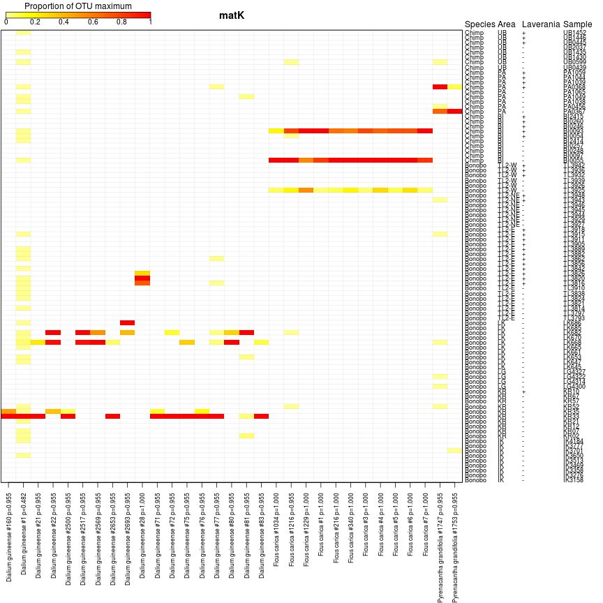

## Check for antimalarial plant taxa


```r
#set seed so reproducible
set.seed(12351)
#stop on errors
knitr::opts_chunk$set(error=FALSE,tidy=TRUE)
```

### Load libraries

```r
library(taxonomizr)
packageVersion("taxonomizr")
```

```
## [1] '0.3.0'
```

```r
library(vipor)
packageVersion("vipor")
```

```
## [1] '0.4.5'
```

```r
source("functions.R")
```

### Load data


```r
source("loadData.R")
```

```
## matK
```

```
## Cache work/matK_rarefyOtus.Rdat does exist. Loading data
```

```
## rbcL
```

```
## Cache work/rbcL_rarefyOtus.Rdat does exist. Loading data
```

### Load taxonomy files


```r
if (!exists("taxaNodes")) {
    getNamesAndNodes("work/")
    taxaNodes <- read.nodes("work/nodes.dmp")
    taxaNamesAmbig <- read.names("work/names.dmp", FALSE)
    taxaNames <- read.names("work/names.dmp")
}
```

```
## work//names.dmp, work//nodes.dmp already exist. Delete to redownload
```

### Read in antimalarial plants


```r
antiMal <- read.csv("antiMalarials.csv", stringsAsFactors = FALSE)
antiMal$isGenus <- !grepl(" ", antiMal$Plant)
antiMal$id <- getId(antiMal$Plant, taxaNamesAmbig)
antiMal$species <- getTaxonomy(antiMal$id, taxaNodes, taxaNames, "species")
antiMal$genus <- getTaxonomy(antiMal$id, taxaNodes, taxaNames, "genus")
```

### Find OTUs with antimalarial hits


```r
# only counts hits with match > 95% of read
hitCut <- 0.95
antiMals <- lapply(names(swarmData), function(ii) {
    species <- swarmData[[ii]][["taxa"]][colnames(swarmData[[ii]][["props"]]), 
        "species"]
    genus <- swarmData[[ii]][["taxa"]][colnames(swarmData[[ii]][["props"]]), 
        "genus"]
    bestHit <- withAs(sw = swarmData[[ii]][["taxa"]][colnames(swarmData[[ii]][["props"]]), 
        ], sw$bestScore/nchar(sw$seq))
    isAntiMal <- bestHit > hitCut & (species %in% antiMal$species[!is.na(antiMal$species)] | 
        genus %in% antiMal$genus[antiMal$isGenus])
    isPresent <- (antiMal$species %in% species[bestHit > hitCut] & !is.na(antiMal$species)) | 
        (antiMal$genus %in% genus[bestHit > hitCut] & antiMal$isGenus)
    antiMalProp <- swarmData[[ii]][["props"]][, isAntiMal, drop = FALSE]
    antiMalTaxa <- swarmData[[ii]][["taxa"]][colnames(antiMalProp), ]
    antiMalProp <- antiMalProp[swarmData[[ii]][["isEnough"]][rownames(antiMalProp)], 
        ]
    antiMalPlants <- antiMal[isPresent, ]
    return(list(prop = antiMalProp, taxa = antiMalTaxa, plants = antiMalPlants))
})
names(antiMals) <- names(swarmData)
```

### Compare antimalarial plant OTUs between endemic and non-endemic bonobo sites

```r
pCut <- Inf  #show all
for (ii in names(swarmData)) {
    message(ii)
    otuProp <- antiMals[[ii]][["prop"]]
    otuProp <- otuProp[rownames(otuProp) %in% rownames(samples), ]
    ss <- samples[rownames(otuProp), ]
    ss <- ss[order(!ss$bonobo, ss$area2, ss$malaria), ]
    # 
    tlGroups <- withAs(s = ss[ss$bonobo & ss$isTL, ], tapply(rownames(s), s$area2, 
        c))
    nonTlGroups <- withAs(s = ss[ss$bonobo & !ss$isTL, ], tapply(rownames(s), 
        s$area2, c))
    nonTlGroups <- nonTlGroups[sapply(nonTlGroups, length) > 5]
    comparisons <- expand.grid(tl = names(tlGroups), nontl = names(nonTlGroups))
    inBonobo <- otuProp[, apply(otuProp[c(unlist(tlGroups), unlist(nonTlGroups)), 
        ], 2, max) > 0]
    message("nOTU: ", ncol(inBonobo), " nTaxa: ", length(unique(antiMals[[ii]][["taxa"]][colnames(inBonobo), 
        "species"])))
    ninePs <- apply(inBonobo, 2, function(xx) apply(comparisons, 1, function(select) suppressWarnings(wilcox.test(xx[tlGroups[[select[1]]]], 
        xx[nonTlGroups[[select[2]]]], alternative = "less"))$p.value))
    condenseP <- p.adjust(apply(ninePs, 2, fishers, correct = 3), "fdr")
    message("Fisher's method combine p-values of 3 TL2 sites vs 3 non-TL2 sites p<.05")
    print(summary(condenseP < 0.05))
    message("")
    if (any(condenseP < pCut)) {
        selectPropAll <- apply(inBonobo[ss$Code, condenseP < pCut & apply(inBonobo > 
            0, 2, sum) > 1], 2, function(x) x/max(x))
        colnames(selectPropAll) <- sprintf("%s p=%0.3f", sub("^[a-z]_", "", 
            swarmData[[ii]][["taxa"]][colnames(selectPropAll), "bestId"]), condenseP[colnames(selectPropAll)])
        breaks <- c(-1e-06, seq(min(c(selectPropAll[selectPropAll > 0], 0.01)) - 
            1e-10, max(selectPropAll) + 1e-10, length.out = 100))
        cols <- c("white", tail(rev(heat.colors(110)), 99))
        maxTree <- hclust(dist(t(selectPropAll[, ])))
        selectPropAll <- selectPropAll[, rev(maxTree$labels[maxTree$order])]
        selectPropAll <- selectPropAll[, order(colnames(selectPropAll))]
        par(mar = c(10.5, 0.1, 3, 14), lheight = 0.7)
        metadata <- ss[rownames(selectPropAll), c("chimpBonobo", "area2", "plasmoPM", 
            "Code")]
        colnames(metadata) <- c("Species", "Area", "Laverania", "Sample")
        plotHeat(selectPropAll, breaks, cols, yaxt = "n", xaxt = "n")
        title(main = ii)
        axis(1, 1:ncol(selectPropAll), colnames(selectPropAll), las = 2, cex.axis = 0.7)
        addMetaData(metadata, cex = 0.75)
    }
}
```

```
## matK
```

```
## nOTU: 57 nTaxa: 3
```

```
## Fisher's method combine p-values of 3 TL2 sites vs 3 non-TL2 sites p<.05
```

```
##    Mode   FALSE 
## logical      57
```

```
## 
```

```
## rbcL
```

```
## nOTU: 493 nTaxa: 18
```

```
## Fisher's method combine p-values of 3 TL2 sites vs 3 non-TL2 sites p<.05
```

```
##    Mode   FALSE 
## logical     493
```

```
## 
```



### Compare antimalarial plant OTUs in plasmodium positive and negative chimps


```r
pCut <- 0.05
for (ii in names(swarmData)) {
    message(ii)
    otuProp <- swarmData[[ii]][["props"]][swarmData[[ii]][["isEnough"]][rownames(swarmData[[ii]][["props"]])], 
        ]
    otuProp <- otuProp[rownames(otuProp) %in% rownames(samples), ]
    ss <- samples[rownames(otuProp), ]
    ss <- ss[order(!ss$bonobo, ss$area2, ss$malaria), ]
    mal <- rownames(ss)[!ss$bonobo & ss$malaria]
    noMal <- rownames(ss)[!ss$bonobo & !ss$malaria]
    inChimp <- otuProp[, apply(otuProp[c(mal, noMal), ], 2, max) > 0]
    ninePs <- apply(inChimp, 2, function(xx) suppressWarnings(wilcox.test(xx[mal], 
        xx[noMal], alternative = "less"))$p.value)
    condenseP <- p.adjust(ninePs, "fdr")
    print(summary(condenseP < pCut))
}
```

```
## matK
```

```
##    Mode   FALSE 
## logical    1269
```

```
## rbcL
```

```
##    Mode   FALSE 
## logical   40264
```


