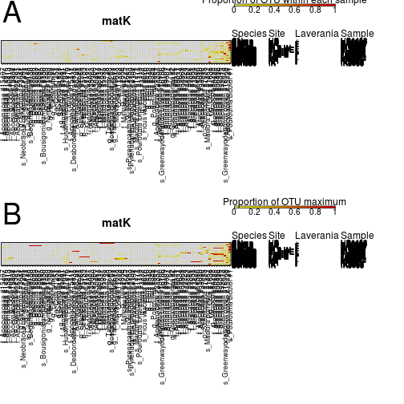
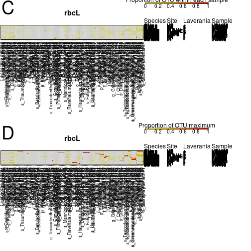

## rbcL and matK abundances


```r
#set seed so reproducible
set.seed(12356)
#stop on errors
knitr::opts_chunk$set(error=FALSE,tidy=TRUE)
```

### Load libraries


```r
library(dnar)
packageVersion("dnar")
```

```
## [1] '0.1'
```

```r
source("functions.R")
```

### Load data


```r
source("loadData.R")
```

```
## matK
```

```
## Cache work/matK_rarefyOtus.Rdat does exist. Loading data
```

```
## rbcL
```

```
## Cache work/rbcL_rarefyOtus.Rdat does exist. Loading data
```

### Make heatmap of OTU abundances

```r
sortSamples <- samples[order(samples$Species, samples$area2, samples$malaria, 
    samples$Code), ]
cols <- c("white", tail(rev(heat.colors(110)), 99))

minProp <- 0.02
for (ii in names(swarmData)) {
    if (ii == "matK") 
        subLetters <- c("A", "B") else subLetters <- c("C", "D")
    message(ii)
    plotProp <- swarmData[[ii]][["props"]][swarmData[[ii]][["isEnough"]], ]
    plotProp <- plotProp[, apply(plotProp, 2, max) > minProp]
    colnames(plotProp) <- swarmData[[ii]][["taxa"]][colnames(plotProp), "bestId"]
    plotProp <- plotProp[, order(apply(plotProp, 2, mean), decreasing = TRUE)]
    plotProp <- plotProp[orderIn(rownames(plotProp), rownames(sortSamples)), 
        ]
    maxProp <- apply(plotProp, 2, function(x) x/max(x))
    maxTree <- hclust(dist(t(maxProp[, ])))
    maxProp <- maxProp[, rev(maxTree$labels[maxTree$order])]
    plotProp <- plotProp[, rev(maxTree$labels[maxTree$order])]
    breaks <- c(-1e-06, seq(min(plotProp[plotProp > 0]) - 1e-10, max(plotProp) + 
        1e-10, length.out = 100))
    breaks2 <- c(-1e-06, seq(min(maxProp[maxProp > 0]) - 1e-10, max(maxProp) + 
        1e-10, length.out = 100))
    plotAndSavePdf(function() {
        par(mfrow = c(2, 1), mar = c(12, 0.1, 3.5, 15))
        image(1:ncol(plotProp), 1:nrow(plotProp), t(plotProp), col = cols, breaks = breaks, 
            xlab = "", ylab = "", xaxt = "n", yaxt = "n", main = ii)
        text(grconvertX(0.005, "nfc", "user"), grconvertY(0.995, "nfc", "user"), 
            subLetters[1], xpd = NA, cex = 3, adj = 0:1)
        insetScale(round(breaks2, 6), cols, c(0.97, 0.58, 0.98, 0.83), label = "Proportion of OTU within each sample")
        box()
        axis(1, 1:ncol(plotProp), colnames(plotProp), cex.axis = 0.7, las = 2, 
            tcl = -0.1, mgp = c(0, 0.3, 0))
        metadata <- sortSamples[rownames(plotProp), c("chimpBonobo", "area2", 
            "plasmoPM", "Code")]
        colnames(metadata) <- c("Species", "Site", "Laverania", "Sample")
        addMetaData(metadata, cex = 0.75)
        abline(h = 1:nrow(plotProp) - 0.5, v = 1:ncol(plotProp) + 0.5, col = "#00000011")
        image(1:ncol(maxProp), 1:nrow(maxProp), t(maxProp), col = cols, breaks = breaks2, 
            xlab = "", ylab = "", xaxt = "n", yaxt = "n", main = ii)
        text(grconvertX(0.005, "nfc", "user"), grconvertY(0.995, "nfc", "user"), 
            subLetters[2], xpd = NA, cex = 3, adj = 0:1)
        box()
        insetScale(round(breaks2, 6), cols, c(0.97, 0.58, 0.98, 0.83), label = "Proportion of OTU maximum")
        axis(1, 1:ncol(maxProp), colnames(maxProp), cex.axis = 0.7, las = 2, 
            tcl = -0.1, mgp = c(0, 0.3, 0))
        abline(h = 1:nrow(maxProp) - 0.5, v = 1:ncol(maxProp) + 0.5, col = "#00000011")
        metadata <- sortSamples[rownames(maxProp), c("chimpBonobo", "area2", 
            "plasmoPM", "Code")]
        colnames(metadata) <- c("Species", "Site", "Laverania", "Sample")
        addMetaData(metadata, cex = 0.75)
    }, sprintf("figure/SupplementaryFigure4_%s.pdf", ii), height = 30, width = 30)
}
```

```
## matK
```

```
## rbcL
```



### Count reads

```r
for (ii in names(swarmData)) {
    message(ii)
    print(swarmData[[ii]][["nReads"]])
    print(mean(swarmData[[ii]][["nReads"]]))
}
```

```
## matK
```

```
## BI0054 BI0055 BI0093 BI0097 BI0246 BI0248 BI0257 BI0260 BI2414 BI2415 
##  20681  16785   6138  18241  14555  22069  25117  11974  22075  10745 
## IK3158 IK3276 IK3358 IK3469 IK3513 IK3650 IK3701 IK3777 IK4184 IK4214 
##  13214  31517  13822  22060  23806  23584  33665  11927  13565    394 
##   KR02   KR05   KR07   KR10   KR12   KR21   KR33   KR35   KR52   KR57 
##  14646   4771  26741  21173   9687  15947  17083  23884  27954   7079 
##   KR67 LG4300 LG4314 LG4322 LG4327  LK645  LK647  LK653  LK661  LK665 
##   9515  15492  14440  16035  22440  16112  24322  23559  12913  30148 
##  LK668  LK670  LK682  LK685  LK686 PA0367 PA0368 PA0370 PA0456 PA1038 
##  17828  23314  17084   6461   6785   8961   6949   2121   6184  12362 
## PA1039 PA1044 PA1049 PA1059 PA1065 TL3793 TL3797 TL3814 TL3816 TL3820 
##  12770  29407  27144  17838  15533   7947   5722  23741  22541  15980 
## TL3821 TL3824 TL3826 TL3838 TL3842 TL3856 TL3862 TL3882 TL3889 TL3905 
##  10483  14012  27873  17244  16785  17809  16211   8264  17953   9894 
## TL3910 TL3911 TL3915 TL3916 TL3918 TL3925 TL3926 TL3927 TL3929 TL3932 
##   8891   6004  12350      4   5461  17959  14300   7431   9298  10320 
## TL3936 TL3939 TL3940 TL3942 TL3943 TL3944 TL3945 TL3946 TL3948 UB0439 
##   8064   8503   4968  38565  27889  27335  29458  19068  28899  14645 
## UB0445 UB0599 UB1430 UB1435 UB1446 UB1452 UB1454 UB2037 
##   6465  18716  20021  28602  10862  16446   4718  15020 
## [1] 16054.46
```

```
## rbcL
```

```
## BI0054 BI0055 BI0093 BI0097 BI0246 BI0248 BI0257 BI0260 BI2414 BI2415 
##  47084   8170  24965  19367  43796  27501  24624  37047  34955  42345 
## IK3158 IK3276 IK3358 IK3469 IK3513 IK3650 IK3701 IK3777 IK4184 IK4214 
##  28955  26904  33260  26309  34224  20059  37953  35568  18817  12082 
##   KR02   KR05   KR07   KR10   KR12   KR21   KR33   KR35   KR52   KR57 
##  21960   2036  33636  20332  25001  22351  20760  25620  12586  12881 
##   KR67 LG4300 LG4314 LG4322 LG4327  LK645  LK647  LK653  LK661  LK665 
##  39674  19342  41723    233  40332  24076  17476  29513  39493  31451 
##  LK668  LK670  LK682  LK685  LK686 PA0367 PA0368 PA0370 PA0456 PA1038 
##  28286  23285   3625   5684   6631  12530  32878  19918  10997  35343 
## PA1039 PA1044 PA1049 PA1059 PA1065 TL3793 TL3797 TL3814 TL3816 TL3820 
##  38723  12169  18341  36066  36026  15360  20919  23377  18222  12504 
## TL3821 TL3824 TL3826 TL3838 TL3842 TL3856 TL3862 TL3882 TL3889 TL3905 
##  18662  24745  17856  20509  25138  26892  29615  18803  15524  19654 
## TL3910 TL3911 TL3915 TL3916 TL3918 TL3925 TL3926 TL3927 TL3929 TL3932 
##  20337  20126  24011  14324   6455  13637  17784   4185   8935  16768 
## TL3936 TL3939 TL3940 TL3942 TL3943 TL3944 TL3945 TL3946 TL3948 UB0439 
##   5543  21353  15543  13599  14550   2675  11265   8706   9829  23095 
## UB0445 UB0599 UB1430 UB1435 UB1446 UB1452 UB1454 UB2037 
##  13292   5956  50333  17081  52110  13066  14353  23895 
## [1] 21995.4
```
