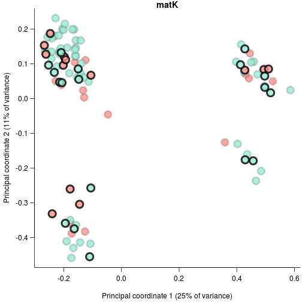
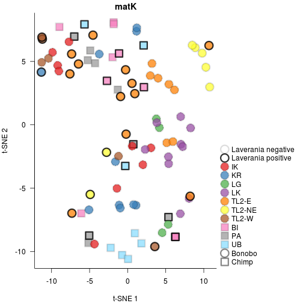
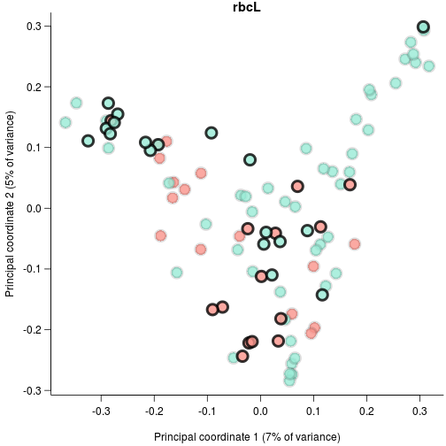
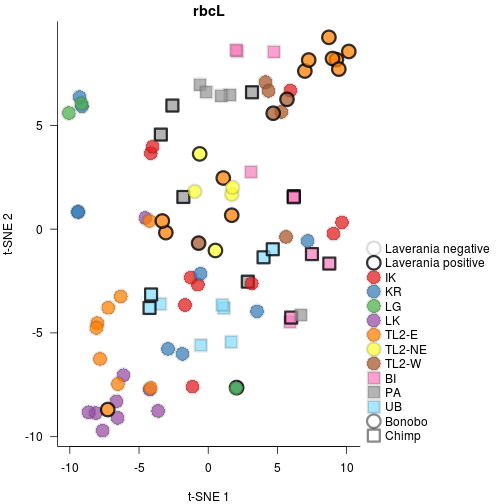

## Load libraries

```r
library(phyloseq)
packageVersion('phyloseq')
```

```
## [1] '1.20.0'
```

```r
library(ape)
packageVersion('ape')
```

```
## [1] '4.1'
```

```r
library(Rtsne)
packageVersion('Rtsne')
```

```
## [1] '0.13'
```

```r
library(vegan)
```

```
## Loading required package: permute
```

```
## Loading required package: lattice
```

```
## This is vegan 2.4-3
```

```r
packageVersion('vegan')
```

```
## [1] '2.4.3'
```

```r
library(ade4)
```

```
## 
## Attaching package: 'ade4'
```

```
## The following object is masked from 'package:vegan':
## 
##     cca
```

```r
packageVersion('ade4')
```

```
## [1] '1.7.6'
```

```r
source('functions.R')
```


## Load data

```r
source("loadData.R")
```

```
## matK
```

```
## Cache work/matK_rarefyOtus.Rdat does exist. Loading data
```

```
## rbcL
```

```
## Cache work/rbcL_rarefyOtus.Rdat does exist. Loading data
```


```r
tlAdonis<-interactAdonis<-plantAdonis<-chimpAdonis<-bonoboAdonis<-list()
mantels<-list()
for(ii in names(swarmData)){
  plotProp<-swarmData[[ii]][['props']][swarmData[[ii]][['isEnough']]&rownames(swarmData[[ii]][['props']]) %in% rownames(samples),]
  plotProp2<-swarmData[[ii]][['rare']][swarmData[[ii]][['isEnough']]&rownames(swarmData[[ii]][['rare']]) %in% rownames(samples),]
  phyOtuW<-otu_table(plotProp,taxa_are_rows=FALSE)
  phyOtuU<-otu_table(plotProp2,taxa_are_rows=FALSE)
  qiimeDataW<-phyloseq(otu_table=phyOtuW,phy_tree=swarmData[[ii]][['tree']])
  qiimeDataU<-phyloseq(otu_table=phyOtuU,phy_tree=swarmData[[ii]][['tree']])
  brayDist<-distance(qiimeDataU,'bray',binary=TRUE)
  brayDistW<-distance(qiimeDataW,'bray',binary=FALSE)
  uniDist<-UniFrac(qiimeDataU,weighted=FALSE)
  uniDistW<-UniFrac(qiimeDataW,weighted=TRUE)
  mantels[[ii]]<-list(
    'uniW'=ade4::mantel.rtest(uniDist,uniDistW,nrepet=1e4),
    'brayW'=ade4::mantel.rtest(uniDist,brayDistW,nrepet=1e4),
    'brayUW'=ade4::mantel.rtest(uniDist,brayDist,nrepet=1e4)
  )
  uniPca<-pcoa(uniDist)
  tsneUni<-Rtsne(uniDist,is_distance=TRUE,verbose=TRUE,perplexity=15,max_iter=3000)
  selectDist<-uniDist

  importance<-uniPca$values$Relative_eig
  colnames(uniPca$vectors)<-sprintf('Principal coordinate %d (%d%% of variance)',1:length(importance),round(importance*100))[1:ncol(uniPca$vectors)]
  selectSamples<-samples[rownames(plotProp),]
  selectSamples<-selectSamples[order(selectSamples$bonobo,selectSamples$area2,selectSamples$malaria),]
  colorBrew<-c('#e41a1cBB','#377eb8BB','#4daf4aBB','#984ea3BB','#ff7f00BB','#ffff33BB','#a65628BB','#f781bfBB','#999999BB','#88ddffBB')
  nArea<-length(unique(selectSamples$area2))
  if(nArea>length(colorBrew))stop('Need to adjust colors for more areas')
  areaCols<-colorBrew[1:nArea]
  names(areaCols)<-unique(selectSamples$area2[order(selectSamples$chimpBonobo)])
  areaPch<-sapply(names(areaCols),function(x)mostAbundant(selectSamples$chimpBonobo[selectSamples$area2==x]))
  malariaCols3<-c('#00000022','#000000CC')
  mediumMalariaCol<-'#00000077'
  malariaCols<-c('#00000022','#000000CC')
  malariaCols2<-rainbow.lab(2,alpha=.9,lightMultiple=.7)
  names(malariaCols3)<-names(malariaCols2)<-names(malariaCols)<-c('Laverania negative','Laverania positive')
  speciesPch<-20+1:length(unique(selectSamples$Species))
  speciesCols<-rainbow.lab(length(unique(selectSamples$Species)),start=-2,end=1,alpha=.8,lightMultiple=.8)
  names(speciesCols)<-names(speciesPch)<-sort(unique(selectSamples$chimpBonobo))

  predictors<-model.matrix(~0+Species+malaria+SIV+area,selectSamples)

  #pcoa
    pos<-my.biplot.pcoa(uniPca,predictors,plot.axes=1:2,pch=21,bg=speciesCols[selectSamples$chimpBonobo],col=malariaCols3[selectSamples$malaria+1],cex=2.25,lwd=4,arrowsFilter=Inf,las=1,mgp=c(2.75,.75,0),sameAxis=FALSE,bty='l',type='n')
    points(pos[!selectSamples$malaria,],col=malariaCols3[1],cex=2.25,lwd=4,bg=speciesCols[selectSamples[!selectSamples$malaria,'chimpBonobo']],pch=21)
    points(pos[selectSamples$malaria,],col=malariaCols3[2],cex=2.25,lwd=4,bg=speciesCols[selectSamples[selectSamples$malaria,'chimpBonobo']],pch=21)
    title(main=sprintf('%s',ii,1,2))

  #tsne
    par(mar=c(4,4,1.5,10))
    plot(tsneUni$Y,pch=speciesPch[selectSamples$chimpBonobo],bg=areaCols[selectSamples$area2],col=malariaCols[selectSamples$malaria+1],cex=2.5,lwd=3,ylab='t-SNE 2',xlab='t-SNE 1',main=sprintf('%s',ii),bty='l',las=1)
    legend(
      par('usr')[2]+.01*diff(par('usr')[1:2]), 
      mean(par('usr')[3:4]),
      c(names(malariaCols),names(areaCols),names(speciesPch)),
      col=c(malariaCols,rep(c(malariaCols[1],mediumMalariaCol),c(length(areaCols),length(speciesPch)))),
      pch=c(rep(21,length(malariaCols)),speciesPch[areaPch],speciesPch),
      pt.bg=c(rep(NA,length(malariaCols)),areaCols,rep(NA,length(speciesPch))),
      inset=.01,pt.lwd=3,pt.cex=2.5,
      xjust=0,xpd=NA,bty='n'
    )

  ss<-samples[labels(selectDist),]
  plantAdonis[[ii]]<-cacheOperation(sprintf('work/adonis_%s.Rdat',ii),adonis,selectDist~bonobo+area2+malaria,data=ss,permutations=1e7,parallel=10)
  interactAdonis[[ii]]<-cacheOperation(sprintf('work/interactAdonis_%s.Rdat',ii),adonis,selectDist~bonobo+area2+malaria*bonobo,data=ss,permutations=1e7,parallel=10)
  chimpDist<-as.matrix(selectDist)
  chimpDist<-as.dist(chimpDist[!ss$bonobo,!ss$bonobo])
  chimpAdonis[[ii]]<-cacheOperation(sprintf('work/adonisChimp_%s.Rdat',ii),adonis,chimpDist~area2+malaria,data=ss[!ss$bonobo,],permutations=1e7,parallel=10)
  bonoboDist<-as.matrix(selectDist)
  bonoboDist<-as.dist(bonoboDist[ss$bonobo,ss$bonobo])
  bonoboAdonis[[ii]]<-cacheOperation(sprintf('work/adonisBonobo_%s.Rdat',ii),adonis,bonoboDist~area2+malaria,data=ss[ss$bonobo,],permutations=1e7,parallel=10)
  tlDist<-as.dist(as.matrix(selectDist)[ss$isTL,ss$isTL])
  tlAdonis[[ii]]<-cacheOperation(sprintf('work/adonisTL_%s.Rdat',ii),adonis,tlDist~malaria,data=ss[ss$isTL,],permutations=1e7,parallel=5)

}
```

```
## Read the 95 x 95 data matrix successfully!
## Using no_dims = 2, perplexity = 15.000000, and theta = 0.500000
## Computing input similarities...
## Building tree...
##  - point 0 of 95
## Done in 0.01 seconds (sparsity = 0.571967)!
## Learning embedding...
## Iteration 50: error is 55.965421 (50 iterations in 0.02 seconds)
## Iteration 100: error is 57.031884 (50 iterations in 0.02 seconds)
## Iteration 150: error is 54.508975 (50 iterations in 0.02 seconds)
## Iteration 200: error is 54.161525 (50 iterations in 0.02 seconds)
## Iteration 250: error is 54.119804 (50 iterations in 0.02 seconds)
## Iteration 300: error is 1.762057 (50 iterations in 0.02 seconds)
## Iteration 350: error is 1.040244 (50 iterations in 0.01 seconds)
## Iteration 400: error is 0.499174 (50 iterations in 0.02 seconds)
## Iteration 450: error is 0.378671 (50 iterations in 0.02 seconds)
## Iteration 500: error is 0.352965 (50 iterations in 0.02 seconds)
## Iteration 550: error is 0.337048 (50 iterations in 0.02 seconds)
## Iteration 600: error is 0.333652 (50 iterations in 0.02 seconds)
## Iteration 650: error is 0.331043 (50 iterations in 0.02 seconds)
## Iteration 700: error is 0.330688 (50 iterations in 0.02 seconds)
## Iteration 750: error is 0.327358 (50 iterations in 0.02 seconds)
## Iteration 800: error is 0.320485 (50 iterations in 0.02 seconds)
## Iteration 850: error is 0.314633 (50 iterations in 0.02 seconds)
## Iteration 900: error is 0.311386 (50 iterations in 0.02 seconds)
## Iteration 950: error is 0.311551 (50 iterations in 0.02 seconds)
## Iteration 1000: error is 0.313876 (50 iterations in 0.02 seconds)
## Iteration 1050: error is 0.313800 (50 iterations in 0.02 seconds)
## Iteration 1100: error is 0.312004 (50 iterations in 0.02 seconds)
## Iteration 1150: error is 0.313866 (50 iterations in 0.02 seconds)
## Iteration 1200: error is 0.302103 (50 iterations in 0.02 seconds)
## Iteration 1250: error is 0.300235 (50 iterations in 0.02 seconds)
## Iteration 1300: error is 0.301186 (50 iterations in 0.02 seconds)
## Iteration 1350: error is 0.300139 (50 iterations in 0.02 seconds)
## Iteration 1400: error is 0.301235 (50 iterations in 0.02 seconds)
## Iteration 1450: error is 0.301189 (50 iterations in 0.02 seconds)
## Iteration 1500: error is 0.300247 (50 iterations in 0.02 seconds)
## Iteration 1550: error is 0.302570 (50 iterations in 0.02 seconds)
## Iteration 1600: error is 0.301800 (50 iterations in 0.02 seconds)
## Iteration 1650: error is 0.300891 (50 iterations in 0.02 seconds)
## Iteration 1700: error is 0.302369 (50 iterations in 0.02 seconds)
## Iteration 1750: error is 0.300749 (50 iterations in 0.02 seconds)
## Iteration 1800: error is 0.300972 (50 iterations in 0.02 seconds)
## Iteration 1850: error is 0.301457 (50 iterations in 0.02 seconds)
## Iteration 1900: error is 0.301347 (50 iterations in 0.02 seconds)
## Iteration 1950: error is 0.299806 (50 iterations in 0.02 seconds)
## Iteration 2000: error is 0.300216 (50 iterations in 0.02 seconds)
## Iteration 2050: error is 0.301588 (50 iterations in 0.02 seconds)
## Iteration 2100: error is 0.300813 (50 iterations in 0.02 seconds)
## Iteration 2150: error is 0.300991 (50 iterations in 0.02 seconds)
## Iteration 2200: error is 0.300815 (50 iterations in 0.02 seconds)
## Iteration 2250: error is 0.301033 (50 iterations in 0.02 seconds)
## Iteration 2300: error is 0.301184 (50 iterations in 0.02 seconds)
## Iteration 2350: error is 0.301484 (50 iterations in 0.02 seconds)
## Iteration 2400: error is 0.301240 (50 iterations in 0.02 seconds)
## Iteration 2450: error is 0.300869 (50 iterations in 0.02 seconds)
## Iteration 2500: error is 0.301710 (50 iterations in 0.02 seconds)
## Iteration 2550: error is 0.301230 (50 iterations in 0.02 seconds)
## Iteration 2600: error is 0.301458 (50 iterations in 0.02 seconds)
## Iteration 2650: error is 0.300874 (50 iterations in 0.02 seconds)
## Iteration 2700: error is 0.300956 (50 iterations in 0.02 seconds)
## Iteration 2750: error is 0.300689 (50 iterations in 0.02 seconds)
## Iteration 2800: error is 0.301102 (50 iterations in 0.02 seconds)
## Iteration 2850: error is 0.301753 (50 iterations in 0.02 seconds)
## Iteration 2900: error is 0.300921 (50 iterations in 0.02 seconds)
## Iteration 2950: error is 0.300417 (50 iterations in 0.02 seconds)
## Iteration 3000: error is 0.301098 (50 iterations in 0.02 seconds)
## Fitting performed in 1.21 seconds.
```



```
## Cache work/adonis_matK.Rdat does not exist. Running operation
```

```
## Cache work/interactAdonis_matK.Rdat does not exist. Running operation
```

```
## Cache work/adonisChimp_matK.Rdat does not exist. Running operation
```

```
## Cache work/adonisBonobo_matK.Rdat does not exist. Running operation
```

```
## Cache work/adonisTL_matK.Rdat does not exist. Running operation
```



```
## Read the 93 x 93 data matrix successfully!
## Using no_dims = 2, perplexity = 15.000000, and theta = 0.500000
## Computing input similarities...
## Building tree...
##  - point 0 of 93
## Done in 0.00 seconds (sparsity = 0.614175)!
## Learning embedding...
## Iteration 50: error is 59.351777 (50 iterations in 0.02 seconds)
## Iteration 100: error is 58.373725 (50 iterations in 0.02 seconds)
## Iteration 150: error is 58.582589 (50 iterations in 0.02 seconds)
## Iteration 200: error is 61.438773 (50 iterations in 0.02 seconds)
## Iteration 250: error is 59.135099 (50 iterations in 0.02 seconds)
## Iteration 300: error is 2.009035 (50 iterations in 0.02 seconds)
## Iteration 350: error is 1.228906 (50 iterations in 0.01 seconds)
## Iteration 400: error is 0.810851 (50 iterations in 0.02 seconds)
## Iteration 450: error is 0.664075 (50 iterations in 0.02 seconds)
## Iteration 500: error is 0.477107 (50 iterations in 0.02 seconds)
## Iteration 550: error is 0.366709 (50 iterations in 0.02 seconds)
## Iteration 600: error is 0.343803 (50 iterations in 0.02 seconds)
## Iteration 650: error is 0.340801 (50 iterations in 0.02 seconds)
## Iteration 700: error is 0.337100 (50 iterations in 0.02 seconds)
## Iteration 750: error is 0.337315 (50 iterations in 0.02 seconds)
## Iteration 800: error is 0.335431 (50 iterations in 0.02 seconds)
## Iteration 850: error is 0.336453 (50 iterations in 0.02 seconds)
## Iteration 900: error is 0.338145 (50 iterations in 0.02 seconds)
## Iteration 950: error is 0.338037 (50 iterations in 0.02 seconds)
## Iteration 1000: error is 0.336819 (50 iterations in 0.02 seconds)
## Iteration 1050: error is 0.335821 (50 iterations in 0.02 seconds)
## Iteration 1100: error is 0.335631 (50 iterations in 0.02 seconds)
## Iteration 1150: error is 0.333037 (50 iterations in 0.02 seconds)
## Iteration 1200: error is 0.335055 (50 iterations in 0.02 seconds)
## Iteration 1250: error is 0.333108 (50 iterations in 0.02 seconds)
## Iteration 1300: error is 0.331196 (50 iterations in 0.02 seconds)
## Iteration 1350: error is 0.333172 (50 iterations in 0.02 seconds)
## Iteration 1400: error is 0.330903 (50 iterations in 0.02 seconds)
## Iteration 1450: error is 0.330390 (50 iterations in 0.02 seconds)
## Iteration 1500: error is 0.332706 (50 iterations in 0.02 seconds)
## Iteration 1550: error is 0.333011 (50 iterations in 0.02 seconds)
## Iteration 1600: error is 0.333683 (50 iterations in 0.02 seconds)
## Iteration 1650: error is 0.332345 (50 iterations in 0.02 seconds)
## Iteration 1700: error is 0.332225 (50 iterations in 0.02 seconds)
## Iteration 1750: error is 0.332751 (50 iterations in 0.02 seconds)
## Iteration 1800: error is 0.329998 (50 iterations in 0.02 seconds)
## Iteration 1850: error is 0.330948 (50 iterations in 0.02 seconds)
## Iteration 1900: error is 0.330979 (50 iterations in 0.02 seconds)
## Iteration 1950: error is 0.328637 (50 iterations in 0.02 seconds)
## Iteration 2000: error is 0.328912 (50 iterations in 0.02 seconds)
## Iteration 2050: error is 0.329687 (50 iterations in 0.02 seconds)
## Iteration 2100: error is 0.331638 (50 iterations in 0.02 seconds)
## Iteration 2150: error is 0.327180 (50 iterations in 0.02 seconds)
## Iteration 2200: error is 0.327002 (50 iterations in 0.02 seconds)
## Iteration 2250: error is 0.327801 (50 iterations in 0.02 seconds)
## Iteration 2300: error is 0.326809 (50 iterations in 0.02 seconds)
## Iteration 2350: error is 0.328673 (50 iterations in 0.02 seconds)
## Iteration 2400: error is 0.328505 (50 iterations in 0.02 seconds)
## Iteration 2450: error is 0.329269 (50 iterations in 0.02 seconds)
## Iteration 2500: error is 0.330925 (50 iterations in 0.02 seconds)
## Iteration 2550: error is 0.328937 (50 iterations in 0.02 seconds)
## Iteration 2600: error is 0.328903 (50 iterations in 0.02 seconds)
## Iteration 2650: error is 0.330823 (50 iterations in 0.02 seconds)
## Iteration 2700: error is 0.329287 (50 iterations in 0.02 seconds)
## Iteration 2750: error is 0.329791 (50 iterations in 0.02 seconds)
## Iteration 2800: error is 0.331089 (50 iterations in 0.02 seconds)
## Iteration 2850: error is 0.328553 (50 iterations in 0.02 seconds)
## Iteration 2900: error is 0.330655 (50 iterations in 0.02 seconds)
## Iteration 2950: error is 0.330349 (50 iterations in 0.02 seconds)
## Iteration 3000: error is 0.329454 (50 iterations in 0.02 seconds)
## Fitting performed in 1.12 seconds.
```



```
## Cache work/adonis_rbcL.Rdat does not exist. Running operation
```

```
## Cache work/interactAdonis_rbcL.Rdat does not exist. Running operation
```

```
## Cache work/adonisChimp_rbcL.Rdat does not exist. Running operation
```

```
## Cache work/adonisBonobo_rbcL.Rdat does not exist. Running operation
```

```
## Cache work/adonisTL_rbcL.Rdat does not exist. Running operation
```



