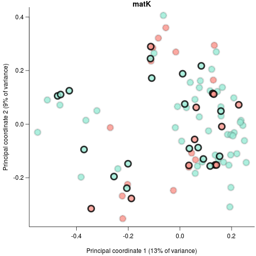
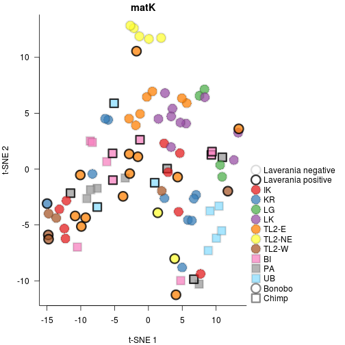

## PCoA and t-SNE of matK and rbcL abundances


```r
#set seed so reproducible
set.seed(12357)
#stop on errors
knitr::opts_chunk$set(error=FALSE,tidy=TRUE)
```

### Load libraries

```r
library(phyloseq)
packageVersion("phyloseq")
```

```
## [1] '1.20.0'
```

```r
library(ape)
packageVersion("ape")
```

```
## [1] '4.1'
```

```r
library(Rtsne)
packageVersion("Rtsne")
```

```
## [1] '0.13'
```

```r
library(vegan)
```

```
## Loading required package: permute
```

```
## Loading required package: lattice
```

```
## This is vegan 2.4-3
```

```r
packageVersion("vegan")
```

```
## [1] '2.4.3'
```

```r
library(ade4)
```

```
## 
## Attaching package: 'ade4'
```

```
## The following object is masked from 'package:vegan':
## 
##     cca
```

```r
packageVersion("ade4")
```

```
## [1] '1.7.6'
```

```r
source("functions.R")
```

### Load data

```r
source("loadData.R")
```

```
## matK
```

```
## Cache work/matK_rarefyOtus.Rdat does exist. Loading data
```

```
## rbcL
```

```
## Cache work/rbcL_rarefyOtus.Rdat does exist. Loading data
```

### Plot plant PCoA and t-SNE

```r
tlAdonis <- interactAdonis <- plantAdonis <- chimpAdonis <- bonoboAdonis <- list()
mantels <- list()
for (ii in names(swarmData)) {
    message(ii)
    plotProp <- swarmData[[ii]][["props"]][swarmData[[ii]][["isEnough"]] & rownames(swarmData[[ii]][["props"]]) %in% 
        rownames(samples), ]
    plotProp2 <- swarmData[[ii]][["rare"]][swarmData[[ii]][["isEnough"]] & rownames(swarmData[[ii]][["rare"]]) %in% 
        rownames(samples), ]
    phyOtuW <- otu_table(plotProp, taxa_are_rows = FALSE)
    phyOtuU <- otu_table(plotProp2, taxa_are_rows = FALSE)
    qiimeDataW <- phyloseq(otu_table = phyOtuW, phy_tree = swarmData[[ii]][["tree"]])
    qiimeDataU <- phyloseq(otu_table = phyOtuU, phy_tree = swarmData[[ii]][["tree"]])
    brayDist <- distance(qiimeDataU, "bray", binary = TRUE)
    brayDistW <- distance(qiimeDataW, "bray", binary = FALSE)
    uniDist <- UniFrac(qiimeDataU, weighted = FALSE)
    uniDistW <- UniFrac(qiimeDataW, weighted = TRUE)
    mantels[[ii]] <- list(uniW = par.mantel.rtest(uniDist, uniDistW, nrepet = 1e+06, 
        mc.cores = 50), brayW = par.mantel.rtest(uniDist, brayDistW, nrepet = 1e+06, 
        mc.cores = 50), brayUW = par.mantel.rtest(uniDist, brayDist, nrepet = 1e+06, 
        mc.cores = 50))
    uniPca <- pcoa(uniDist)
    tsneUni <- Rtsne(uniDist, is_distance = TRUE, verbose = TRUE, perplexity = 15, 
        max_iter = 3000)
    selectDist <- uniDist
    
    importance <- uniPca$values$Relative_eig
    colnames(uniPca$vectors) <- sprintf("Principal coordinate %d (%d%% of variance)", 
        1:length(importance), round(importance * 100))[1:ncol(uniPca$vectors)]
    selectSamples <- samples[rownames(plotProp), ]
    selectSamples <- selectSamples[order(selectSamples$bonobo, selectSamples$area2, 
        selectSamples$malaria), ]
    colorBrew <- c("#e41a1cBB", "#377eb8BB", "#4daf4aBB", "#984ea3BB", "#ff7f00BB", 
        "#ffff33BB", "#a65628BB", "#f781bfBB", "#999999BB", "#88ddffBB")
    nArea <- length(unique(selectSamples$area2))
    if (nArea > length(colorBrew)) 
        stop("Need to adjust colors for more areas")
    areaCols <- colorBrew[1:nArea]
    names(areaCols) <- unique(selectSamples$area2[order(selectSamples$chimpBonobo)])
    areaPch <- sapply(names(areaCols), function(x) mostAbundant(selectSamples$chimpBonobo[selectSamples$area2 == 
        x]))
    malariaCols3 <- c("#00000022", "#000000CC")
    mediumMalariaCol <- "#00000077"
    malariaCols <- c("#00000022", "#000000CC")
    malariaCols2 <- rainbow.lab(2, alpha = 0.9, lightMultiple = 0.7)
    names(malariaCols3) <- names(malariaCols2) <- names(malariaCols) <- c("Laverania negative", 
        "Laverania positive")
    speciesPch <- 20 + 1:length(unique(selectSamples$Species))
    speciesCols <- rainbow.lab(length(unique(selectSamples$Species)), start = -2, 
        end = 1, alpha = 0.8, lightMultiple = 0.8)
    names(speciesCols) <- names(speciesPch) <- sort(unique(selectSamples$chimpBonobo))
    
    predictors <- model.matrix(~0 + Species + malaria + SIV + area, selectSamples)
    
    # pcoa
    plotAndSavePdf(function() {
        pos <- my.biplot.pcoa(uniPca, predictors, plot.axes = 1:2, pch = 21, 
            bg = speciesCols[selectSamples$chimpBonobo], col = malariaCols3[selectSamples$malaria + 
                1], cex = 2.25, lwd = 4, arrowsFilter = Inf, las = 1, mgp = c(2.75, 
                0.75, 0), sameAxis = FALSE, bty = "l", type = "n")
        points(pos[!selectSamples$malaria, ], col = malariaCols3[1], cex = 2.25, 
            lwd = 4, bg = speciesCols[selectSamples[!selectSamples$malaria, 
                "chimpBonobo"]], pch = 21)
        points(pos[selectSamples$malaria, ], col = malariaCols3[2], cex = 2.25, 
            lwd = 4, bg = speciesCols[selectSamples[selectSamples$malaria, "chimpBonobo"]], 
            pch = 21)
        title(main = sprintf("%s", ii, 1, 2))
    }, sprintf("figure/Figure6_%s.pdf", ii), width = 6, height = 6)
    
    # tsne
    plotAndSavePdf(function() {
        par(mar = c(4, 4, 1.5, 10))
        plot(tsneUni$Y, pch = speciesPch[selectSamples$chimpBonobo], bg = areaCols[selectSamples$area2], 
            col = malariaCols[selectSamples$malaria + 1], cex = 2.5, lwd = 3, 
            ylab = "t-SNE 2", xlab = "t-SNE 1", main = sprintf("%s", ii), bty = "l", 
            las = 1)
        legend(par("usr")[2] + 0.01 * diff(par("usr")[1:2]), mean(par("usr")[3:4]), 
            c(names(malariaCols), names(areaCols), names(speciesPch)), col = c(malariaCols, 
                rep(c(malariaCols[1], mediumMalariaCol), c(length(areaCols), 
                  length(speciesPch)))), pch = c(rep(21, length(malariaCols)), 
                speciesPch[areaPch], speciesPch), pt.bg = c(rep(NA, length(malariaCols)), 
                areaCols, rep(NA, length(speciesPch))), inset = 0.01, pt.lwd = 3, 
            pt.cex = 2.5, xjust = 0, xpd = NA, bty = "n")
    }, sprintf("figure/SupplementaryFigure5_%s.pdf", ii), width = 10, height = 8)
    
    ss <- samples[labels(selectDist), ]
    plantAdonis[[ii]] <- adonis(selectDist ~ bonobo + area2 + malaria, data = ss, 
        permutations = 1e+07, parallel = 10)
    interactAdonis[[ii]] <- adonis(selectDist ~ bonobo + area2 + malaria * bonobo, 
        data = ss, permutations = 1e+07, parallel = 10)
    chimpDist <- as.matrix(selectDist)
    chimpDist <- as.dist(chimpDist[!ss$bonobo, !ss$bonobo])
    chimpAdonis[[ii]] <- adonis(chimpDist ~ area2 + malaria, data = ss[!ss$bonobo, 
        ], permutations = 1e+07, parallel = 10)
    bonoboDist <- as.matrix(selectDist)
    bonoboDist <- as.dist(bonoboDist[ss$bonobo, ss$bonobo])
    bonoboAdonis[[ii]] <- adonis(bonoboDist ~ area2 + malaria, data = ss[ss$bonobo, 
        ], permutations = 1e+07, parallel = 10)
    tlDist <- as.dist(as.matrix(selectDist)[ss$isTL, ss$isTL])
    tlAdonis[[ii]] <- adonis(tlDist ~ malaria, data = ss[ss$isTL, ], permutations = 1e+07, 
        parallel = 5)
}
```

```
## matK
```

```
## Read the 92 x 92 data matrix successfully!
## Using no_dims = 2, perplexity = 15.000000, and theta = 0.500000
## Computing input similarities...
## Building tree...
##  - point 0 of 92
## Done in 0.00 seconds (sparsity = 0.612949)!
## Learning embedding...
## Iteration 50: error is 58.719104 (50 iterations in 0.02 seconds)
## Iteration 100: error is 58.567620 (50 iterations in 0.02 seconds)
## Iteration 150: error is 57.021059 (50 iterations in 0.02 seconds)
## Iteration 200: error is 56.617728 (50 iterations in 0.02 seconds)
## Iteration 250: error is 57.379297 (50 iterations in 0.02 seconds)
## Iteration 300: error is 2.065222 (50 iterations in 0.02 seconds)
## Iteration 350: error is 1.351184 (50 iterations in 0.01 seconds)
## Iteration 400: error is 1.007928 (50 iterations in 0.02 seconds)
## Iteration 450: error is 0.591793 (50 iterations in 0.02 seconds)
## Iteration 500: error is 0.470414 (50 iterations in 0.02 seconds)
## Iteration 550: error is 0.469102 (50 iterations in 0.02 seconds)
## Iteration 600: error is 0.466720 (50 iterations in 0.02 seconds)
## Iteration 650: error is 0.462929 (50 iterations in 0.02 seconds)
## Iteration 700: error is 0.456742 (50 iterations in 0.02 seconds)
## Iteration 750: error is 0.456366 (50 iterations in 0.02 seconds)
## Iteration 800: error is 0.450496 (50 iterations in 0.02 seconds)
## Iteration 850: error is 0.442971 (50 iterations in 0.02 seconds)
## Iteration 900: error is 0.435512 (50 iterations in 0.02 seconds)
## Iteration 950: error is 0.434164 (50 iterations in 0.02 seconds)
## Iteration 1000: error is 0.436509 (50 iterations in 0.02 seconds)
## Iteration 1050: error is 0.435496 (50 iterations in 0.02 seconds)
## Iteration 1100: error is 0.442039 (50 iterations in 0.02 seconds)
## Iteration 1150: error is 0.441736 (50 iterations in 0.02 seconds)
## Iteration 1200: error is 0.417068 (50 iterations in 0.02 seconds)
## Iteration 1250: error is 0.409714 (50 iterations in 0.02 seconds)
## Iteration 1300: error is 0.407327 (50 iterations in 0.02 seconds)
## Iteration 1350: error is 0.411369 (50 iterations in 0.02 seconds)
## Iteration 1400: error is 0.406387 (50 iterations in 0.02 seconds)
## Iteration 1450: error is 0.408077 (50 iterations in 0.02 seconds)
## Iteration 1500: error is 0.406306 (50 iterations in 0.02 seconds)
## Iteration 1550: error is 0.403656 (50 iterations in 0.02 seconds)
## Iteration 1600: error is 0.408456 (50 iterations in 0.02 seconds)
## Iteration 1650: error is 0.408556 (50 iterations in 0.02 seconds)
## Iteration 1700: error is 0.407118 (50 iterations in 0.02 seconds)
## Iteration 1750: error is 0.407297 (50 iterations in 0.02 seconds)
## Iteration 1800: error is 0.407234 (50 iterations in 0.02 seconds)
## Iteration 1850: error is 0.409799 (50 iterations in 0.02 seconds)
## Iteration 1900: error is 0.411649 (50 iterations in 0.02 seconds)
## Iteration 1950: error is 0.410366 (50 iterations in 0.02 seconds)
## Iteration 2000: error is 0.412817 (50 iterations in 0.02 seconds)
## Iteration 2050: error is 0.410824 (50 iterations in 0.02 seconds)
## Iteration 2100: error is 0.411522 (50 iterations in 0.02 seconds)
## Iteration 2150: error is 0.414082 (50 iterations in 0.02 seconds)
## Iteration 2200: error is 0.412718 (50 iterations in 0.02 seconds)
## Iteration 2250: error is 0.414112 (50 iterations in 0.02 seconds)
## Iteration 2300: error is 0.414789 (50 iterations in 0.02 seconds)
## Iteration 2350: error is 0.411167 (50 iterations in 0.02 seconds)
## Iteration 2400: error is 0.407961 (50 iterations in 0.02 seconds)
## Iteration 2450: error is 0.408797 (50 iterations in 0.02 seconds)
## Iteration 2500: error is 0.407236 (50 iterations in 0.02 seconds)
## Iteration 2550: error is 0.403260 (50 iterations in 0.02 seconds)
## Iteration 2600: error is 0.398490 (50 iterations in 0.02 seconds)
## Iteration 2650: error is 0.389625 (50 iterations in 0.02 seconds)
## Iteration 2700: error is 0.383527 (50 iterations in 0.02 seconds)
## Iteration 2750: error is 0.381044 (50 iterations in 0.02 seconds)
## Iteration 2800: error is 0.381362 (50 iterations in 0.02 seconds)
## Iteration 2850: error is 0.380018 (50 iterations in 0.02 seconds)
## Iteration 2900: error is 0.371803 (50 iterations in 0.02 seconds)
## Iteration 2950: error is 0.374023 (50 iterations in 0.02 seconds)
## Iteration 3000: error is 0.371292 (50 iterations in 0.02 seconds)
## Fitting performed in 1.06 seconds.
```



```
## rbcL
```

```
## Read the 93 x 93 data matrix successfully!
## Using no_dims = 2, perplexity = 15.000000, and theta = 0.500000
## Computing input similarities...
## Building tree...
##  - point 0 of 93
## Done in 0.01 seconds (sparsity = 0.622731)!
## Learning embedding...
## Iteration 50: error is 59.020644 (50 iterations in 0.03 seconds)
## Iteration 100: error is 57.987725 (50 iterations in 0.02 seconds)
## Iteration 150: error is 61.045261 (50 iterations in 0.03 seconds)
## Iteration 200: error is 61.861628 (50 iterations in 0.03 seconds)
## Iteration 250: error is 59.978866 (50 iterations in 0.03 seconds)
## Iteration 300: error is 2.328754 (50 iterations in 0.02 seconds)
## Iteration 350: error is 1.639063 (50 iterations in 0.01 seconds)
## Iteration 400: error is 1.025190 (50 iterations in 0.02 seconds)
## Iteration 450: error is 0.767524 (50 iterations in 0.02 seconds)
## Iteration 500: error is 0.615584 (50 iterations in 0.02 seconds)
## Iteration 550: error is 0.430137 (50 iterations in 0.02 seconds)
## Iteration 600: error is 0.378942 (50 iterations in 0.02 seconds)
## Iteration 650: error is 0.361895 (50 iterations in 0.02 seconds)
## Iteration 700: error is 0.365773 (50 iterations in 0.02 seconds)
## Iteration 750: error is 0.368216 (50 iterations in 0.02 seconds)
## Iteration 800: error is 0.368330 (50 iterations in 0.02 seconds)
## Iteration 850: error is 0.369341 (50 iterations in 0.02 seconds)
## Iteration 900: error is 0.369145 (50 iterations in 0.03 seconds)
## Iteration 950: error is 0.372049 (50 iterations in 0.02 seconds)
## Iteration 1000: error is 0.366698 (50 iterations in 0.02 seconds)
## Iteration 1050: error is 0.367843 (50 iterations in 0.02 seconds)
## Iteration 1100: error is 0.367702 (50 iterations in 0.02 seconds)
## Iteration 1150: error is 0.369351 (50 iterations in 0.02 seconds)
## Iteration 1200: error is 0.369186 (50 iterations in 0.02 seconds)
## Iteration 1250: error is 0.368449 (50 iterations in 0.02 seconds)
## Iteration 1300: error is 0.369701 (50 iterations in 0.02 seconds)
## Iteration 1350: error is 0.370307 (50 iterations in 0.02 seconds)
## Iteration 1400: error is 0.369501 (50 iterations in 0.02 seconds)
## Iteration 1450: error is 0.367378 (50 iterations in 0.02 seconds)
## Iteration 1500: error is 0.368661 (50 iterations in 0.02 seconds)
## Iteration 1550: error is 0.370676 (50 iterations in 0.02 seconds)
## Iteration 1600: error is 0.367996 (50 iterations in 0.02 seconds)
## Iteration 1650: error is 0.344720 (50 iterations in 0.02 seconds)
## Iteration 1700: error is 0.330878 (50 iterations in 0.02 seconds)
## Iteration 1750: error is 0.333038 (50 iterations in 0.02 seconds)
## Iteration 1800: error is 0.329276 (50 iterations in 0.02 seconds)
## Iteration 1850: error is 0.326203 (50 iterations in 0.02 seconds)
## Iteration 1900: error is 0.324818 (50 iterations in 0.02 seconds)
## Iteration 1950: error is 0.328856 (50 iterations in 0.02 seconds)
## Iteration 2000: error is 0.329636 (50 iterations in 0.02 seconds)
## Iteration 2050: error is 0.331549 (50 iterations in 0.02 seconds)
## Iteration 2100: error is 0.331870 (50 iterations in 0.02 seconds)
## Iteration 2150: error is 0.331254 (50 iterations in 0.02 seconds)
## Iteration 2200: error is 0.330270 (50 iterations in 0.02 seconds)
## Iteration 2250: error is 0.331499 (50 iterations in 0.02 seconds)
## Iteration 2300: error is 0.331114 (50 iterations in 0.02 seconds)
## Iteration 2350: error is 0.332107 (50 iterations in 0.02 seconds)
## Iteration 2400: error is 0.332440 (50 iterations in 0.02 seconds)
## Iteration 2450: error is 0.330584 (50 iterations in 0.02 seconds)
## Iteration 2500: error is 0.332428 (50 iterations in 0.02 seconds)
## Iteration 2550: error is 0.331233 (50 iterations in 0.02 seconds)
## Iteration 2600: error is 0.331958 (50 iterations in 0.02 seconds)
## Iteration 2650: error is 0.333140 (50 iterations in 0.02 seconds)
## Iteration 2700: error is 0.333409 (50 iterations in 0.02 seconds)
## Iteration 2750: error is 0.330139 (50 iterations in 0.02 seconds)
## Iteration 2800: error is 0.331013 (50 iterations in 0.02 seconds)
## Iteration 2850: error is 0.332076 (50 iterations in 0.03 seconds)
## Iteration 2900: error is 0.331733 (50 iterations in 0.02 seconds)
## Iteration 2950: error is 0.332814 (50 iterations in 0.02 seconds)
## Iteration 3000: error is 0.331438 (50 iterations in 0.02 seconds)
## Fitting performed in 1.26 seconds.
```



### Mantel test of different distances

```r
mantels
```

```
## $matK
## $matK$uniW
## Monte-Carlo test
## Call: mantelnoneuclid(m1 = m1, m2 = m2, nrepet = nrepet)
## 
## Observation: 0.3447672 
## 
## Based on 1000000 replicates
## Simulated p-value: 9.99999e-07 
## Alternative hypothesis: greater 
## 
##       Std.Obs   Expectation      Variance 
##  1.132792e+01 -2.729873e-05  9.264458e-04 
## 
## $matK$brayW
## Monte-Carlo test
## Call: mantelnoneuclid(m1 = m1, m2 = m2, nrepet = nrepet)
## 
## Observation: 0.3717721 
## 
## Based on 1000000 replicates
## Simulated p-value: 9.99999e-07 
## Alternative hypothesis: greater 
## 
##       Std.Obs   Expectation      Variance 
##  1.171818e+01 -5.065037e-05  1.006819e-03 
## 
## $matK$brayUW
## Monte-Carlo test
## Call: mantelnoneuclid(m1 = m1, m2 = m2, nrepet = nrepet)
## 
## Observation: 0.5529449 
## 
## Based on 1000000 replicates
## Simulated p-value: 9.99999e-07 
## Alternative hypothesis: greater 
## 
##      Std.Obs  Expectation     Variance 
## 1.836084e+01 1.628117e-05 9.068866e-04 
## 
## 
## $rbcL
## $rbcL$uniW
## Monte-Carlo test
## Call: mantelnoneuclid(m1 = m1, m2 = m2, nrepet = nrepet)
## 
## Observation: 0.689035 
## 
## Based on 1000000 replicates
## Simulated p-value: 9.99999e-07 
## Alternative hypothesis: greater 
## 
##       Std.Obs   Expectation      Variance 
##  2.279943e+01 -5.908820e-06  9.133600e-04 
## 
## $rbcL$brayW
## Monte-Carlo test
## Call: mantelnoneuclid(m1 = m1, m2 = m2, nrepet = nrepet)
## 
## Observation: 0.6839004 
## 
## Based on 1000000 replicates
## Simulated p-value: 9.99999e-07 
## Alternative hypothesis: greater 
## 
##       Std.Obs   Expectation      Variance 
##  2.712222e+01 -2.825286e-06  6.358267e-04 
## 
## $rbcL$brayUW
## Monte-Carlo test
## Call: par.mantel.rtest(m1 = uniDist, m2 = brayDist, nrepet = 1e+06, 
##     mc.cores = 50)
## 
## Observation: 0.8692566 
## 
## Based on 1000000 replicates
## Simulated p-value: 9.99999e-07 
## Alternative hypothesis: greater 
## 
##      Std.Obs  Expectation     Variance 
## 3.354830e+01 2.743856e-05 6.713169e-04
```

### PERMANOVA testing of covariates

```r
plantAdonis
```

```
## $matK
## 
## Call:
## adonis(formula = selectDist ~ bonobo + area2 + malaria, data = ss,      permutations = 1e+07, parallel = 10) 
## 
## Permutation: free
## Number of permutations: 1e+07
## 
## Terms added sequentially (first to last)
## 
##           Df SumsOfSqs MeanSqs F.Model      R2  Pr(>F)    
## bonobo     1    0.5987 0.59874  2.1572 0.02049 0.00234 ** 
## area2      8    5.8053 0.72567  2.6146 0.19864   1e-07 ***
## malaria    1    0.3402 0.34024  1.2259 0.01164 0.17983    
## Residuals 81   22.4814 0.27755         0.76923            
## Total     91   29.2257                 1.00000            
## ---
## Signif. codes:  0 '***' 0.001 '**' 0.01 '*' 0.05 '.' 0.1 ' ' 1
## 
## $rbcL
## 
## Call:
## adonis(formula = selectDist ~ bonobo + area2 + malaria, data = ss,      permutations = 1e+07, parallel = 10) 
## 
## Permutation: free
## Number of permutations: 1e+07
## 
## Terms added sequentially (first to last)
## 
##           Df SumsOfSqs MeanSqs F.Model      R2 Pr(>F)    
## bonobo     1     1.084 1.08356 2.95779 0.02801  1e-07 ***
## area2      8     7.229 0.90357 2.46646 0.18684  1e-07 ***
## malaria    1     0.336 0.33640 0.91826 0.00869 0.7084    
## Residuals 82    30.040 0.36634         0.77646           
## Total     92    38.689                 1.00000           
## ---
## Signif. codes:  0 '***' 0.001 '**' 0.01 '*' 0.05 '.' 0.1 ' ' 1
```

```r
interactAdonis
```

```
## $matK
## 
## Call:
## adonis(formula = selectDist ~ bonobo + area2 + malaria * bonobo,      data = ss, permutations = 1e+07, parallel = 10) 
## 
## Permutation: free
## Number of permutations: 1e+07
## 
## Terms added sequentially (first to last)
## 
##                Df SumsOfSqs MeanSqs F.Model      R2  Pr(>F)    
## bonobo          1    0.5987 0.59874  2.1643 0.02049 0.00228 ** 
## area2           8    5.8053 0.72567  2.6231 0.19864   1e-07 ***
## malaria         1    0.3402 0.34024  1.2299 0.01164 0.17658    
## bonobo:malaria  1    0.3498 0.34978  1.2644 0.01197 0.15248    
## Residuals      80   22.1316 0.27664         0.75726            
## Total          91   29.2257                 1.00000            
## ---
## Signif. codes:  0 '***' 0.001 '**' 0.01 '*' 0.05 '.' 0.1 ' ' 1
## 
## $rbcL
## 
## Call:
## adonis(formula = selectDist ~ bonobo + area2 + malaria * bonobo,      data = ss, permutations = 1e+07, parallel = 10) 
## 
## Permutation: free
## Number of permutations: 1e+07
## 
## Terms added sequentially (first to last)
## 
##                Df SumsOfSqs MeanSqs F.Model      R2 Pr(>F)    
## bonobo          1     1.084 1.08356 2.95440 0.02801  1e-07 ***
## area2           8     7.229 0.90357 2.46364 0.18684  1e-07 ***
## malaria         1     0.336 0.33640 0.91720 0.00869 0.7118    
## bonobo:malaria  1     0.332 0.33230 0.90604 0.00859 0.7487    
## Residuals      81    29.708 0.36676         0.76787           
## Total          92    38.689                 1.00000           
## ---
## Signif. codes:  0 '***' 0.001 '**' 0.01 '*' 0.05 '.' 0.1 ' ' 1
```

```r
chimpAdonis
```

```
## $matK
## 
## Call:
## adonis(formula = chimpDist ~ area2 + malaria, data = ss[!ss$bonobo,      ], permutations = 1e+07, parallel = 10) 
## 
## Permutation: free
## Number of permutations: 1e+07
## 
## Terms added sequentially (first to last)
## 
##           Df SumsOfSqs MeanSqs F.Model      R2   Pr(>F)    
## area2      2    1.3470 0.67350 2.28831 0.16106 0.000984 ***
## malaria    1    0.2469 0.24691 0.83891 0.02952 0.617997    
## Residuals 23    6.7694 0.29432         0.80942             
## Total     26    8.3633                 1.00000             
## ---
## Signif. codes:  0 '***' 0.001 '**' 0.01 '*' 0.05 '.' 0.1 ' ' 1
## 
## $rbcL
## 
## Call:
## adonis(formula = chimpDist ~ area2 + malaria, data = ss[!ss$bonobo,      ], permutations = 1e+07, parallel = 10) 
## 
## Permutation: free
## Number of permutations: 1e+07
## 
## Terms added sequentially (first to last)
## 
##           Df SumsOfSqs MeanSqs F.Model      R2  Pr(>F)    
## area2      2    1.6955 0.84775  2.1430 0.14237 1.2e-06 ***
## malaria    1    0.3238 0.32379  0.8185 0.02719   0.858    
## Residuals 25    9.8898 0.39559         0.83044            
## Total     28   11.9091                 1.00000            
## ---
## Signif. codes:  0 '***' 0.001 '**' 0.01 '*' 0.05 '.' 0.1 ' ' 1
```

```r
bonoboAdonis
```

```
## $matK
## 
## Call:
## adonis(formula = bonoboDist ~ area2 + malaria, data = ss[ss$bonobo,      ], permutations = 1e+07, parallel = 10) 
## 
## Permutation: free
## Number of permutations: 1e+07
## 
## Terms added sequentially (first to last)
## 
##           Df SumsOfSqs MeanSqs F.Model      R2  Pr(>F)    
## area2      6    4.4583 0.74306  2.7571 0.22002   1e-07 ***
## malaria    1    0.4431 0.44311  1.6441 0.02187 0.02606 *  
## Residuals 57   15.3622 0.26951         0.75812            
## Total     64   20.2636                 1.00000            
## ---
## Signif. codes:  0 '***' 0.001 '**' 0.01 '*' 0.05 '.' 0.1 ' ' 1
## 
## $rbcL
## 
## Call:
## adonis(formula = bonoboDist ~ area2 + malaria, data = ss[ss$bonobo,      ], permutations = 1e+07, parallel = 10) 
## 
## Permutation: free
## Number of permutations: 1e+07
## 
## Terms added sequentially (first to last)
## 
##           Df SumsOfSqs MeanSqs F.Model      R2 Pr(>F)    
## area2      6    5.5330 0.92217 2.60581 0.21533  1e-07 ***
## malaria    1    0.3449 0.34491 0.97461 0.01342 0.5054    
## Residuals 56   19.8180 0.35389         0.77125           
## Total     63   25.6959                 1.00000           
## ---
## Signif. codes:  0 '***' 0.001 '**' 0.01 '*' 0.05 '.' 0.1 ' ' 1
```

```r
tlAdonis
```

```
## $matK
## 
## Call:
## adonis(formula = tlDist ~ malaria, data = ss[ss$isTL, ], permutations = 1e+07,      parallel = 5) 
## 
## Permutation: free
## Number of permutations: 1e+07
## 
## Terms added sequentially (first to last)
## 
##           Df SumsOfSqs MeanSqs F.Model      R2 Pr(>F)   
## malaria    1    0.5703 0.57031  1.9651 0.06148 0.0065 **
## Residuals 30    8.7065 0.29022         0.93852          
## Total     31    9.2769                 1.00000          
## ---
## Signif. codes:  0 '***' 0.001 '**' 0.01 '*' 0.05 '.' 0.1 ' ' 1
## 
## $rbcL
## 
## Call:
## adonis(formula = tlDist ~ malaria, data = ss[ss$isTL, ], permutations = 1e+07,      parallel = 5) 
## 
## Permutation: free
## Number of permutations: 1e+07
## 
## Terms added sequentially (first to last)
## 
##           Df SumsOfSqs MeanSqs F.Model      R2 Pr(>F)
## malaria    1    0.4097 0.40966  1.0546 0.03396 0.3115
## Residuals 30   11.6533 0.38844         0.96604       
## Total     31   12.0630                 1.00000
```


