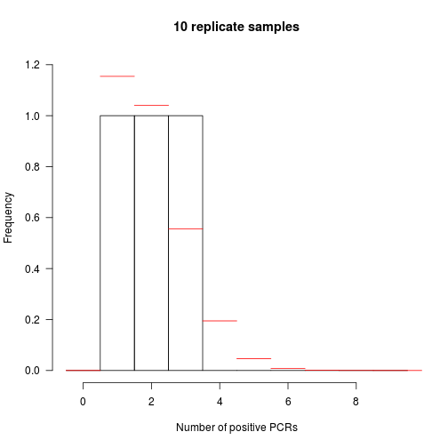

## Sensitivity of plasmodium PCR detection


```r
#set seed so reproducible
set.seed(12358)
#stop on errors
knitr::opts_chunk$set(error=FALSE,tidy=TRUE)
```

### Libraries

```r
# probability of k positives out of n trials in a zero truncated binomial
# distribution with probability p
dztbinom <- function(k, n, p, log = FALSE) {
    out <- lchoose(n, k) + k * log(p) + (n - k) * log(1 - p) - log(1 - (1 - 
        p)^n)
    out[k < 1] <- -Inf
    if (!log) 
        return(exp(out)) else return(out)
}

# probability of k positives out of n trials in a zero truncated binomial
# distribution with logit transformed probability phi
dztbinomphi <- function(k, n, phi, log = FALSE) {
    out <- lchoose(n, k) + k * phi + n * log(1/(1 + exp(phi))) - log(1 - (1/(exp(phi) + 
        1))^n)
    out[k < 1] <- -Inf
    if (!log) 
        return(exp(out)) else return(out)
}

# likelihood of data given proportion theta
like <- function(theta, positives, replicates) -sum(dztbinom(positives, replicates, 
    theta, log = TRUE))
# likelihood data given logit transformed proportion phi
likePhi <- function(phi, positives, replicates) -sum(dztbinomphi(positives, 
    replicates, phi, log = TRUE))

# use the likelihood ratio to estimate 95% CI
lr95 <- function(positives, replicates, best) {
    potentialProps <- seq(1e-05, 0.99999, 1e-05)
    potentialLikes <- sapply(potentialProps, like, positives, replicates)
    boundaries <- range(which(potentialLikes - best < 1.92)) + c(-1, 1)
    potentialProps[boundaries]
}

# second derivative of the probability of k positives out of n trials in a
# zero truncated binomial distribution with probability p logit transformed
# to phi
ddlztbinomphi <- function(k, n, phi) {
    -n * exp(phi)/(exp(phi) + 1)^2 + n^2 * exp(2 * phi) * (1/(exp(phi) + 1))^(2 * 
        n - 2)/(1 - (1/(exp(phi) + 1))^n)^2 - n * exp(phi) * (1/(exp(phi) + 
        1))^(n + 1)/(1 - (1/(exp(phi) + 1))^n) - n * exp(2 * phi)/(exp(phi) + 
        1)^2/((exp(phi) + 1)^n - 1)
}

# second derivative of likelihood is the sum of second derivative for each
# observation
ddlikephi <- function(phi, positives, replicates) sum(ddlztbinomphi(positives, 
    replicates, phi))

# asymptotic 95% CI for p assuming normality of MLE using logit transform
# for better behaved interval
asymptotic95phi <- function(theta, positives, replicates) {
    phi <- log(theta/(1 - theta))
    phis <- phi + c(-1.96, 1.96) * 1/sqrt(-ddlikephi(phi, positives, replicates))
    exp(phis)/(1 + exp(phis))
}
```

### Load data

```r
pcr <- read.csv("pcrPos.csv", stringsAsFactors = FALSE)
```

### Find maximum likelihood estimate for sensitivity using a zero truncated binomial

```r
mle <- optimize(like, interval = 0:1, pcr$positive, pcr$replicates)
mleB <- optimize(like, interval = 0:1, pcr$positive[pcr$Host == "P. paniscus"], 
    pcr$replicates[pcr$Host == "P. paniscus"])
mleC <- optimize(like, interval = 0:1, pcr$positive[pcr$Host == "P. t. schweifurthii"], 
    pcr$replicates[pcr$Host == "P. t. schweifurthii"])
print(mle)
```

```
## $minimum
## [1] 0.1668332
## 
## $objective
## [1] 82.88128
```

```r
print(mleB)
```

```
## $minimum
## [1] 0.146481
## 
## $objective
## [1] 21.24298
```

```r
print(mleC)
```

```
## $minimum
## [1] 0.1750241
## 
## $objective
## [1] 61.42558
```

### Find confidence interval based on likelihood ratio

```r
ci95 <- lr95(pcr$positive, pcr$replicates, mle$objective)
ci95B <- lr95(pcr$positive[pcr$Host == "P. paniscus"], pcr$replicates[pcr$Host == 
    "P. paniscus"], mleB$objective)
ci95C <- lr95(pcr$positive[pcr$Host == "P. t. schweifurthii"], pcr$replicates[pcr$Host == 
    "P. t. schweifurthii"], mleC$objective)
print(ci95)
```

```
## [1] 0.12979 0.20767
```

```r
print(ci95B)
```

```
## [1] 0.08475 0.22290
```

```r
print(ci95C)
```

```
## [1] 0.13082 0.22432
```

### Compare to confidence interval based on asymptotic normality

```r
normCi95 <- asymptotic95phi(mle$minimum, pcr$positive, pcr$replicates)
normCi95B <- asymptotic95phi(mleB$minimum, pcr$positive[pcr$Host == "P. paniscus"], 
    pcr$replicates[pcr$Host == "P. paniscus"])
normCi95C <- asymptotic95phi(mleB$minimum, pcr$positive[pcr$Host == "P. t. schweifurthii"], 
    pcr$replicates[pcr$Host == "P. t. schweifurthii"])
print(normCi95)
```

```
## [1] 0.1386473 0.1994224
```

```r
print(normCi95B)
```

```
## [1] 0.1008015 0.2080707
```

```r
print(normCi95C)
```

```
## [1] 0.1156355 0.1838439
```
###

```r
props <- seq(0.001, 0.5, 0.001)
plot(props, sapply(props, like, pcr$positive, pcr$replicates), xlab = "Proportion", 
    ylab = "Negative log likelihood")
abline(v = mle$minimum)
# asymptotic normality estimate
abline(v = normCi95, lty = 2)
# likelihood ratio estimate
abline(h = like(mle$minimum, pcr$positive, pcr$replicates) + 1.92, lty = 2)
```


```r
phis <- seq(-3, -0.5, 0.001)
plot(phis, sapply(phis, likePhi, pcr$positive, pcr$replicates), xlab = "Logit transformed proportion", 
    ylab = "Negative log likelihood")
abline(v = log(mle$minimum/(1 - mle$minimum)))
# asymptotic normality estimate
abline(v = log(normCi95/(1 - normCi95)), lty = 2)
# likelihood ratio estimate
abline(h = likePhi(log(mle$minimum/(1 - mle$minimum)), pcr$positive, pcr$replicates) + 
    1.92, lty = 2)
```


### Compare the observed data with that expected from the estimated sensitivity

```r
hist(pcr$positive[pcr$replicates == 8], breaks = 0:9 - 0.5, xlab = "Number of positive PCRs", 
    main = "8 replicate samples", las = 1)
ps <- dztbinom(0:8, 8, mle$minimum)
preds <- ps * sum(pcr$replicates == 8)
segments(0:8 - 0.5, preds, 0:8 + 0.5, preds, col = "red")
```


```r
hist(pcr$positive[pcr$replicates == 10], breaks = 0:10 - 0.5, xlab = "Number of positive PCRs", 
    main = "10 replicate samples", ylim = c(0, 1.2), las = 1)
ps <- dztbinom(0:10, 10, mle$minimum)
preds <- ps * sum(pcr$replicates == 10)
segments(0:10 - 0.5, preds, 0:10 + 0.5, preds, col = "red")
```


